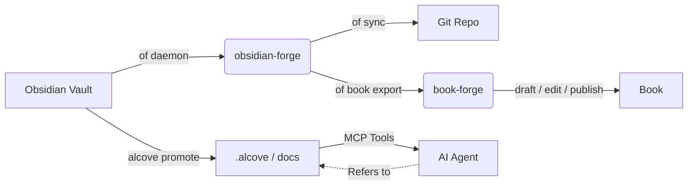

<div align="center">

# ⚒️ obsidian-forge

**Obsidian vault generator, automation daemon, and graph strengthener**

<p align="center">
  <a href="https://github.com/epicsagas/obsidian-forge/stargazers"></a>
  <a href="https://github.com/epicsagas/obsidian-forge/network/members"></a>
  <a href="https://github.com/epicsagas/obsidian-forge/issues"></a>
  <a href="https://github.com/epicsagas/obsidian-forge/commits/main"></a>
</p>
<p align="center">
  <a href="https://crates.io/crates/obsidian-forge"></a>
  <a href="LICENSE"></a>
  <a href="https://blog.rust-lang.org/"></a>
  <a href="https://buymeacoffee.com/epicsaga"></a>
</p>

**Single binary. Multi-vault. Zero config to get started.**

[English](#) · [中文](docs/README_zh-CN.md) · [日本語](docs/README_ja.md) · [한국어](docs/README_ko.md) · [Español](docs/README_es.md) · [Português](docs/README_pt-BR.md) · [Français](docs/README_fr.md) · [Deutsch](docs/README_de.md) · [Русский](docs/README_ru.md) · [Türkçe](docs/README_tr.md)

</div>

---

## What is obsidian-forge?

`obsidian-forge` is a Rust CLI that scaffolds, automates, and maintains [Obsidian](https://obsidian.md) vaults. It runs as a background daemon watching your inbox, strengthening your knowledge graph, and syncing to git — so you can focus on writing.

```
of init my-brain          # scaffold a new vault in seconds
of daemon enable         # register as a macOS login item
# → your vault now auto-processes, auto-links, and auto-commits
# "of" is a built-in short alias for "obsidian-forge"
```

---

## Features

| | Feature | Description |
|---|---|---|
| 🏗️ | **Vault scaffolding** | PARA layout, bundled templates, `.obsidian` config, git init |
| 🔗 | **Graph strengthening** | Backlinks, bridge notes, related-project links, auto-tags |
| 📥 | **Inbox processing** | Frontmatter injection, AI classification, PARA routing |
| 🔄 | **Sync cycle** | MOC rebuild → graph → auto git commit/push on a timer |
| 🗂️ | **Multi-vault** | One daemon manages all vaults; enable, pause, or disable per vault |
| ⚙️ | **Settings store** | Import plugins/themes from one vault and push to all others |
| 🤖 | **AI metadata** | Ollama, OpenAI, OpenRouter, LM Studio, or any OpenAI-compatible endpoint |
| 📄 | **PDF → Markdown** | Converts via `marker_single` with `pdftotext` fallback |
| 🍎 | **Login item** | Installs as a macOS LaunchAgent — auto-starts, auto-restarts |
| ♻️ | **Idempotent** | Safe to run any operation multiple times; no duplicate output |
| 📚 | **Book projects** | Init, track, export, and source-sync vault-integrated writing projects |

---

## Installation

### macOS / Linux

```bash
brew install epicsagas/tap/obsidian-forge
```

No Homebrew? Use the installer script:

```bash
curl --proto '=https' --tlsv1.2 -LsSf \
  https://github.com/epicsagas/obsidian-forge/releases/latest/download/install.sh | sh
```

### Windows

```powershell
irm https://github.com/epicsagas/obsidian-forge/releases/latest/download/install.ps1 | iex
```

### Via Rust toolchain

```bash
cargo binstall obsidian-forge   # pre-built binary (fast)
cargo install obsidian-forge    # build from source
```

Both `obsidian-forge` and `of` (short alias) are installed by all methods above.

> `of --version` to verify. Update with `brew upgrade obsidian-forge` or re-run the installer script.

### Platform Support

| Platform | Architecture | Status |
|---|---|---|
| macOS | Apple Silicon (aarch64) | ✅ Fully supported |
| macOS | Intel (x86_64) | ✅ Fully supported |
| Linux | x86_64 (glibc) | ✅ Fully supported |
| Linux | x86_64 (musl/static) | ✅ Fully supported |
| Linux | ARM64 (aarch64) | ✅ Fully supported |
| Windows | x86_64 (MSVC) | ⚠️ Partially supported (no LaunchAgent) |

### Claude Code Skill

If you use [Claude Code](https://claude.ai/code), install the obsidian-forge skill to get context-aware AI assistance for `of` commands:

```bash
mkdir -p ~/.claude/skills/obsidian-forge
cp "$(of --skill-path 2>/dev/null || echo ./SKILL.md)" ~/.claude/skills/obsidian-forge/SKILL.md
```

Or copy `SKILL.md` from this repo root manually. Once installed, Claude automatically triggers the skill when you ask about vault management, PARA routing, graph operations, or daemon issues.

### Prerequisites

| Tool | Required | Purpose |
|---|---|---|
| Rust 1.85+ | source builds only | Compile |
| git | ✅ | Vault versioning |
| Ollama / OpenAI / OpenRouter / LM Studio | ⬜ optional | AI tagging (`process-all`) |
| marker_single | ⬜ optional | High-quality PDF conversion |

---

## Quick Start

```bash
# 1. Create a new vault
of init my-brain

# 2. Open in Obsidian → File → Open Vault → my-brain

# 3. Register it with the global config
of vault add ~/my-brain

# 4. Install the background daemon
of daemon enable

# Done — drop notes into 00-Inbox/ and obsidian-forge handles the rest
```

---

## Commands

### Vault Initialization

```bash
obsidian-forge init <name>
obsidian-forge init <name> --path ~/vaults
obsidian-forge init <name> --clone-settings-from ~/other-vault

# Re-run on an existing vault to repair/upgrade (idempotent — never overwrites)
obsidian-forge init my-brain --path ~/
```

### Multi-Vault Management

```bash
obsidian-forge vault add <path> [--name <alias>]
obsidian-forge vault remove <name>          # unregister (files kept)
obsidian-forge vault list                   # NAME / ENABLED / WATCH / PATH
obsidian-forge vault enable  <name>
obsidian-forge vault disable <name>         # exclude from sync and watch
obsidian-forge vault pause   <name>         # skip daemon; manual sync ok
obsidian-forge vault resume  <name>
```

### Settings Management

Sync `.obsidian/` plugins, themes, and snippets across vaults.

```bash
obsidian-forge settings import <vault>      # pull settings into global store
obsidian-forge settings push   <vault>      # push global settings to one vault
obsidian-forge settings push-all            # push to ALL registered vaults
obsidian-forge settings status

# Direct clone between two vaults
obsidian-forge clone-settings <source> <target>
```

### Graph Operations

```bash
obsidian-forge graph health                 # show statistics and health metrics
obsidian-forge graph orphans [--auto-link]  # list orphans (or auto-link with AI)
obsidian-forge graph extract [--no-ai]      # extract links and relationships
obsidian-forge graph tags [--dry-run]       # normalize and cluster tags
obsidian-forge graph strengthen             # run full pipeline

# Legacy alias (runs full pipeline)
obsidian-forge strengthen-graph
```

### One-off Operations

```bash
obsidian-forge sync               [--vault <name>]   # MOC → graph → git
obsidian-forge update-mocs        [--vault <name>]
obsidian-forge process-all        [--vault <name>]   # AI inbox processing
obsidian-forge status             [--vault <name>]   # show config and AI status
obsidian-forge doctor             [--vault <name>]   # diagnose vault health
```

### Background Daemon (macOS LaunchAgent)

```bash
obsidian-forge daemon enable     # write plist + bootstrap (login item)
obsidian-forge daemon disable    # bootout + remove plist
obsidian-forge daemon start
obsidian-forge daemon stop
obsidian-forge daemon restart
obsidian-forge daemon status     # shows PID, last exit, and scheduled vaults
```

> Logs → `~/.obsidian-forge/logs/obsidian-forge/forge.log`

### Foreground Watch

```bash
obsidian-forge watch              # all watchable vaults
obsidian-forge watch --vault <name> --interval <seconds>
```

### Book Projects

Manage book writing projects from within the vault.

```bash
of book init <name> [--genre <genre>] [--lang <lang>]   # scaffold in 01-Projects/
of book status [<name>]                                   # draft / edit / publish progress
of book export <name> [--output <dir>]                   # export for book-forge
of book sync   <name>                                     # link tagged notes → sources/
```

Notes tagged `book/<name>` in the vault are auto-linked into `sources/` by `book sync`.

---

## Configuration

`vault.toml` is created automatically by `init`. Every value has a sensible default.

```toml
[vault]
name            = "my-brain"
layout          = "para"           # only layout currently supported
inbox_dir       = "00-Inbox"
zettelkasten_dir= "10-Zettelkasten"
archive_dir     = "99-Archives"
attachments_dir = "Attachments"
templates_dir   = "obsidian-templates"

[graph]
backlinks        = true
bridge_notes     = true
auto_tags        = true
related_projects = true
# [[graph.concepts]]
# name     = "AI"
# keywords = ["machine learning", "LLM", "neural"]
# tags     = ["ai", "ml"]

[sync]
git_auto_commit  = true
git_auto_push    = true
interval_minutes = 60

[ai]
# provider: ollama | openai | openrouter | lmstudio | openai-compatible
provider = "ollama"
model    = "gemma3"
base_url = "http://192.168.0.28:1234/v1"  # required for openai-compatible; others have defaults
# api_key  = ""                          # optional — env var is preferred (see below)

[daemon]
label   = "com.obsidian-forge.watch"
log_dir = "~/.obsidian-forge/logs"
```

**API keys** are resolved in this order:

1. `api_key` in `[ai]` section (config.toml or vault.toml) — *avoid committing secrets*
2. Environment variable (see table below)
3. `~/.config/obsidian-forge/.env` file — **recommended** (auto-loaded, never committed)

| Provider | Environment variable | Notes |
|---|---|---|
| `openai` | `OPENAI_API_KEY` | [Get key →](https://platform.openai.com/api-keys) |
| `openrouter` | `OPENROUTER_API_KEY` | [Get key →](https://openrouter.ai/keys) |
| `openai-compatible` | `OPENAI_COMPATIBLE_API_KEY` | falls back to `OPENAI_API_KEY` |
| `ollama` / `lmstudio` | — | no key needed |

**Setting up API keys with `.env` (recommended):**

```bash
# Create the .env file (never committed to git)
cat > ~/.config/obsidian-forge/.env << 'EOF'
# Uncomment the line(s) for your provider(s):
# OPENAI_API_KEY=sk-...
# OPENROUTER_API_KEY=sk-or-...
# OPENAI_COMPATIBLE_API_KEY=...
EOF
```

> If both `OPENAI_COMPATIBLE_API_KEY` and `OPENAI_API_KEY` are set, the
> provider-specific one takes precedence. This lets you use `openai` and
> `openai-compatible` with different keys simultaneously.

**Config resolution:**

```
$VAULT_PATH                              # env override
│
├── auto-detection (walks up from CWD)  # looks for vault.toml or 00-Inbox/
│
~/.config/obsidian-forge/config.toml    # global: registered vaults
<vault>/vault.toml                      # per-vault settings
```

---

## Architecture

```
obsidian-forge/
├── src/
│   ├── main.rs        CLI (clap), multi-vault dispatch, sync loop
│   ├── config.rs      vault.toml + global config structs
│   ├── init.rs        vault scaffolding, settings import/push
│   ├── moc.rs         MOC hub file generation
│   ├── graph/         Graph strengthening pipeline
│   │   ├── mod.rs       pipeline coordinator
│   │   ├── scan.rs      vault-wide graph scanning
│   │   ├── tags.rs      concept-based auto-tagging
│   │   ├── wikilinks.rs wikilink extraction & injection
│   │   ├── backlinks.rs backlink section generation
│   │   ├── bridges.rs   bridge note creation
│   │   ├── relationships.rs  related-project linking
│   │   ├── orphans.rs   orphan detection
│   │   ├── autotag.rs   auto-tag orchestration
│   │   └── health.rs    graph health reporting
│   ├── book.rs        Book project management (init, status, export, sync)
│   ├── git.rs         auto commit + push (conventional commits)
│   ├── notes.rs       inbox processing + PARA routing
│   ├── converter.rs   PDF → Markdown
│   ├── ai.rs          AI client (Ollama + OpenAI-compatible providers)
│   ├── prompts.rs     LLM prompt templates
│   └── watcher.rs     filesystem watcher (notify crate)
└── vault.toml         per-vault config (created by init)
```

### Ecosystem

obsidian-forge is the **companion project to [alcove](https://github.com/epicsagas/alcove)** — an MCP server that serves project docs to AI agents. They share a Cargo workspace and work together to close the loop between personal knowledge and project intelligence:

- **obsidian-forge** = **The Forge** (write/push). Background daemon that automates vault maintenance, strengthens the knowledge graph, and syncs to git.
- **alcove** = **The Library** (read/pull). MCP server that provides AI agents with on-demand, searchable access to documentation without bloating the context window.
- **[book-forge](https://github.com/epicsagas/book-forge)** = **The Press** (compose/publish). AI-assisted book writing toolkit that consumes the exported directory from `of book export` and drives the full drafting → editing → publishing pipeline.



### Integration with Alcove

While `obsidian-forge` focuses on building and automating your knowledge graph, [Alcove](https://github.com/epicsagas/alcove) ensures that knowledge is actionable for AI coding agents.

#### How to use them together:

1.  **Build in Obsidian**: Use `obsidian-forge` to maintain your vault's health, create MOCs, and auto-link related concepts.
2.  **Promote to Project Docs**: When a note (e.g., an architectural decision or a feature spec) is ready for a project, run `alcove promote --source path/to/note.md`.
3.  **Agent Discovery**: Your AI agent (using the Alcove MCP server) can now "discover" that note via `search_project_docs` or `get_doc_file` instead of you having to copy-paste it into the chat.
4.  **Policy Compliance**: Use Alcove's `validate_docs` to ensure your promoted notes meet the project's documentation standards (defined in `policy.toml`).

### Integration with book-forge

[book-forge](https://github.com/epicsagas/book-forge) is the dedicated AI book writing toolkit. `obsidian-forge` handles the **vault side** — organizing notes, tagging research, and scaffolding the project structure. `book-forge` handles the **writing side** — drafting chapters, editing passes, and packaging for publishing.

#### Workflow: Vault → Book

```bash
# 1. Tag research notes in your vault
#    Add "book/my-novel" to frontmatter tags of any relevant note

# 2. Initialize the book project
of book init my-novel --genre fiction --lang en

# 3. Pull tagged notes into sources/
of book sync my-novel

# 4. Export to a book-forge-compatible directory
of book export my-novel --output ~/books/

# 5. Hand off to book-forge
cd ~/books/my-novel
book-forge draft        # AI-assisted chapter drafting from sources/
book-forge edit         # multi-pass editing pipeline
book-forge publish      # package EPUB / PDF
```

The exported directory contains `PRD.md` (goals), `STYLE.md` (voice & tone guide), `drafts/`, `edits/`, and `publish/` — exactly the structure `book-forge` expects.

---

## Contributing

Contributions are welcome! Please read [CONTRIBUTING.md](CONTRIBUTING.md) before submitting a pull request.

```bash
git clone https://github.com/epicsagas/obsidian-forge.git
cd obsidian-forge
cargo build
cargo test
```

---

## Links

- 📚 **Documentation**: This README + inline code documentation
- 🐛 **Issues**: [GitHub Issues](https://github.com/epicsagas/obsidian-forge/issues)
- 💬 **Discussions**: [GitHub Discussions](https://github.com/epicsagas/obsidian-forge/discussions)
- 📦 **Crates.io**: [obsidian-forge](https://crates.io/crates/obsidian-forge)

---

## License

Apache 2.0 © 2026 [epicsagas](https://github.com/epicsagas)
