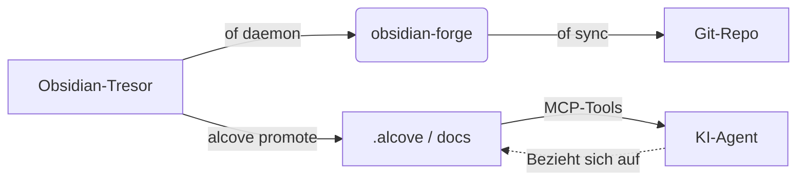

<div align="center">

# ⚒️ obsidian-forge

**Obsidian-Tresor-Generator, Automatisierungs-Daemon und Graph-Verstärker**

[](LICENSE)
[](https://www.rust-lang.org)
[](https://crates.io/crates/obsidian-forge)
[](https://buymeacoffee.com/epicsaga)

**Eine einzige Binärdatei. Mehrere Tresore. Null Konfiguration zum Starten.**

[English](../README.md) · [中文](README_zh-CN.md) · [日本語](README_ja.md) · [한국어](README_ko.md) · [Español](README_es.md) · [Português](README_pt-BR.md) · [Français](README_fr.md) · [Deutsch](README_de.md) · [Русский](README_ru.md) · [Türkçe](README_tr.md)

</div>

---

## Was ist obsidian-forge?

`obsidian-forge` ist eine Rust-CLI, die [Obsidian](https://obsidian.md)-Tresore aufbaut, automatisiert und pflegt. Es läuft als Hintergrund-Daemon, der Ihren Posteingang überwacht, Ihren Wissensgraphen stärkt und mit git synchronisiert — damit Sie sich auf das Schreiben konzentrieren können.

```
of init my-brain          # neuen Tresor in Sekunden aufbauen
of daemon enable         # als macOS-Anmeldeobjekt registrieren
# → Ihr Tresor verarbeitet, verknüpft und committet jetzt automatisch
# "of" ist ein eingebauter Kurzalias für "obsidian-forge"
```

---

## Funktionen

| | Funktion | Beschreibung |
|---|---|---|
| 🏗️ | **Tresor-Aufbau** | PARA-Layout, gebündelte Vorlagen, `.obsidian`-Konfiguration, git-Initialisierung |
| 🔗 | **Graph-Verstärkung** | Rückverweise, Brückennotizen, Links zu verwandten Projekten, automatische Tags |
| 📥 | **Posteingangsverarbeitung** | Frontmatter-Injektion, KI-Klassifizierung, PARA-Routing |
| 🔄 | **Synchronisierungszyklus** | MOC-Neuaufbau → Graph → automatischer git-Commit/Push per Timer |
| 🗂️ | **Multi-Tresor** | Ein Daemon verwaltet alle Tresore; pro Tresor aktivieren, pausieren oder deaktivieren |
| ⚙️ | **Einstellungsspeicher** | Plugins/Themen aus einem Tresor importieren und an alle anderen übertragen |
| 🤖 | **KI-Metadaten** | Ollama, OpenAI, OpenRouter, LM Studio oder beliebiger OpenAI-kompatibler Endpunkt |
| 📄 | **PDF → Markdown** | Konvertierung über `marker_single` mit `pdftotext`-Fallback |
| 🍎 | **Anmeldeobjekt** | Wird als macOS LaunchAgent installiert — automatischer Start und Neustart |
| ♻️ | **Idempotent** | Jede Operation ist beliebig oft sicher ausführbar; keine doppelte Ausgabe |

---

## Installation

### macOS / Linux

```bash
brew install epicsagas/tap/obsidian-forge
```

Kein Homebrew? Verwenden Sie das Installationsskript:

```bash
curl --proto '=https' --tlsv1.2 -LsSf \
  https://github.com/epicsagas/obsidian-forge/releases/latest/download/obsidian-forge-installer.sh | sh
```

### Windows

```powershell
irm https://github.com/epicsagas/obsidian-forge/releases/latest/download/obsidian-forge-installer.ps1 | iex
```

### Via Rust-Werkzeugkette

```bash
cargo binstall obsidian-forge   # vorkompilierte Binärdatei (schnell)
cargo install obsidian-forge    # aus dem Quellcode kompilieren
```

Sowohl `obsidian-forge` als auch `of` (Kurzalias) werden von allen oben genannten Methoden installiert.

> `of --version` zur Überprüfung. Aktualisieren mit `brew upgrade obsidian-forge` oder durch erneutes Ausführen des Installationsskripts.

### Plattformunterstützung

| Plattform | Architektur | Status |
|---|---|---|
| macOS | Apple Silicon (aarch64) | ✅ Vollständig unterstützt |
| macOS | Intel (x86_64) | ✅ Vollständig unterstützt |
| Linux | x86_64 (glibc) | ✅ Vollständig unterstützt |
| Linux | x86_64 (musl/static) | ✅ Vollständig unterstützt |
| Linux | ARM64 (aarch64) | ✅ Vollständig unterstützt |
| Windows | x86_64 (MSVC) | ⚠️ Teilweise unterstützt (kein LaunchAgent) |

### Voraussetzungen

| Werkzeug | Erforderlich | Zweck |
|---|---|---|
| Rust 1.85+ | nur Quellcode-Builds | Kompilieren |
| git | ✅ | Tresor-Versionierung |
| Ollama / OpenAI / OpenRouter / LM Studio | ⬜ optional | KI-Tagging (`process-all`) |
| marker_single | ⬜ optional | Hochwertige PDF-Konvertierung |

---

## Schnellstart

```bash
# 1. Neuen Tresor erstellen
of init my-brain

# 2. In Obsidian öffnen → Datei → Tresor öffnen → my-brain

# 3. In der globalen Konfiguration registrieren
of vault add ~/my-brain

# 4. Hintergrund-Daemon installieren
of daemon enable

# Fertig — Notizen in 00-Inbox/ ablegen und obsidian-forge erledigt den Rest
```

---

## Befehle

### Tresor-Initialisierung

```bash
obsidian-forge init <name>
obsidian-forge init <name> --path ~/vaults
obsidian-forge init <name> --clone-settings-from ~/other-vault

# In einem bestehenden Tresor erneut ausführen, um ihn zu reparieren/zu aktualisieren (idempotent — überschreibt niemals)
obsidian-forge init my-brain --path ~/
```

### Multi-Tresor-Verwaltung

```bash
obsidian-forge vault add <path> [--name <alias>]
obsidian-forge vault remove <name>          # abmelden (Dateien bleiben erhalten)
obsidian-forge vault list                   # NAME / ENABLED / WATCH / PATH
obsidian-forge vault enable  <name>
obsidian-forge vault disable <name>         # von Synchronisierung und Überwachung ausschließen
obsidian-forge vault pause   <name>         # Daemon überspringen; manuelle Synchronisierung möglich
obsidian-forge vault resume  <name>
```

### Einstellungsspeicher

Synchronisiert `.obsidian/`-Plugins, -Themen und -Snippets über alle Tresore.

```bash
obsidian-forge settings import <vault>      # Einstellungen in globalen Speicher importieren
obsidian-forge settings push   <vault>      # globale Einstellungen an einen Tresor übertragen
obsidian-forge settings push-all            # an ALLE registrierten Tresore übertragen
obsidian-forge settings status

# Direktes Klonen zwischen zwei Tresoren
obsidian-forge clone-settings <source> <target>
```

### Graph-Operationen

```bash
obsidian-forge graph health                 # Statistiken und Gesundheitsmetriken anzeigen
obsidian-forge graph orphans [--auto-link]  # Waisen auflisten (oder automatisch mit KI verlinken)
obsidian-forge graph extract [--no-ai]      # Links und Beziehungen extrahieren
obsidian-forge graph tags [--dry-run]       # Tags normalisieren und gruppieren
obsidian-forge graph strengthen             # volle Pipeline ausführen

# Vererbter Alias (führt die volle Pipeline aus)
obsidian-forge strengthen-graph
```

### Einmalige Operationen

```bash
obsidian-forge sync               [--vault <name>]   # MOC → Graph → git
obsidian-forge update-mocs        [--vault <name>]
obsidian-forge process-all        [--vault <name>]   # KI-Posteingangsverarbeitung
obsidian-forge status             [--vault <name>]   # Konfig- und KI-Status anzeigen
obsidian-forge doctor             [--vault <name>]   # Tresorgesundheit diagnostizieren
```

### Hintergrund-Daemon (macOS LaunchAgent)

```bash
obsidian-forge daemon enable     # plist schreiben + Bootstrap (Anmeldeobjekt)
obsidian-forge daemon disable    # Bootout + plist entfernen
obsidian-forge daemon start
obsidian-forge daemon stop
obsidian-forge daemon restart
obsidian-forge daemon status     # zeigt PID, letzten Exit-Code und geplante Tresore
```

> Protokolle → `~/.obsidian-forge/logs/obsidian-forge/forge.log`

### Vordergrund-Überwachung

```bash
obsidian-forge watch              # alle überwachbaren Tresore
obsidian-forge watch --vault <name> --interval <sekunden>
```

---

## Konfiguration

`vault.toml` wird automatisch von `init` erstellt. Jeder Wert hat einen sinnvollen Standardwert.

```toml
[vault]
name            = "my-brain"
layout          = "para"           # einziges derzeit unterstütztes Layout
inbox_dir       = "00-Inbox"
zettelkasten_dir= "10-Zettelkasten"
archive_dir     = "99-Archives"
attachments_dir = "Attachments"
templates_dir   = "obsidian-templates"

[graph]
backlinks        = true
bridge_notes     = true
auto_tags        = true
related_projects = true
# [[graph.concepts]]
# name     = "AI"
# keywords = ["machine learning", "LLM", "neural"]
# tags     = ["ai", "ml"]

[sync]
git_auto_commit  = true
git_auto_push    = true
interval_minutes = 60

[ai]
# provider: ollama | openai | openrouter | lmstudio | openai-compatible
provider = "ollama"
model    = "gemma3"
base_url = "http://192.168.0.28:1234/v1"  # erforderlich für openai-compatible; andere haben Standardwerte
# api_key  = ""                          # optional — Umgebungsvariable wird bevorzugt (siehe unten)

[daemon]
label   = "com.obsidian-forge.watch"
log_dir = "~/.obsidian-forge/logs"
```

**API-Schlüssel** werden in dieser Reihenfolge aufgelöst:

1. `api_key` im Abschnitt `[ai]` (config.toml oder vault.toml) — *vermeiden Sie das Committen von Geheimnissen*
2. Umgebungsvariable (siehe Tabelle unten)
3. Datei `~/.config/obsidian-forge/.env` — **empfohlen** (automatisch geladen, nie committet)

| Anbieter | Umgebungsvariable | Hinweise |
|---|---|---|
| `openai` | `OPENAI_API_KEY` | [Schlüssel holen →](https://platform.openai.com/api-keys) |
| `openrouter` | `OPENROUTER_API_KEY` | [Schlüssel holen →](https://openrouter.ai/keys) |
| `openai-compatible` | `OPENAI_COMPATIBLE_API_KEY` | Fallback auf `OPENAI_API_KEY` |
| `ollama` / `lmstudio` | — | kein Schlüssel erforderlich |

**API-Schlüssel mit `.env` einrichten (empfohlen):**

```bash
# Erstellen Sie die .env-Datei (wird nie in git committet)
cat > ~/.config/obsidian-forge/.env << 'EOF'
# Kommentieren Sie die Zeile(n) Ihres/Ihrer Anbieter aus:
# OPENAI_API_KEY=sk-...
# OPENROUTER_API_KEY=sk-or-...
# OPENAI_COMPATIBLE_API_KEY=...
EOF
```

> Wenn sowohl `OPENAI_COMPATIBLE_API_KEY` als auch `OPENAI_API_KEY` gesetzt sind,
> hat die anbieterspezifische Vorrang. So können Sie `openai` und
> `openai-compatible` gleichzeitig mit verschiedenen Schlüsseln verwenden.

**Konfigurationsauflösung:**

```
$VAULT_PATH                              # Überschreibung per Umgebungsvariable
│
├── Automatische Erkennung (geht von CWD aufwärts)  # sucht nach vault.toml oder 00-Inbox/
│
~/.config/obsidian-forge/config.toml    # global: registrierte Tresore
<vault>/vault.toml                      # tresorspezifische Einstellungen
```

---

## Architektur

```
obsidian-forge/
├── src/
│   ├── main.rs        CLI (clap), Multi-Tresor-Dispatch, Synchronisierungsschleife
│   ├── config.rs      vault.toml + globale Konfigurationsstrukturen
│   ├── init.rs        Tresor-Aufbau, Einstellungen importieren/übertragen
│   ├── moc.rs         MOC-Hub-Datei-Generierung
│   ├── graph/         Graph-Verstärkungs-Pipeline
│   │   ├── mod.rs       Pipeline-Koordinator
│   │   ├── scan.rs      tresorweiter Graph-Scan
│   │   ├── tags.rs      konzeptbasiertes automatisches Tagging
│   │   ├── wikilinks.rs Wikilink-Extraktion und -Injektion
│   │   ├── backlinks.rs Rückverweis-Sektions-Generierung
│   │   ├── bridges.rs   Brückennotizen-Erstellung
│   │   ├── relationships.rs Verknüpfung verwandter Projekte
│   │   ├── orphans.rs   Waisenerkennung
│   │   ├── autotag.rs   Orchestrierung automatischer Tags
│   │   └── health.rs    Graph-Gesundheitsbericht
│   ├── git.rs         automatischer Commit + Push (Conventional Commits)
│   ├── notes.rs       Posteingangsverarbeitung + PARA-Routing
│   ├── converter.rs   PDF → Markdown
│   ├── ai.rs          KI-Client (Ollama + OpenAI-kompatible Anbieter)
│   ├── prompts.rs     LLM-Prompt-Vorlagen
│   └── watcher.rs     Dateisystem-Watcher (notify-Crate)
└── vault.toml         tresorspezifische Konfiguration (von init erstellt)
```

### Ökosystem

obsidian-forge ist das **Partnerprojekt von [alcove](https://github.com/epicsagas/alcove)** — einem MCP-Server, der Projektdokumente für KI-Agenten bereitstellt. Sie teilen sich einen Cargo-Workspace und arbeiten zusammen, um den Kreislauf zwischen persönlichem Wissen und Projektintelligenz zu schließen:

- **obsidian-forge** = **Die Schmiede** (schreiben/pushen). Hintergrund-Daemon, der die Tresor-Pflege automatisiert, den Wissensgraphen stärkt und mit git synchronisiert.
- **alcove** = **Die Bibliothek** (lesen/pullen). MCP-Server, der KI-Agenten On-Demand- und durchsuchbaren Zugriff auf Dokumentationen bietet, ohne das Kontextfenster aufzublähen.



### Integration mit Alcove

Während sich `obsidian-forge` auf den Aufbau und die Automatisierung Ihres Wissensgraphen konzentriert, stellt [Alcove](https://github.com/epicsagas/alcove) sicher, dass dieses Wissen für KI-Coding-Agenten nutzbar ist.

#### Wie man sie zusammen verwendet:

1.  **In Obsidian aufbauen**: Verwenden Sie `obsidian-forge`, um die Gesundheit Ihres Tresors zu erhalten, MOCs zu erstellen und verwandte Konzepte automatisch zu verlinken.
2.  **Zu Projektdokumenten befördern**: Wenn eine Notiz (z. B. eine Architekturentscheidung oder eine Funktionsspezifikation) bereit für ein Projekt ist, führen Sie `alcove promote --source pfad/zu/notiz.md` aus.
3.  **Agenten-Entdeckung**: Ihr KI-Agent (der den Alcove-MCP-Server verwendet) kann diese Notiz nun über `search_project_docs` oder `get_doc_file` "entdecken", anstatt dass Sie sie manuell in den Chat kopieren müssen.
4.  **Richtlinienkonformität**: Verwenden Sie Alcoves `validate_docs`, um sicherzustellen, dass Ihre beförderten Notizen den Dokumentationsstandards des Projekts entsprechen (definiert in `policy.toml`).

---

## Mitwirken

Beiträge sind willkommen! Bitte lesen Sie [CONTRIBUTING.md](../CONTRIBUTING.md), bevor Sie einen Pull Request einreichen.

```bash
git clone https://github.com/epicsagas/obsidian-forge.git
cd obsidian-forge
cargo build
cargo test
```

---

## Links

- 📚 **Dokumentation**: Dieses README + Inline-Code-Dokumentation
- 🐛 **Probleme**: [GitHub Issues](https://github.com/epicsagas/obsidian-forge/issues)
- 💬 **Diskussionen**: [GitHub Discussions](https://github.com/epicsagas/obsidian-forge/discussions)
- 📦 **Crates.io**: [obsidian-forge](https://crates.io/crates/obsidian-forge)

---

## Lizenz

Apache 2.0 © 2026 [epicsagas](https://github.com/epicsagas)
