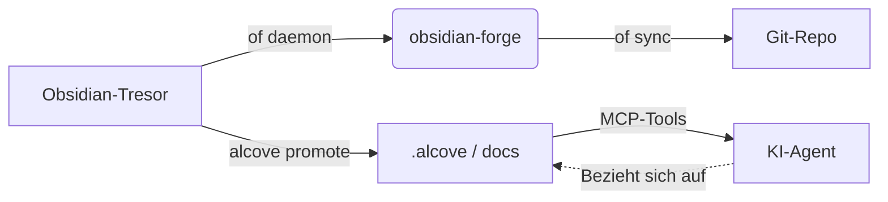

<div align="center">

# ⚒️ obsidian-forge

**Obsidian-Tresor-Generator, Automatisierungs-Daemon und Wartungs-Toolkit**

[](LICENSE)
[](https://www.rust-lang.org)
[](https://crates.io/crates/obsidian-forge)
[](https://buymeacoffee.com/epicsaga)

**Eine einzige Binärdatei. Mehrere Tresore. Null Konfiguration zum Starten.**

[English](../README.md) · [中文](README_zh-CN.md) · [日本語](README_ja.md) · [한국어](README_ko.md) · [Español](README_es.md) · [Português](README_pt-BR.md) · [Français](README_fr.md) · [Deutsch](README_de.md) · [Русский](README_ru.md) · [Türkçe](README_tr.md)

</div>

---

## Was ist obsidian-forge?

`obsidian-forge` ist eine Rust-CLI, die [Obsidian](https://obsidian.md)-Tresore aufbaut, automatisiert und pflegt. Es läuft als Hintergrund-Daemon, der Ihren Posteingang überwacht, die Integrität Ihres Tresors prüft und mit git synchronisiert — damit Sie sich auf das Schreiben konzentrieren können.

```
of init my-brain          # neuen Tresor in Sekunden aufbauen
of daemon enable         # als macOS-Anmeldeobjekt registrieren
# → Ihr Tresor wird jetzt automatisch verarbeitet, auf Gesundheit geprüft und committet
# "of" ist ein eingebauter Kurzalias für "obsidian-forge"
```

---

## Funktionen

| | Funktion | Beschreibung |
|---|---|---|
| 🏗️ | **Tresor-Aufbau** | PARA-Layout, gebündelte Vorlagen, `.obsidian`-Konfiguration, git-Initialisierung |
| 🛡️ | **Tresor-Integrität** | Tag-Prüfungen, Prüfungen auf defekte Links (code-fence-bewusst), Frontmatter-Normalisierung — alles mit `--fix` |
| 📊 | **Graph-Gesundheit** | Metriken zu Notizen/Links/Waisen/defekten Links, die Ihre Lint-Schleife speisen |
| 📥 | **Posteingangsverarbeitung** | Frontmatter-Injektion, KI-Klassifizierung, PARA-Routing |
| 🔄 | **Synchronisierungszyklus** | Graph-Gesundheitsprüfung → automatischer git-Commit/Push per Timer |
| 🗂️ | **Multi-Tresor** | Ein Daemon verwaltet alle Tresore; Pro-Tresor-Flags in der globalen Konfiguration |
| 🤖 | **KI-Metadaten** | Ollama, OpenAI, OpenRouter, LM Studio oder beliebiger OpenAI-kompatibler Endpunkt |
| 📄 | **PDF → Markdown** | Konvertierung über `marker_single` mit `pdftotext`-Fallback |
| 🍎 | **Anmeldeobjekt** | Wird als macOS LaunchAgent installiert — automatischer Start und Neustart |
| ♻️ | **Idempotent** | Jede Operation ist beliebig oft sicher ausführbar; keine doppelte Ausgabe |

---

## Installation

### macOS / Linux

```bash
brew install epicsagas/tap/obsidian-forge
```

Kein Homebrew? Verwenden Sie das Installationsskript:

```bash
curl --proto '=https' --tlsv1.2 -LsSf \
  https://github.com/epicsagas/obsidian-forge/releases/latest/download/install.sh | sh
```

### Windows

```powershell
irm https://github.com/epicsagas/obsidian-forge/releases/latest/download/install.ps1 | iex
```

### Via Rust-Werkzeugkette

```bash
cargo binstall obsidian-forge   # vorkompilierte Binärdatei (schnell)
cargo install obsidian-forge    # aus dem Quellcode kompilieren
cargo install obsidian-forge --features dashboard-ui  # inkl. GUI für `of dashboard`
```

Sowohl `obsidian-forge` als auch `of` (Kurzalias) werden von allen oben genannten Methoden installiert. Das Dashboard wird ausschließlich in Quellcode-Builds mit `--features dashboard-ui` ausgeliefert.

> `of --version` zur Überprüfung. Aktualisieren mit `brew upgrade obsidian-forge` oder durch erneutes Ausführen des Installationsskripts.

### Plattformunterstützung

| Plattform | Architektur | Status |
|---|---|---|
| macOS | Apple Silicon (aarch64) | ✅ Vollständig unterstützt |
| macOS | Intel (x86_64) | ✅ Vollständig unterstützt |
| Linux | x86_64 (glibc) | ✅ Vollständig unterstützt |
| Linux | x86_64 (musl/static) | ✅ Vollständig unterstützt |
| Linux | ARM64 (aarch64) | ✅ Vollständig unterstützt |
| Windows | x86_64 (MSVC) | ⚠️ Teilweise unterstützt (kein LaunchAgent) |

### KI-Agenten-Plugins

obsidian-forge wird mit 4 eingebauten Agenten-Skills geliefert, die KI-Assistenten kontextbewusste Tresor-Operationen bieten:

| Skill | Auslöser |
|-------|---------|
| `vault-health` | Tresor-Gesundheitsprüfung, Tresor diagnostizieren, Tresor-Status |
| `vault-sync` | Tresor synchronisieren, Graph-Gesundheitsprüfung, Tresor-Änderungen committen |
| `inbox-process` | Posteingang verarbeiten, Notizen klassifizieren, PARA-Routing |
| `vault-fix` | Tresor reparieren, Tags reparieren, Links korrigieren, Frontmatter korrigieren |

#### Claude Code

```bash
claude plugin marketplace add epicsagas/plugins
claude plugin install obsidian-forge@epicsagas
```

#### Codex CLI

```bash
codex plugin marketplace add epicsagas/plugins
```

#### Antigravity

```bash
agy plugin install https://github.com/epicsagas/obsidian-forge
```

Nach der Installation löst Ihr KI-Agent automatisch den richtigen Skill aus, wenn Sie nach Tresor-Verwaltung, PARA-Routing, Graph-Operationen oder Daemon-Problemen fragen.

### Voraussetzungen

| Werkzeug | Erforderlich | Zweck |
|---|---|---|
| Rust 1.85+ | nur Quellcode-Builds | Kompilieren |
| git | ✅ | Tresor-Versionierung |
| Ollama / OpenAI / OpenRouter / LM Studio | ⬜ optional | KI-Tagging (`process-all`) |
| marker_single | ⬜ optional | Hochwertige PDF-Konvertierung |

---

## Schnellstart

```bash
# 1. Neuen Tresor erstellen (registriert ihn in der globalen Konfiguration)
of init my-brain

# 2. In Obsidian öffnen → Datei → Tresor öffnen → my-brain

# 3. Hintergrund-Daemon installieren
of daemon enable

# Fertig — Notizen in 00-Inbox/ ablegen und obsidian-forge erledigt den Rest
```

---

## Befehle

### Tresor-Initialisierung

```bash
obsidian-forge init <name>
obsidian-forge init <name> --path ~/vaults
obsidian-forge init <name> --clone-settings-from ~/other-vault

# In einem bestehenden Tresor erneut ausführen, um ihn zu reparieren/zu aktualisieren (idempotent — überschreibt niemals)
obsidian-forge init my-brain --path ~/
```

### Multi-Tresor-Verwaltung

Tresore werden automatisch von `init` registriert (sicheres erneutes Ausführen in einem bestehenden Verzeichnis).
Pro-Tresor-Flags (`enabled`, `watch`) liegen in `~/.config/obsidian-forge/config.toml`:

```toml
[[vaults]]
name    = "my-brain"
path    = "/path/to/my-brain"
enabled = true    # in der Synchronisierung enthalten
watch   = true    # vom Daemon überwacht
```

### Tresor-Integrität & Graph-Operationen

```bash
obsidian-forge check-tags            [--vault <name>]  # fehlende layer/type/project-Tags
obsidian-forge check-tags --fix      [--vault <name>]  # fehlende Tags injizieren
obsidian-forge check-links           [--vault <name>]  # defekte Wikilinks (code-fence-bewusst)
obsidian-forge check-links --fix     [--vault <name>]  # Dateinamen-/Erweiterungsabweichungen korrigieren
obsidian-forge normalize-frontmatter [--vault <name>]  # YAML-Fehlformatierungen
obsidian-forge graph health          [--vault <name>]  # Statistiken und Gesundheitsmetriken anzeigen
```

### Einmalige Operationen

```bash
obsidian-forge sync               [--vault <name>]   # Graph-Gesundheit → git
obsidian-forge process-all        [--vault <name>]   # KI-Posteingangsverarbeitung
obsidian-forge status             [--vault <name>]   # Konfig- und KI-Status anzeigen
obsidian-forge doctor             [--vault <name>]   # Tresorgesundheit diagnostizieren
```

### Hintergrund-Daemon (macOS LaunchAgent)

```bash
obsidian-forge daemon enable     # plist schreiben + Bootstrap (Anmeldeobjekt)
obsidian-forge daemon disable    # Bootout + plist entfernen
obsidian-forge daemon start
obsidian-forge daemon stop
obsidian-forge daemon restart
obsidian-forge daemon status     # zeigt PID, letzten Exit-Code und geplante Tresore
```

> Protokolle → `~/.obsidian-forge/logs/obsidian-forge/forge.log`

### Vordergrund-Überwachung

```bash
obsidian-forge watch              # alle überwachbaren Tresore
obsidian-forge watch --vault <name> --interval <sekunden>
```

### Dashboard

Durchstöbern Sie Ihren Tresor visuell mit dem Desktop-Dashboard (Tauri-2- + Svelte-5-App).

```bash
of dashboard                    # das Dashboard-GUI öffnen
of dashboard --vault <name>     # einen bestimmten Tresor öffnen
```

Jede Notiz wird mit einem **Vitalitätswert**, der **PARA-Zonen**-Klassifizierung und der Graph-Vernetzung angezeigt. Suchen Sie nach Titel, Pfad oder Tags; filtern Sie nach Zone oder Tag; und klappen Sie dann eine Notiz auf, um:

- **ÖFFNEN** — in Obsidian zu öffnen
- **VERWANDTE FINDEN** — graphbasierte verwandte Notizen (Rückverweise + gemeinsame Tags, Top 5)
- **KI FRAGEN** — generiert eine einzeilige Zusammenfassung, Schlüsselfragen und Link-Vorschläge (erfordert KI-Konfiguration)

> **Vorkompilierte Desktop-Builds** sind an jeden [GitHub Release](https://github.com/epicsagas/obsidian-forge/releases) angehängt — laden Sie die Datei für Ihr OS herunter:
> - **macOS** — `Obsidian.Forge.Dashboard_*_aarch64.dmg` (Apple Silicon; Intel aus dem Quellcode)
> - **Linux** — `.AppImage` (als ausführbar markieren: `chmod +x *.AppImage`)
> - **Windows** — `.msi`-Installer
>
> Die Builds sind **unsignt**. Unter macOS umgehen Sie Gatekeeper: `xattr -cr "/Applications/Obsidian Forge Dashboard.app"`. Unter Windows wählen Sie „Weitere Informationen → Trotzdem ausführen", um SmartScreen zu passieren. Lieber aus dem Quellcode? `cargo install obsidian-forge --features dashboard-ui`. Mindestens ein registrierter Tresor ist erforderlich.

---

## Konfiguration

`vault.toml` wird automatisch von `init` erstellt. Jeder Wert hat einen sinnvollen Standardwert.

```toml
[vault]
name            = "my-brain"
layout          = "para"           # einziges derzeit unterstütztes Layout
inbox_dir       = "00-Inbox"
zettelkasten_dir= "10-Zettelkasten"
archive_dir     = "99-Archives"
attachments_dir = "Attachments"
templates_dir   = "obsidian-templates"

# [projects]
# exclude = ["_template"]           # zusätzliche Top-Level-Verzeichnisse, die beim Scannen übersprungen werden
                                    # (Punkt-Verzeichnisse und node_modules werden immer ausgeschlossen)

[sync]
git_auto_commit  = true
git_auto_push    = true
interval_minutes = 60

[ai]
# provider: ollama | openai | openrouter | lmstudio | openai-compatible
provider = "ollama"
model    = "gemma3"
base_url = "http://192.168.0.28:1234/v1"  # erforderlich für openai-compatible; andere haben Standardwerte
# api_key  = ""                          # optional — Umgebungsvariable wird bevorzugt (siehe unten)

[daemon]
label   = "com.obsidian-forge.watch"
log_dir = "~/.obsidian-forge/logs"
```

**API-Schlüssel** werden in dieser Reihenfolge aufgelöst:

1. `api_key` im Abschnitt `[ai]` (config.toml oder vault.toml) — *vermeiden Sie das Committen von Geheimnissen*
2. Umgebungsvariable (siehe Tabelle unten)
3. Datei `~/.config/obsidian-forge/.env` — **empfohlen** (automatisch geladen, nie committet)

| Anbieter | Umgebungsvariable | Hinweise |
|---|---|---|
| `openai` | `OPENAI_API_KEY` | [Schlüssel holen →](https://platform.openai.com/api-keys) |
| `openrouter` | `OPENROUTER_API_KEY` | [Schlüssel holen →](https://openrouter.ai/keys) |
| `openai-compatible` | `OPENAI_COMPATIBLE_API_KEY` | Fallback auf `OPENAI_API_KEY` |
| `ollama` / `lmstudio` | — | kein Schlüssel erforderlich |

**API-Schlüssel mit `.env` einrichten (empfohlen):**

```bash
# Erstellen Sie die .env-Datei (wird nie in git committet)
cat > ~/.config/obsidian-forge/.env << 'EOF'
# Kommentieren Sie die Zeile(n) Ihres/Ihrer Anbieter aus:
# OPENAI_API_KEY=sk-...
# OPENROUTER_API_KEY=sk-or-...
# OPENAI_COMPATIBLE_API_KEY=...
EOF
```

> Wenn sowohl `OPENAI_COMPATIBLE_API_KEY` als auch `OPENAI_API_KEY` gesetzt sind,
> hat die anbieterspezifische Vorrang. So können Sie `openai` und
> `openai-compatible` gleichzeitig mit verschiedenen Schlüsseln verwenden.

**Konfigurationsauflösung:**

```
$VAULT_PATH                              # Überschreibung per Umgebungsvariable
│
├── Automatische Erkennung (geht von CWD aufwärts)  # sucht nach vault.toml oder 00-Inbox/
│
~/.config/obsidian-forge/config.toml    # global: registrierte Tresore
<vault>/vault.toml                      # tresorspezifische Einstellungen
```

---

## Architektur

```
obsidian-forge/
├── src/
│   ├── main.rs        CLI (clap), Multi-Tresor-Dispatch, Synchronisierungsschleife
│   ├── config.rs      vault.toml + globale Konfigurationsstrukturen
│   ├── init.rs        Tresor-Aufbau
│   ├── check_tags.rs  Tag-Gesundheitsprüfungen (--fix)
│   ├── check_links.rs Prüfungen auf defekte Wikilinks (--fix)
│   ├── frontmatter.rs Frontmatter-Normalisierung (--fix)
│   ├── graph/
│   │   ├── wikilinks.rs Wikilink-Extraktion und -Auflösung
│   │   └── health.rs    Graph-Gesundheitsbericht
│   ├── git.rs         automatischer Commit + Push (Conventional Commits)
│   ├── notes.rs       Posteingangsverarbeitung + PARA-Routing
│   ├── converter.rs   PDF → Markdown
│   ├── ai.rs          KI-Client (Ollama + OpenAI-kompatible Anbieter)
│   ├── prompts.rs     LLM-Prompt-Vorlagen
│   └── watcher.rs     Dateisystem-Watcher (notify-Crate)
└── vault.toml         tresorspezifische Konfiguration (von init erstellt)
```

### Ökosystem

obsidian-forge ist das **Partnerprojekt von [alcove](https://github.com/epicsagas/alcove)** — einem MCP-Server, der Projektdokumente für KI-Agenten bereitstellt. Sie teilen sich einen Cargo-Workspace und arbeiten zusammen, um den Kreislauf zwischen persönlichem Wissen und Projektintelligenz zu schließen:

- **obsidian-forge** = **Die Schmiede** (schreiben/pushen). Hintergrund-Daemon, der die Tresor-Pflege automatisiert und mit git synchronisiert.
- **alcove** = **Die Bibliothek** (lesen/pullen). MCP-Server, der KI-Agenten On-Demand- und durchsuchbaren Zugriff auf Dokumentationen bietet, ohne das Kontextfenster aufzublähen.
- **[Velith](https://github.com/epicsagas/Velith)** = **Die Druckerei** (verfassen/veröffentlichen). Eigenständiges KI-gestütztes Buch-Schreib-Toolkit für Entwurf → Bearbeitung → Veröffentlichung.


```mermaid
graph LR
    A[Obsidian-Tresor] -->|of daemon| B(obsidian-forge)
    B -->|of sync| C[Git-Repo]
    A -->|alcove promote| D[.alcove / docs]
    D -->|MCP-Tools| E[KI-Agent]
    E -.->|Bezieht sich auf| D
```

### Integration mit Alcove

Während sich `obsidian-forge` auf die Erhaltung der mechanischen Gesundheit Ihres Tresors konzentriert, stellt [Alcove](https://github.com/epicsagas/alcove) sicher, dass dieses Wissen für KI-Coding-Agenten nutzbar ist.

#### Wie man sie zusammen verwendet:

1.  **In Obsidian aufbauen**: Verwenden Sie `obsidian-forge`, um Ihren Tresor gesund zu halten — Posteingangs-Routing, Integritätsprüfungen, git-Synchronisierung.
2.  **Zu Projektdokumenten befördern**: Wenn eine Notiz (z. B. eine Architekturentscheidung oder eine Funktionsspezifikation) bereit für ein Projekt ist, führen Sie `alcove promote --source pfad/zu/notiz.md` aus.
3.  **Agenten-Entdeckung**: Ihr KI-Agent (der den Alcove-MCP-Server verwendet) kann diese Notiz nun über `search_project_docs` oder `get_doc_file` "entdecken", anstatt dass Sie sie manuell in den Chat kopieren müssen.
4.  **Richtlinienkonformität**: Verwenden Sie Alcoves `validate_docs`, um sicherzustellen, dass Ihre beförderten Notizen den Dokumentationsstandards des Projekts entsprechen (definiert in `policy.toml`).

---

## Mitwirken

Beiträge sind willkommen! Bitte lesen Sie [CONTRIBUTING.md](../CONTRIBUTING.md), bevor Sie einen Pull Request einreichen.

```bash
git clone https://github.com/epicsagas/obsidian-forge.git
cd obsidian-forge
cargo build
cargo test
```

---

## Links

- 📚 **Dokumentation**: Dieses README + Inline-Code-Dokumentation
- 🐛 **Probleme**: [GitHub Issues](https://github.com/epicsagas/obsidian-forge/issues)
- 💬 **Diskussionen**: [GitHub Discussions](https://github.com/epicsagas/obsidian-forge/discussions)
- 📦 **Crates.io**: [obsidian-forge](https://crates.io/crates/obsidian-forge)

---

## Lizenz

Apache 2.0 © 2026 [epicsagas](https://github.com/epicsagas)
