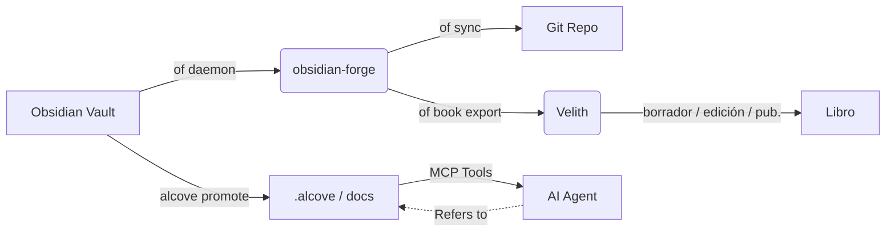

<div align="center">

# ⚒️ obsidian-forge

**Generador de bóvedas Obsidian, demonio de automatización y potenciador de grafos**

[](LICENSE)
[](https://www.rust-lang.org)
[](https://crates.io/crates/obsidian-forge)
[](https://buymeacoffee.com/epicsaga)

**Un solo binario. Múltiples bóvedas. Sin configuración para empezar.**

[English](../README.md) · [中文](README_zh-CN.md) · [日本語](README_ja.md) · [한국어](README_ko.md) · [Español](README_es.md) · [Português](README_pt-BR.md) · [Français](README_fr.md) · [Deutsch](README_de.md) · [Русский](README_ru.md) · [Türkçe](README_tr.md)

</div>

---

## ¿Qué es obsidian-forge?

`obsidian-forge` es una CLI de Rust que construye, automatiza y mantiene bóvedas de [Obsidian](https://obsidian.md). Se ejecuta como un demonio en segundo plano vigilando tu bandeja de entrada, fortaleciendo tu grafo de conocimiento y sincronizando con git — para que puedas centrarte en escribir.

```
of init my-brain          # construye una nueva bóveda en segundos
of daemon enable         # registra como elemento de inicio de macOS
# → tu bóveda ahora se procesa, enlaza y confirma automáticamente
# "of" es un alias corto integrado para "obsidian-forge"
```

---

## Características

| | Característica | Descripción |
|---|---|---|
| 🏗️ | **Construcción de bóvedas** | Estructura PARA, plantillas incluidas, configuración `.obsidian`, inicialización git |
| 🔗 | **Fortalecimiento del grafo** | Backlinks, notas puente, enlaces a proyectos relacionados, etiquetas automáticas |
| 📥 | **Procesamiento de bandeja** | Inyección de frontmatter, clasificación IA, enrutamiento PARA |
| 🔄 | **Ciclo de sincronización** | Reconstrucción MOC → grafo → commit/push git automático por temporizador |
| 🗂️ | **Multi-bóveda** | Un demonio gestiona todas las bóvedas; habilita, pausa o deshabilita por bóveda |
| ⚙️ | **Almacén de configuración** | Importa plugins/temas de una bóveda y los envía a todas las demás |
| 🤖 | **Metadatos IA** | Ollama, OpenAI, OpenRouter, LM Studio o cualquier endpoint compatible con OpenAI |
| 📄 | **PDF → Markdown** | Convierte mediante `marker_single` con `pdftotext` como respaldo |
| 🍎 | **Elemento de inicio** | Se instala como macOS LaunchAgent — se inicia y reinicia automáticamente |
| ♻️ | **Idempotente** | Cualquier operación es segura de ejecutar múltiples veces; sin salida duplicada |
| 📚 | **Proyectos de libro** | Inicializar, rastrear, exportar y sincronizar proyectos de escritura integrados en la bóveda |

---

## Instalación

### macOS / Linux

```bash
brew install epicsagas/tap/obsidian-forge
```

¿No tienes Homebrew? Usa el script de instalación:

```bash
curl --proto '=https' --tlsv1.2 -LsSf \
  https://github.com/epicsagas/obsidian-forge/releases/latest/download/obsidian-forge-installer.sh | sh
```

### Windows

```powershell
irm https://github.com/epicsagas/obsidian-forge/releases/latest/download/obsidian-forge-installer.ps1 | iex
```

### Vía toolchain de Rust

```bash
cargo binstall obsidian-forge   # binario preconstruido (rápido)
cargo install obsidian-forge    # compilar desde el código fuente
```

Todos los métodos anteriores instalan tanto `obsidian-forge` como `of` (alias corto).

> Ejecuta `of --version` para verificar. Actualiza con `brew upgrade obsidian-forge` o vuelve a ejecutar el script de instalación.

### Soporte de plataformas

| Plataforma | Arquitectura | Estado |
|---|---|---|
| macOS | Apple Silicon (aarch64) | ✅ Completamente soportado |
| macOS | Intel (x86_64) | ✅ Completamente soportado |
| Linux | x86_64 (glibc) | ✅ Completamente soportado |
| Linux | x86_64 (musl/static) | ✅ Completamente soportado |
| Linux | ARM64 (aarch64) | ✅ Completamente soportado |
| Windows | x86_64 (MSVC) | ⚠️ Parcialmente soportado (sin LaunchAgent) |

### Plugins de Agente IA

obsidian-forge incluye 5 habilidades de agente integradas que proporcionan a los asistentes de IA operaciones de bóveda con contexto:

| Habilidad | Activador |
|-------|---------|
| `vault-health` | Comprobar salud de bóveda, diagnosticar bóveda, estado de bóveda |
| `vault-sync` | Sincronizar bóveda, actualizar MOCs y grafo, confirmar cambios de bóveda |
| `graph-strengthen` | Fortalecer grafo, salud del grafo, corregir huérfanos |
| `inbox-process` | Procesar bandeja, clasificar notas, enrutamiento PARA |
| `vault-fix` | Reparar bóveda, reparar etiquetas, corregir enlaces, corregir frontmatter |

#### Claude Code

```bash
claude plugin marketplace add epicsagas/plugins
claude plugin install obsidian-forge@epicsagas
```

#### Codex CLI

```bash
codex plugin marketplace add epicsagas/plugins
```

#### Antigravity

```bash
agy plugin install https://github.com/epicsagas/obsidian-forge
```

Una vez instalado, tu agente de IA activa automáticamente la habilidad adecuada cuando preguntas sobre gestión de bóvedas, enrutamiento PARA, operaciones de grafo o problemas del demonio.

### Requisitos previos

| Herramienta | Requerida | Propósito |
|---|---|---|
| Rust 1.85+ | solo compilación desde fuente | Compilación |
| git | ✅ | Versionado de bóvedas |
| Ollama / OpenAI / OpenRouter / LM Studio | ⬜ opcional | Etiquetado IA (`process-all`) |
| marker_single | ⬜ opcional | Conversión PDF de alta calidad |

---

## Inicio rápido

```bash
# 1. Crear una nueva bóveda
of init my-brain

# 2. Abrir en Obsidian → Archivo → Abrir bóveda → my-brain

# 3. Registrarla en la configuración global
of vault add ~/my-brain

# 4. Instalar el demonio en segundo plano
of daemon enable

# Listo — coloca notas en 00-Inbox/ y obsidian-forge se encarga del resto
```

---

## Comandos

### Inicialización de bóvedas

```bash
obsidian-forge init <name>
obsidian-forge init <name> --path ~/vaults
obsidian-forge init <name> --clone-settings-from ~/other-vault

# Reejecutar en una bóveda existente para reparar/actualizar (idempotente — nunca sobrescribe)
obsidian-forge init my-brain --path ~/
```

### Gestión de múltiples bóvedas

```bash
obsidian-forge vault add <path> [--name <alias>]
obsidian-forge vault remove <name>          # desregistrar (archivos conservados)
obsidian-forge vault list                   # NAME / ENABLED / WATCH / PATH
obsidian-forge vault enable  <name>
obsidian-forge vault disable <name>         # excluir de sincronización y vigilancia
obsidian-forge vault pause   <name>         # omitir demonio; sincronización manual ok
obsidian-forge vault resume  <name>
```

### Gestión de configuración

Sincroniza plugins, temas y fragmentos de `.obsidian/` entre bóvedas.

```bash
obsidian-forge settings import <vault>      # importar configuración al almacén global
obsidian-forge settings push   <vault>      # enviar configuración global a una bóveda
obsidian-forge settings push-all            # enviar a TODAS las bóvedas registradas
obsidian-forge settings status

# Clonación directa entre dos bóvedas
obsidian-forge clone-settings <source> <target>
```

### Operaciones de grafo

```bash
obsidian-forge graph health                 # mostrar estadísticas y métricas de salud
obsidian-forge graph orphans [--auto-link]  # listar huérfanos (o auto-enlazar con IA)
obsidian-forge graph extract [--no-ai]      # extraer enlaces y relaciones
obsidian-forge graph tags [--dry-run]       # normalizar y agrupar etiquetas
obsidian-forge graph strengthen             # ejecutar flujo completo

# Alias heredado (ejecuta el flujo completo)
obsidian-forge strengthen-graph
```

### Operaciones únicas

```bash
obsidian-forge sync               [--vault <name>]   # MOC → grafo → git
obsidian-forge update-mocs        [--vault <name>]
obsidian-forge process-all        [--vault <name>]   # procesamiento IA de bandeja
obsidian-forge status             [--vault <name>]   # mostrar estado de config e IA
obsidian-forge doctor             [--vault <name>]   # diagnosticar salud de la bóveda
```

### Demonio en segundo plano (macOS LaunchAgent)

```bash
obsidian-forge daemon enable     # escribir plist + bootstrap (elemento de inicio)
obsidian-forge daemon disable    # bootout + eliminar plist
obsidian-forge daemon start
obsidian-forge daemon stop
obsidian-forge daemon restart
obsidian-forge daemon status     # muestra PID, último código de salida y bóvedas programadas
```

> Registros → `~/.obsidian-forge/logs/obsidian-forge/forge.log`

### Vigilancia en primer plano

```bash
obsidian-forge watch              # todas las bóvedas vigilables
obsidian-forge watch --vault <name> --interval <segundos>
```

### Proyectos de libro

Gestiona proyectos de escritura de libros directamente desde la bóveda.

```bash
of book init <name> [--genre <genre>] [--lang <lang>]   # crear estructura en 01-Projects/
of book status [<name>]                                   # progreso: borrador / edición / publicación
of book export <name> [--output <dir>]                   # exportar para Velith
of book sync   <name>                                     # enlazar notas etiquetadas → sources/
```

Las notas etiquetadas con `book/<name>` en la bóveda se enlazan automáticamente en `sources/` mediante `book sync`.

---

## Configuración

`vault.toml` es creado automáticamente por `init`. Cada valor tiene un valor predeterminado razonable.

```toml
[vault]
name            = "my-brain"
layout          = "para"           # único diseño actualmente soportado
inbox_dir       = "00-Inbox"
zettelkasten_dir= "10-Zettelkasten"
archive_dir     = "99-Archives"
attachments_dir = "Attachments"
templates_dir   = "obsidian-templates"

[graph]
backlinks        = true
bridge_notes     = true
auto_tags        = true
related_projects = true
# [[graph.concepts]]
# name     = "AI"
# keywords = ["machine learning", "LLM", "neural"]
# tags     = ["ai", "ml"]

[sync]
git_auto_commit  = true
git_auto_push    = true
interval_minutes = 60

[ai]
# provider: ollama | openai | openrouter | lmstudio | openai-compatible
provider = "ollama"
model    = "gemma3"
base_url = "http://192.168.0.28:1234/v1"  # requerido para openai-compatible; otros tienen valores por defecto
# api_key  = ""                          # opcional — se prefiere variable de entorno (ver abajo)

[daemon]
label   = "com.obsidian-forge.watch"
log_dir = "~/.obsidian-forge/logs"
```

**Las claves API** se resuelven en este orden:

1. `api_key` en la sección `[ai]` (config.toml o vault.toml) — *evita confirmar secretos*
2. Variable de entorno (ver tabla abajo)
3. Archivo `~/.config/obsidian-forge/.env` — **recomendado** (carga automática, nunca se confirma)

| Proveedor | Variable de entorno | Notas |
|---|---|---|
| `openai` | `OPENAI_API_KEY` | [Obtener clave →](https://platform.openai.com/api-keys) |
| `openrouter` | `OPENROUTER_API_KEY` | [Obtener clave →](https://openrouter.ai/keys) |
| `openai-compatible` | `OPENAI_COMPATIBLE_API_KEY` | retrocede a `OPENAI_API_KEY` |
| `ollama` / `lmstudio` | — | no se necesita clave |

**Configuración de claves API con `.env` (recomendado):**

```bash
# Crea el archivo .env (nunca se confirma a git)
cat > ~/.config/obsidian-forge/.env << 'EOF'
# Descomenta la(s) línea(s) de tu(s) proveedor(es):
# OPENAI_API_KEY=sk-...
# OPENROUTER_API_KEY=sk-or-...
# OPENAI_COMPATIBLE_API_KEY=...
EOF
```

> Si tanto `OPENAI_COMPATIBLE_API_KEY` como `OPENAI_API_KEY` están configuradas,
> la específica del proveedor tiene prioridad. Esto permite usar `openai` y
> `openai-compatible` con claves diferentes simultáneamente.

**Resolución de configuración:**

```
$VAULT_PATH                              # anulación por variable de entorno
│
├── detección automática (sube desde CWD)  # busca vault.toml o 00-Inbox/
│
~/.config/obsidian-forge/config.toml    # global: bóvedas registradas
<vault>/vault.toml                      # configuración por bóveda
```

---

## Arquitectura

```
obsidian-forge/
├── src/
│   ├── main.rs        CLI (clap), despacho multi-bóveda, bucle de sincronización
│   ├── config.rs      vault.toml + estructuras de configuración global
│   ├── init.rs        construcción de bóvedas, importación/envío de configuración
│   ├── moc.rs         generación de archivos hub MOC
│   ├── graph/         Flujo de fortalecimiento del grafo
│   │   ├── mod.rs       coordinador del flujo
│   │   ├── scan.rs      escaneo del grafo en toda la bóveda
│   │   ├── tags.rs      etiquetado automático basado en conceptos
│   │   ├── wikilinks.rs extracción e inyección de wikilinks
│   │   ├── backlinks.rs generación de sección de backlinks
│   │   ├── bridges.rs   creación de notas puente
│   │   ├── relationships.rs enlace de proyectos relacionados
│   │   ├── orphans.rs   detección de notas huérfanas
│   │   ├── autotag.rs   orquestación de etiquetas automáticas
│   │   └── health.rs    informe de salud del grafo
│   ├── git.rs         commit + push automático (commits convencionales)
│   ├── notes.rs       procesamiento de bandeja + enrutamiento PARA
│   ├── converter.rs   PDF → Markdown
│   ├── ai.rs          cliente IA (Ollama, proveedores compatibles con OpenAI)
│   ├── prompts.rs     plantillas de prompts LLM
│   └── watcher.rs     vigilante del sistema de archivos (crate notify)
└── vault.toml         configuración por bóveda (creada por init)
```

### Ecosistema

obsidian-forge es el **proyecto compañero de [alcove](https://github.com/epicsagas/alcove)** — un servidor MCP que sirve documentos de proyecto a agentes IA. Comparten un espacio de trabajo Cargo y trabajan juntos para cerrar el ciclo entre el conocimiento personal y la inteligencia de proyecto:

- **obsidian-forge** = **La Forja** (escribir/empujar). Demonio en segundo plano que automatiza el mantenimiento de la bóveda, fortalece el grafo de conocimiento y sincroniza con git.
- **alcove** = **La Biblioteca** (leer/tirar). Servidor MCP que proporciona a los agentes IA acceso bajo demanda y con capacidad de búsqueda a la documentación sin inflar la ventana de contexto.
- **[Velith](https://github.com/epicsagas/Velith)** = **La Imprenta** (redactar/publicar). Toolkit de escritura de libros asistido por IA que consume el directorio exportado por `of book export` y gestiona el pipeline completo de borrador → edición → publicación.



### Integración con Alcove

Mientras `obsidian-forge` se centra en construir y automatizar tu grafo de conocimiento, [Alcove](https://github.com/epicsagas/alcove) asegura que el conocimiento sea accionable para los agentes de codificación IA.

#### Cómo usarlos juntos:

1.  **Construye en Obsidian**: Usa `obsidian-forge` para mantener la salud de tu bóveda, crear MOCs y auto-enlazar conceptos relacionados.
2.  **Promociona a Documentos de Proyecto**: Cuando una nota (ej. una decisión arquitectónica o una especificación de característica) esté lista para un proyecto, ejecuta `alcove promote --source ruta/a/nota.md`.
3.  **Descubrimiento por el Agente**: Tu agente IA (usando el servidor MCP Alcove) ahora puede "descubrir" esa nota vía `search_project_docs` o `get_doc_file` en lugar de que tú tengas que copiar y pegar en el chat.
4.  **Cumplimiento de Políticas**: Usa `validate_docs` de Alcove para asegurar que tus notas promocionadas cumplan con los estándares de documentación del proyecto (definidos en `policy.toml`).

### Integración con Velith

[Velith](https://github.com/epicsagas/Velith) es el toolkit dedicado de escritura de libros con IA. `obsidian-forge` gestiona el **lado de la bóveda** — organizar notas, etiquetar investigaciones, crear la estructura del proyecto. `Velith` gestiona el **lado de la escritura** — borradores de capítulos, pasadas de edición, empaquetado para publicación.

#### Flujo de trabajo: Bóveda → Libro

```bash
# 1. Etiquetar notas de investigación en la bóveda
#    Añadir "book/mi-libro" a las tags del frontmatter de las notas relevantes

# 2. Inicializar el proyecto de libro
of book init mi-libro --genre non-fiction --lang es

# 3. Sincronizar notas etiquetadas en sources/
of book sync mi-libro

# 4. Exportar a directorio compatible con Velith
of book export mi-libro --output ~/books/

# 5. Transferir a Velith
cd ~/books/mi-libro
Velith draft        # borrador de capítulos con IA desde sources/
Velith edit         # pipeline de edición en múltiples pasadas
Velith publish      # empaquetar EPUB / PDF
```

El directorio exportado contiene `PRD.md` (objetivos), `STYLE.md` (guía de estilo), `drafts/`, `edits/` y `publish/` — exactamente la estructura que `Velith` espera.

---

## Contribuir

¡Las contribuciones son bienvenidas! Por favor, lee [CONTRIBUTING.md](../CONTRIBUTING.md) antes de enviar un pull request.

```bash
git clone https://github.com/epicsagas/obsidian-forge.git
cd obsidian-forge
cargo build
cargo test
```

---

## Enlaces

- 📚 **Documentación**: Este README + documentación en línea de código
- 🐛 **Problemas**: [GitHub Issues](https://github.com/epicsagas/obsidian-forge/issues)
- 💬 **Discusiones**: [GitHub Discussions](https://github.com/epicsagas/obsidian-forge/discussions)
- 📦 **Crates.io**: [obsidian-forge](https://crates.io/crates/obsidian-forge)

---

## Licencia

Apache 2.0 © 2026 [epicsagas](https://github.com/epicsagas)
