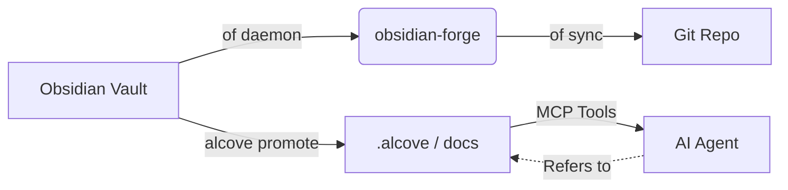

<div align="center">

# ⚒️ obsidian-forge

**Generador de bóvedas Obsidian, demonio de automatización y kit de mantenimiento**

[](LICENSE)
[](https://www.rust-lang.org)
[](https://crates.io/crates/obsidian-forge)
[](https://buymeacoffee.com/epicsaga)

**Un solo binario. Múltiples bóvedas. Sin configuración para empezar.**

[English](../README.md) · [中文](README_zh-CN.md) · [日本語](README_ja.md) · [한국어](README_ko.md) · [Español](README_es.md) · [Português](README_pt-BR.md) · [Français](README_fr.md) · [Deutsch](README_de.md) · [Русский](README_ru.md) · [Türkçe](README_tr.md)

</div>

---

## ¿Qué es obsidian-forge?

`obsidian-forge` es una CLI de Rust que construye, automatiza y mantiene bóvedas de [Obsidian](https://obsidian.md). Se ejecuta como un demonio en segundo plano vigilando tu bandeja de entrada, comprobando la integridad de tu bóveda y sincronizando con git — para que puedas centrarte en escribir.

```
of init my-brain          # construye una nueva bóveda en segundos
of daemon enable         # registra como elemento de inicio de macOS
# → tu bóveda ahora se procesa, comprueba la salud y se confirma automáticamente
# "of" es un alias corto integrado para "obsidian-forge"
```

---

## Características

| | Característica | Descripción |
|---|---|---|
| 🏗️ | **Construcción de bóvedas** | Estructura PARA, plantillas incluidas, configuración `.obsidian`, inicialización git |
| 🛡️ | **Integridad de la bóveda** | Comprobaciones de etiquetas, enlaces rotos (que ignoran los bloques de código) y normalización de frontmatter — todo con `--fix` |
| 📊 | **Salud del grafo** | Métricas de notas/enlaces/huérfanos/enlaces rotos que alimentan tu bucle de lint |
| 📥 | **Procesamiento de bandeja** | Inyección de frontmatter, clasificación IA, enrutamiento PARA |
| 🔄 | **Ciclo de sincronización** | Comprobación de salud del grafo → commit/push git automático por temporizador |
| 🗂️ | **Multi-bóveda** | Un demonio gestiona todas las bóvedas; flags por bóveda en la configuración global |
| 🤖 | **Metadatos IA** | Ollama, OpenAI, OpenRouter, LM Studio o cualquier endpoint compatible con OpenAI |
| 📄 | **PDF → Markdown** | Convierte mediante `marker_single` con `pdftotext` como respaldo |
| 🍎 | **Elemento de inicio** | Se instala como macOS LaunchAgent — se inicia y reinicia automáticamente |
| ♻️ | **Idempotente** | Cualquier operación es segura de ejecutar múltiples veces; sin salida duplicada |

---

## Instalación

### macOS / Linux

```bash
brew install epicsagas/tap/obsidian-forge
```

¿No tienes Homebrew? Usa el script de instalación:

```bash
curl --proto '=https' --tlsv1.2 -LsSf \
  https://github.com/epicsagas/obsidian-forge/releases/latest/download/install.sh | sh
```

### Windows

```powershell
irm https://github.com/epicsagas/obsidian-forge/releases/latest/download/install.ps1 | iex
```

### Vía toolchain de Rust

```bash
cargo binstall obsidian-forge   # binario preconstruido (rápido)
cargo install obsidian-forge    # compilar desde el código fuente
cargo install obsidian-forge --features dashboard-ui  # incluye la GUI de `of dashboard`
```

Todos los métodos anteriores instalan tanto `obsidian-forge` como `of` (alias corto). El panel de control de escritorio solo se incluye en compilaciones desde el código fuente con `--features dashboard-ui`.

> Ejecuta `of --version` para verificar. Actualiza con `brew upgrade obsidian-forge` o vuelve a ejecutar el script de instalación.

### Soporte de plataformas

| Plataforma | Arquitectura | Estado |
|---|---|---|
| macOS | Apple Silicon (aarch64) | ✅ Completamente soportado |
| macOS | Intel (x86_64) | ✅ Completamente soportado |
| Linux | x86_64 (glibc) | ✅ Completamente soportado |
| Linux | x86_64 (musl/static) | ✅ Completamente soportado |
| Linux | ARM64 (aarch64) | ✅ Completamente soportado |
| Windows | x86_64 (MSVC) | ⚠️ Parcialmente soportado (sin LaunchAgent) |

### Plugins de Agente IA

obsidian-forge incluye 4 habilidades de agente integradas que proporcionan a los asistentes de IA operaciones de bóveda con contexto:

| Habilidad | Activador |
|-------|---------|
| `vault-health` | Comprobar salud de bóveda, diagnosticar bóveda, estado de bóveda |
| `vault-sync` | Sincronizar bóveda, comprobación de salud del grafo, confirmar cambios de bóveda |
| `inbox-process` | Procesar bandeja, clasificar notas, enrutamiento PARA |
| `vault-fix` | Reparar bóveda, reparar etiquetas, corregir enlaces, corregir frontmatter |

#### Claude Code

```bash
claude plugin marketplace add epicsagas/plugins
claude plugin install obsidian-forge@epicsagas
```

#### Codex CLI

```bash
codex plugin marketplace add epicsagas/plugins
```

#### Antigravity

```bash
agy plugin install https://github.com/epicsagas/obsidian-forge
```

#### Grok CLI

```bash
grok plugin install epicsagas/obsidian-forge --trust
```

Una vez instalado, tu agente de IA activa automáticamente la habilidad adecuada cuando preguntas sobre gestión de bóvedas, enrutamiento PARA, comprobaciones de integridad o problemas del demonio.

### Requisitos previos

| Herramienta | Requerida | Propósito |
|---|---|---|
| Rust 1.85+ | solo compilación desde fuente | Compilación |
| git | ✅ | Versionado de bóvedas |
| Ollama / OpenAI / OpenRouter / LM Studio | ⬜ opcional | Etiquetado IA (`process-all`) |
| marker_single | ⬜ opcional | Conversión PDF de alta calidad |

---

## Inicio rápido

```bash
# 1. Crear una nueva bóveda (la registra en la configuración global)
of init my-brain

# 2. Abrir en Obsidian → Archivo → Abrir bóveda → my-brain

# 3. Instalar el demonio en segundo plano
of daemon enable

# Listo — coloca notas en 00-Inbox/ y obsidian-forge se encarga del resto
```

---

## Comandos

### Inicialización de bóvedas

```bash
obsidian-forge init <name>
obsidian-forge init <name> --path ~/vaults
obsidian-forge init <name> --clone-settings-from ~/other-vault

# Reejecutar en una bóveda existente para reparar/actualizar (idempotente — nunca sobrescribe)
obsidian-forge init my-brain --path ~/
```

### Gestión de múltiples bóvedas

Las bóvedas se registran automáticamente con `init` (seguro de reejecutar en un directorio existente).
Los flags por bóveda (`enabled`, `watch`) viven en `~/.config/obsidian-forge/config.toml`:

```toml
[[vaults]]
name    = "my-brain"
path    = "/ruta/a/my-brain"
enabled = true    # incluida en la sincronización
watch   = true    # vigilada por el demonio
```

### Operaciones de integridad y grafo

```bash
obsidian-forge check-tags            [--vault <name>]  # etiquetas layer/type/project faltantes
obsidian-forge check-tags --fix      [--vault <name>]  # inyectar etiquetas faltantes
obsidian-forge check-links           [--vault <name>]  # wikilinks rotos (que ignoran los bloques de código)
obsidian-forge check-links --fix     [--vault <name>]  # corregir discordancias de nombre/extensión
obsidian-forge normalize-frontmatter [--vault <name>]  # malformaciones de YAML
obsidian-forge graph health          [--vault <name>]  # estadísticas y métricas de salud
```

### Operaciones únicas

```bash
obsidian-forge sync               [--vault <name>]   # salud del grafo → git
obsidian-forge process-all        [--vault <name>]   # procesamiento IA de bandeja
obsidian-forge status             [--vault <name>]   # mostrar estado de config e IA
obsidian-forge doctor             [--vault <name>]   # diagnosticar salud de la bóveda
```

### Demonio en segundo plano (macOS LaunchAgent)

```bash
obsidian-forge daemon enable     # escribir plist + bootstrap (elemento de inicio)
obsidian-forge daemon disable    # bootout + eliminar plist
obsidian-forge daemon start
obsidian-forge daemon stop
obsidian-forge daemon restart
obsidian-forge daemon status     # muestra PID, último código de salida y bóvedas programadas
```

> Registros → `~/.obsidian-forge/logs/obsidian-forge/forge.log`

### Vigilancia en primer plano

```bash
obsidian-forge watch              # todas las bóvedas vigilables
obsidian-forge watch --vault <name> --interval <segundos>
```

### Panel de control

Explora tu bóveda visualmente con el panel de control de escritorio (app Tauri 2 + Svelte 5).

```bash
of dashboard                    # abrir la GUI del panel de control
of dashboard --vault <name>     # abrir una bóveda específica
```

Cada nota se muestra con una **puntuación de vitalidad**, clasificación de **zona PARA** y conectividad del grafo. Busca por título, ruta o etiquetas; filtra por zona o etiqueta; y luego expande una nota para:

- **ABRIR** — abrirla en Obsidian
- **BUSCAR RELACIONADAS** — notas relacionadas basadas en el grafo (backlinks + etiquetas compartidas, top 5)
- **PREGUNTAR A LA IA** — genera un resumen de una línea, preguntas clave y sugerencias de enlaces (requiere configuración de IA)

> Las **compilaciones de escritorio preconstruidas** se adjuntan a cada [GitHub Release](https://github.com/epicsagas/obsidian-forge/releases) — descarga el archivo correspondiente a tu SO:
> - **macOS** — `Obsidian.Forge.Dashboard_*_aarch64.dmg` (Apple Silicon; Intel desde el código fuente)
> - **Linux** — `.AppImage` (hazlo ejecutable: `chmod +x *.AppImage`)
> - **Windows** — instalador `.msi`
>
> Las compilaciones **no están firmadas**. En macOS, elude Gatekeeper: `xattr -cr "/Applications/Obsidian Forge Dashboard.app"`. En Windows, elige "Más información → Ejecutar de todos modos" para pasar SmartScreen. ¿Prefieres el código fuente? `cargo install obsidian-forge --features dashboard-ui`. Se requiere al menos una bóveda registrada.

---

## Configuración

`vault.toml` es creado automáticamente por `init`. Cada valor tiene un valor predeterminado razonable.

```toml
[vault]
name            = "my-brain"
layout          = "para"           # único diseño actualmente soportado
inbox_dir       = "00-Inbox"
zettelkasten_dir= "10-Zettelkasten"
archive_dir     = "99-Archives"
attachments_dir = "Attachments"
templates_dir   = "obsidian-templates"

# [projects]
# exclude = ["_template"]           # directorios de nivel superior adicionales que se omiten al escanear
                                    # (los que empiezan por punto y node_modules siempre se excluyen)

[sync]
git_auto_commit  = true
git_auto_push    = true
interval_minutes = 60

[ai]
# provider: ollama | openai | openrouter | lmstudio | openai-compatible
provider = "ollama"
model    = "gemma3"
base_url = "http://192.168.0.28:1234/v1"  # requerido para openai-compatible; otros tienen valores por defecto
# api_key  = ""                          # opcional — se prefiere variable de entorno (ver abajo)

[daemon]
label   = "com.obsidian-forge.watch"
log_dir = "~/.obsidian-forge/logs"
```

**Las claves API** se resuelven en este orden:

1. `api_key` en la sección `[ai]` (config.toml o vault.toml) — *evita confirmar secretos*
2. Variable de entorno (ver tabla abajo)
3. Archivo `~/.config/obsidian-forge/.env` — **recomendado** (carga automática, nunca se confirma)

| Proveedor | Variable de entorno | Notas |
|---|---|---|
| `openai` | `OPENAI_API_KEY` | [Obtener clave →](https://platform.openai.com/api-keys) |
| `openrouter` | `OPENROUTER_API_KEY` | [Obtener clave →](https://openrouter.ai/keys) |
| `openai-compatible` | `OPENAI_COMPATIBLE_API_KEY` | retrocede a `OPENAI_API_KEY` |
| `ollama` / `lmstudio` | — | no se necesita clave |

**Configuración de claves API con `.env` (recomendado):**

```bash
# Crea el archivo .env (nunca se confirma a git)
cat > ~/.config/obsidian-forge/.env << 'EOF'
# Descomenta la(s) línea(s) de tu(s) proveedor(es):
# OPENAI_API_KEY=sk-...
# OPENROUTER_API_KEY=sk-or-...
# OPENAI_COMPATIBLE_API_KEY=...
EOF
```

> Si tanto `OPENAI_COMPATIBLE_API_KEY` como `OPENAI_API_KEY` están configuradas,
> la específica del proveedor tiene prioridad. Esto permite usar `openai` y
> `openai-compatible` con claves diferentes simultáneamente.

**Resolución de configuración:**

```
$VAULT_PATH                              # anulación por variable de entorno
│
├── detección automática (sube desde CWD)  # busca vault.toml o 00-Inbox/
│
~/.config/obsidian-forge/config.toml    # global: bóvedas registradas
<vault>/vault.toml                      # configuración por bóveda
```

---

## Arquitectura

```
obsidian-forge/
├── src/
│   ├── main.rs        CLI (clap), despacho multi-bóveda, bucle de sincronización
│   ├── config.rs      vault.toml + estructuras de configuración global
│   ├── init.rs        construcción de bóvedas
│   ├── check_tags.rs  comprobaciones de salud de etiquetas (--fix)
│   ├── check_links.rs comprobaciones de wikilinks rotos (--fix)
│   ├── frontmatter.rs normalización de frontmatter (--fix)
│   ├── graph/
│   │   ├── wikilinks.rs extracción y resolución de wikilinks
│   │   └── health.rs    informe de salud del grafo
│   ├── git.rs         commit + push automático (commits convencionales)
│   ├── notes.rs       procesamiento de bandeja + enrutamiento PARA
│   ├── converter.rs   PDF → Markdown
│   ├── ai.rs          cliente IA (Ollama, proveedores compatibles con OpenAI)
│   ├── prompts.rs     plantillas de prompts LLM
│   └── watcher.rs     vigilante del sistema de archivos (crate notify)
└── vault.toml         configuración por bóveda (creada por init)
```

### Ecosistema

obsidian-forge es el **proyecto compañero de [alcove](https://github.com/epicsagas/alcove)** — un servidor MCP que sirve documentos de proyecto a agentes IA. Comparten un espacio de trabajo Cargo y trabajan juntos para cerrar el ciclo entre el conocimiento personal y la inteligencia de proyecto:

- **obsidian-forge** = **La Forja** (escribir/empujar). Demonio en segundo plano que automatiza el mantenimiento de la bóveda y sincroniza con git.
- **alcove** = **La Biblioteca** (leer/tirar). Servidor MCP que proporciona a los agentes IA acceso bajo demanda y con capacidad de búsqueda a la documentación sin inflar la ventana de contexto.
- **[Velith](https://github.com/epicsagas/Velith)** = **La Imprenta** (redactar/publicar). Toolkit independiente de escritura de libros asistido por IA para el flujo borrador → edición → publicación.


```mermaid
graph LR
    A[Obsidian Vault] -->|of daemon| B(obsidian-forge)
    B -->|of sync| C[Git Repo]
    A -->|alcove promote| D[.alcove / docs]
    D -->|MCP Tools| E[AI Agent]
    E -.->|Refers to| D
```

### Integración con Alcove

Mientras `obsidian-forge` se centra en mantener la salud mecánica de tu bóveda, [Alcove](https://github.com/epicsagas/alcove) asegura que el conocimiento sea accionable para los agentes de codificación IA.

#### Cómo usarlos juntos:

1.  **Construye en Obsidian**: Usa `obsidian-forge` para mantener tu bóveda sana — enrutamiento de bandeja, comprobaciones de integridad, sincronización con git.
2.  **Promociona a Documentos de Proyecto**: Cuando una nota (ej. una decisión arquitectónica o una especificación de característica) esté lista para un proyecto, ejecuta `alcove promote --source ruta/a/nota.md`.
3.  **Descubrimiento por el Agente**: Tu agente IA (usando el servidor MCP Alcove) ahora puede "descubrir" esa nota vía `search_project_docs` o `get_doc_file` en lugar de que tú tengas que copiar y pegar en el chat.
4.  **Cumplimiento de Políticas**: Usa `validate_docs` de Alcove para asegurar que tus notas promocionadas cumplan con los estándares de documentación del proyecto (definidos en `policy.toml`).

---

## Contribuir

¡Las contribuciones son bienvenidas! Por favor, lee [CONTRIBUTING.md](../CONTRIBUTING.md) antes de enviar un pull request.

```bash
git clone https://github.com/epicsagas/obsidian-forge.git
cd obsidian-forge
cargo build
cargo test
```

---

## Enlaces

- 📚 **Documentación**: Este README + documentación en línea de código
- 🐛 **Problemas**: [GitHub Issues](https://github.com/epicsagas/obsidian-forge/issues)
- 💬 **Discusiones**: [GitHub Discussions](https://github.com/epicsagas/obsidian-forge/discussions)
- 📦 **Crates.io**: [obsidian-forge](https://crates.io/crates/obsidian-forge)

---

## Licencia

Apache 2.0 © 2026 [epicsagas](https://github.com/epicsagas)
