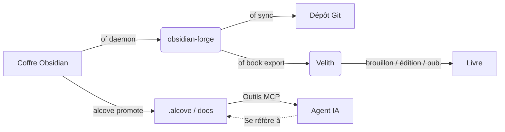

<div align="center">

# ⚒️ obsidian-forge

**Générateur de coffres Obsidian, daemon d'automatisation et renforceur de graphes**

[](LICENSE)
[](https://www.rust-lang.org)
[](https://crates.io/crates/obsidian-forge)
[](https://buymeacoffee.com/epicsaga)

**Un seul binaire. Multi-coffres. Zéro configuration pour démarrer.**

[English](../README.md) · [中文](README_zh-CN.md) · [日本語](README_ja.md) · [한국어](README_ko.md) · [Español](README_es.md) · [Português](README_pt-BR.md) · [Français](README_fr.md) · [Deutsch](README_de.md) · [Русский](README_ru.md) · [Türkçe](README_tr.md)

</div>

---

## Qu'est-ce qu'obsidian-forge ?

`obsidian-forge` est une CLI Rust qui structure, automatise et maintient les coffres [Obsidian](https://obsidian.md). Il fonctionne comme un daemon en arrière-plan qui surveille votre boîte de réception, renforce votre graphe de connaissances et synchronise avec git — afin que vous puissiez vous concentrer sur l'écriture.

```
of init my-brain          # structure un nouveau coffre en quelques secondes
of daemon enable         # enregistre comme élément de connexion macOS
# → votre coffre traite, lie et valide maintenant automatiquement
# "of" est un alias court intégré pour "obsidian-forge"
```

---

## Fonctionnalités

| | Fonctionnalité | Description |
|---|---|---|
| 🏗️ | **Structure de coffre** | Disposition PARA, modèles intégrés, config `.obsidian`, initialisation git |
| 🔗 | **Renforcement du graphe** | Rétroliens, notes de liaison, liens vers projets connexes, tags automatiques |
| 📥 | **Traitement de la boîte de réception** | Injection de frontmatter, classification IA, routage PARA |
| 🔄 | **Cycle de synchronisation** | Reconstruction MOC → graphe → commit/push git automatique sur minuterie |
| 🗂️ | **Multi-coffres** | Un daemon gère tous les coffres ; activer, mettre en pause ou désactiver par coffre |
| ⚙️ | **Magasin de paramètres** | Importer les plugins/thèmes d'un coffre et les pousser vers tous les autres |
| 🤖 | **Métadonnées IA** | Ollama, OpenAI, OpenRouter, LM Studio ou tout endpoint compatible OpenAI |
| 📄 | **PDF → Markdown** | Convertit via `marker_single` avec repli sur `pdftotext` |
| 🍎 | **Élément de connexion** | S'installe comme macOS LaunchAgent — démarrage et redémarrage automatiques |
| ♻️ | **Idempotent** | Toute opération est sûre à exécuter plusieurs fois ; aucune sortie en double |
| 📚 | **Projets de livre** | Initialiser, suivre, exporter et synchroniser des projets d'écriture intégrés au coffre |

---

## Installation

### macOS / Linux

```bash
brew install epicsagas/tap/obsidian-forge
```

Pas de Homebrew ? Utilisez le script d'installation :

```bash
curl --proto '=https' --tlsv1.2 -LsSf \
  https://github.com/epicsagas/obsidian-forge/releases/latest/download/obsidian-forge-installer.sh | sh
```

### Windows

```powershell
irm https://github.com/epicsagas/obsidian-forge/releases/latest/download/obsidian-forge-installer.ps1 | iex
```

### Via la chaîne d'outils Rust

```bash
cargo binstall obsidian-forge   # binaire précompilé (rapide)
cargo install obsidian-forge    # compiler depuis les sources
cargo install obsidian-forge --features dashboard-ui  # inclure l'interface graphique `of dashboard`
```

Les deux commandes `obsidian-forge` et `of` (alias court) sont installées par toutes les méthodes ci-dessus. Le tableau de bord de bureau n'est livré que dans les builds depuis les sources avec `--features dashboard-ui`.

> `of --version` pour vérifier. Mettre à jour avec `brew upgrade obsidian-forge` ou relancer le script d'installation.

### Support des plateformes

| Plateforme | Architecture | État |
|---|---|---|
| macOS | Apple Silicon (aarch64) | ✅ Entièrement supporté |
| macOS | Intel (x86_64) | ✅ Entièrement supporté |
| Linux | x86_64 (glibc) | ✅ Entièrement supporté |
| Linux | x86_64 (musl/statique) | ✅ Entièrement supporté |
| Linux | ARM64 (aarch64) | ✅ Entièrement supporté |
| Windows | x86_64 (MSVC) | ⚠️ Partiellement supporté (pas de LaunchAgent) |

### Plugins d'Agent IA

obsidian-forge est livré avec 5 compétences d'agent intégrées qui offrent aux assistants IA des opérations de coffre adaptées au contexte :

| Compétence | Déclencheur |
|-------|---------|
| `vault-health` | Vérification de santé du coffre, diagnostiquer le coffre, statut du coffre |
| `vault-sync` | Synchroniser le coffre, mettre à jour les MOCs et le graphe, commiter les modifications du coffre |
| `graph-strengthen` | Renforcer le graphe, santé du graphe, corriger les orphelins |
| `inbox-process` | Traiter la boîte de réception, classer les notes, routage PARA |
| `vault-fix` | Réparer le coffre, réparer les tags, corriger les liens, corriger le frontmatter |

#### Claude Code

```bash
claude plugin marketplace add epicsagas/plugins
claude plugin install obsidian-forge@epicsagas
```

#### Codex CLI

```bash
codex plugin marketplace add epicsagas/plugins
```

#### Antigravity

```bash
agy plugin install https://github.com/epicsagas/obsidian-forge
```

Une fois installé, votre agent IA déclenche automatiquement la bonne compétence lorsque vous posez des questions sur la gestion du coffre, le routage PARA, les opérations de graphe ou les problèmes du daemon.

### Prérequis

| Outil | Requis | Objectif |
|---|---|---|
| Rust 1.85+ | builds depuis les sources uniquement | Compilation |
| git | ✅ | Gestion des versions du coffre |
| Ollama / OpenAI / OpenRouter / LM Studio | ⬜ optionnel | Marquage IA (`process-all`) |
| marker_single | ⬜ optionnel | Conversion PDF haute qualité |

---

## Démarrage rapide

```bash
# 1. Créer un nouveau coffre
of init my-brain

# 2. Ouvrir dans Obsidian → Fichier → Ouvrir le coffre → my-brain

# 3. L'enregistrer dans la configuration globale
of vault add ~/my-brain

# 4. Installer le daemon en arrière-plan
of daemon enable

# Terminé — déposez des notes dans 00-Inbox/ et obsidian-forge s'occupe du reste
```

---

## Commandes

### Initialisation du coffre

```bash
obsidian-forge init <name>
obsidian-forge init <name> --path ~/vaults
obsidian-forge init <name> --clone-settings-from ~/other-vault

# Réexécuter sur un coffre existant pour réparer/mettre à niveau (idempotent — n'écrase jamais)
obsidian-forge init my-brain --path ~/
```

### Gestion multi-coffres

```bash
obsidian-forge vault add <path> [--name <alias>]
obsidian-forge vault remove <name>          # désenregistrer (fichiers conservés)
obsidian-forge vault list                   # NAME / ENABLED / WATCH / PATH
obsidian-forge vault enable  <name>
obsidian-forge vault disable <name>         # exclure de la synchronisation et surveillance
obsidian-forge vault pause   <name>         # ignorer le daemon ; synchronisation manuelle ok
obsidian-forge vault resume  <name>
```

### Gestion des paramètres

Synchronise les plugins, thèmes et snippets `.obsidian/` entre les coffres.

```bash
obsidian-forge settings import <vault>      # importer les paramètres dans le magasin global
obsidian-forge settings push   <vault>      # pousser les paramètres globaux vers un coffre
obsidian-forge settings push-all            # pousser vers TOUS les coffres enregistrés
obsidian-forge settings status

# Clone direct entre deux coffres
obsidian-forge clone-settings <source> <target>
```

### Opérations de graphe

```bash
obsidian-forge graph health                 # afficher les statistiques et métriques de santé
obsidian-forge graph orphans [--auto-link]  # lister les orphelins (ou auto-lier avec l'IA)
obsidian-forge graph extract [--no-ai]      # extraire les liens et les relations
obsidian-forge graph tags [--dry-run]       # normaliser et regrouper les tags
obsidian-forge graph strengthen             # exécuter le pipeline complet

# Alias hérité (exécute le pipeline complet)
obsidian-forge strengthen-graph
```

### Opérations ponctuelles

```bash
obsidian-forge sync               [--vault <name>]   # MOC → graphe → git
obsidian-forge update-mocs        [--vault <name>]
obsidian-forge process-all        [--vault <name>]   # traitement IA de la boîte de réception
obsidian-forge status             [--vault <name>]   # afficher l'état de la config et de l'IA
obsidian-forge doctor             [--vault <name>]   # diagnostiquer la santé du coffre
```

### Daemon en arrière-plan (macOS LaunchAgent)

```bash
obsidian-forge daemon enable     # écrire le plist + bootstrap (élément de connexion)
obsidian-forge daemon disable    # bootout + supprimer le plist
obsidian-forge daemon start
obsidian-forge daemon stop
obsidian-forge daemon restart
obsidian-forge daemon status     # affiche le PID, le dernier code de sortie et les coffres planifiés
```

> Journaux → `~/.obsidian-forge/logs/obsidian-forge/forge.log`

### Surveillance en avant-plan

```bash
obsidian-forge watch              # tous les coffres surveillables
obsidian-forge watch --vault <name> --interval <secondes>
```

### Projets de livre

Gérez vos projets d'écriture de livres directement depuis le coffre.

```bash
of book init <name> [--genre <genre>] [--lang <lang>]   # créer la structure dans 01-Projects/
of book status [<name>]                                   # avancement : brouillon / édition / publication
of book export <name> [--output <dir>]                   # exporter pour Velith
of book sync   <name>                                     # lier les notes étiquetées → sources/
```

Les notes du coffre portant le tag `book/<name>` sont automatiquement liées dans `sources/` par `book sync`.

### Tableau de bord

Parcourez votre coffre visuellement avec le tableau de bord de bureau (application Tauri 2 + Svelte 5).

```bash
of dashboard                    # ouvrir l'interface graphique du tableau de bord
of dashboard --vault <name>     # ouvrir un coffre spécifique
```

Chaque note est affichée avec un **score de vitalité**, une classification **zone PARA** et la connectivité du graphe. Recherchez par titre, chemin ou tags ; filtrez par zone ou par tag ; puis déployez une note pour :

- **OUVRIR** — l'ouvrir dans Obsidian
- **TROUVER DES NOTES CONNEXES** — notes connexes basées sur le graphe (rétroliens + tags partagés, top 5)
- **DEMANDER À L'IA** — génère un résumé d'une ligne, des questions clés et des suggestions de liens (nécessite une config IA)

> Le tableau de bord est une fonctionnalité optionnelle `dashboard-ui`, exclue des binaires précompilés. Compilez depuis les sources avec `--features dashboard-ui` (voir Installation). Au moins un coffre enregistré est requis.

---

## Configuration

`vault.toml` est créé automatiquement par `init`. Chaque valeur a une valeur par défaut raisonnable.

```toml
[vault]
name            = "my-brain"
layout          = "para"           # seule disposition actuellement supportée
inbox_dir       = "00-Inbox"
zettelkasten_dir= "10-Zettelkasten"
archive_dir     = "99-Archives"
attachments_dir = "Attachments"
templates_dir   = "obsidian-templates"

[graph]
backlinks        = true
bridge_notes     = true
auto_tags        = true
related_projects = true
# [[graph.concepts]]
# name     = "AI"
# keywords = ["machine learning", "LLM", "neural"]
# tags     = ["ai", "ml"]

[sync]
git_auto_commit  = true
git_auto_push    = true
interval_minutes = 60

[ai]
# provider: ollama | openai | openrouter | lmstudio | openai-compatible
provider = "ollama"
model    = "gemma3"
base_url = "http://192.168.0.28:1234/v1"  # requis pour openai-compatible ; les autres ont des valeurs par défaut
# api_key  = ""                          # optionnel — la variable d'environnement est préférée (voir ci-dessous)

[daemon]
label   = "com.obsidian-forge.watch"
log_dir = "~/.obsidian-forge/logs"
```

**Les clés API** sont résolues dans cet ordre :

1. `api_key` dans la section `[ai]` (config.toml ou vault.toml) — *évitez de valider des secrets*
2. Variable d'environnement (voir tableau ci-dessous)
3. Fichier `~/.config/obsidian-forge/.env` — **recommandé** (chargement automatique, jamais validé)

| Provider | Variable d'environnement | Remarques |
|---|---|---|
| `openai` | `OPENAI_API_KEY` | [Obtenir la clé →](https://platform.openai.com/api-keys) |
| `openrouter` | `OPENROUTER_API_KEY` | [Obtenir la clé →](https://openrouter.ai/keys) |
| `openai-compatible` | `OPENAI_COMPATIBLE_API_KEY` | revient à `OPENAI_API_KEY` |
| `ollama` / `lmstudio` | — | aucune clé requise |

**Configuration des clés API avec `.env` (recommandé) :**

```bash
# Créez le fichier .env (jamais validé dans git)
cat > ~/.config/obsidian-forge/.env << 'EOF'
# Décommentez la/les ligne(s) de votre/vos fournisseur(s) :
# OPENAI_API_KEY=sk-...
# OPENROUTER_API_KEY=sk-or-...
# OPENAI_COMPATIBLE_API_KEY=...
EOF
```

> Si `OPENAI_COMPATIBLE_API_KEY` et `OPENAI_API_KEY` sont toutes les deux définies,
> celle spécifique au fournisseur est prioritaire. Cela permet d'utiliser `openai` et
> `openai-compatible` avec des clés différentes simultanément.

**Résolution de la configuration :**

```
$VAULT_PATH                              # remplacement par variable d'environnement
│
├── détection automatique (remonte depuis le CWD)  # cherche vault.toml ou 00-Inbox/
│
~/.config/obsidian-forge/config.toml    # global : coffres enregistrés
<vault>/vault.toml                      # paramètres par coffre
```

---

## Architecture

```
obsidian-forge/
├── src/
│   ├── main.rs        CLI (clap), dispatch multi-coffres, boucle de synchronisation
│   ├── config.rs      vault.toml + structures de configuration globale
│   ├── init.rs        structure du coffre, import/push de paramètres
│   ├── moc.rs         génération du fichier hub MOC
│   ├── graph/         Pipeline de renforcement du graphe
│   │   ├── mod.rs       coordinateur du pipeline
│   │   ├── scan.rs      scan du graphe dans tout le coffre
│   │   ├── tags.rs      marquage automatique basé sur les concepts
│   │   ├── wikilinks.rs extraction et injection de wikilinks
│   │   ├── backlinks.rs génération de la section des rétroliens
│   │   ├── bridges.rs   création de notes de liaison
│   │   ├── relationships.rs liaison de projets connexes
│   │   ├── orphans.rs   détection de notes orphelines
│   │   ├── autotag.rs   orchestration des tags automatiques
│   │   └── health.rs    rapport sur la santé du graphe
│   ├── git.rs         commit + push automatique (commits conventionnels)
│   ├── notes.rs       traitement de la boîte de réception + routage PARA
│   ├── converter.rs   PDF → Markdown
│   ├── ai.rs          client IA (Ollama, fournisseurs compatibles OpenAI)
│   ├── prompts.rs     modèles de prompts LLM
│   └── watcher.rs     surveillance du système de fichiers (crate notify)
└── vault.toml         configuration par coffre (créée par init)
```

### Écosystème

obsidian-forge est le **projet compagnon d'[alcove](https://github.com/epicsagas/alcove)** — un serveur MCP qui fournit des documents de projet aux agents IA. Ils partagent un espace de travail Cargo et travaillent ensemble pour fermer la boucle entre les connaissances personnelles et l'intelligence de projet :

- **obsidian-forge** = **La Forge** (écrire/pousser). Daemon en arrière-plan qui automatise la maintenance du coffre, renforce le graphe de connaissances et synchronise avec git.
- **alcove** = **La Bibliothèque** (lire/tirer). Serveur MCP qui offre aux agents IA un accès à la demande et recherchable à la documentation sans gonfler la fenêtre de contexte.
- **[Velith](https://github.com/epicsagas/Velith)** = **L'Imprimerie** (rédiger/publier). Toolkit d'écriture de livres assisté par IA qui consomme le répertoire exporté par `of book export` et pilote le pipeline complet brouillon → édition → publication.



### Intégration avec Alcove

Alors qu'`obsidian-forge` se concentre sur la construction et l'automatisation de votre graphe de connaissances, [Alcove](https://github.com/epicsagas/alcove) garantit que ces connaissances sont exploitables pour les agents de codage IA.

#### Comment les utiliser ensemble :

1.  **Construire dans Obsidian** : Utilisez `obsidian-forge` pour maintenir la santé de votre coffre, créer des MOC et lier automatiquement les concepts connexes.
2.  **Promouvoir vers les documents du projet** : Lorsqu'une note (ex : une décision architecturale ou une spécification de fonctionnalité) est prête pour un projet, exécutez `alcove promote --source chemin/vers/note.md`.
3.  **Découverte par l'agent** : Votre agent IA (utilisant le serveur MCP Alcove) peut désormais « découvrir » cette note via `search_project_docs` ou `get_doc_file` au lieu que vous ayez à copier-coller dans le chat.
4.  **Conformité aux politiques** : Utilisez `validate_docs` d'Alcove pour vous assurer que vos notes promues respectent les normes de documentation du projet (définies dans `policy.toml`).

### Intégration avec Velith

[Velith](https://github.com/epicsagas/Velith) est le toolkit dédié à l'écriture de livres avec l'IA. `obsidian-forge` gère le **côté coffre** — organiser les notes, étiqueter les recherches, créer la structure du projet. `Velith` gère le **côté rédaction** — brouillons de chapitres, passes d'édition, packaging pour la publication.

#### Flux de travail : Coffre → Livre

```bash
# 1. Étiqueter les notes de recherche dans le coffre
#    Ajouter "book/mon-livre" aux tags du frontmatter des notes pertinentes

# 2. Initialiser le projet de livre
of book init mon-livre --genre non-fiction --lang fr

# 3. Synchroniser les notes étiquetées dans sources/
of book sync mon-livre

# 4. Exporter vers un répertoire compatible Velith
of book export mon-livre --output ~/books/

# 5. Transférer à Velith
cd ~/books/mon-livre
Velith draft        # rédaction de chapitres par IA depuis sources/
Velith edit         # pipeline d'édition en plusieurs passes
Velith publish      # packaging EPUB / PDF
```

Le répertoire exporté contient `PRD.md` (objectifs), `STYLE.md` (guide de style), `drafts/`, `edits/` et `publish/` — exactement la structure qu'attend `Velith`.

---

## Contribuer

Les contributions sont les bienvenues ! Veuillez lire [CONTRIBUTING.md](../CONTRIBUTING.md) avant de soumettre une pull request.

```bash
git clone https://github.com/epicsagas/obsidian-forge.git
cd obsidian-forge
cargo build
cargo test
```

---

## Liens

- 📚 **Documentation** : Ce README + documentation de code en ligne
- 🐛 **Problèmes** : [GitHub Issues](https://github.com/epicsagas/obsidian-forge/issues)
- 💬 **Discussions** : [GitHub Discussions](https://github.com/epicsagas/obsidian-forge/discussions)
- 📦 **Crates.io** : [obsidian-forge](https://crates.io/crates/obsidian-forge)

---

## Licence

Apache 2.0 © 2026 [epicsagas](https://github.com/epicsagas)
