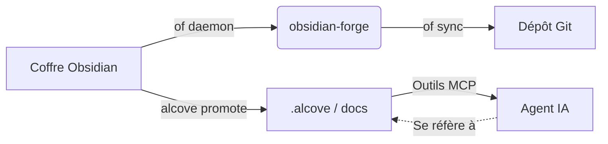

<div align="center">

# ⚒️ obsidian-forge

**Générateur de coffres Obsidian, daemon d'automatisation et boîte à outils de maintenance**

[](LICENSE)
[](https://www.rust-lang.org)
[](https://crates.io/crates/obsidian-forge)
[](https://buymeacoffee.com/epicsaga)

**Un seul binaire. Multi-coffres. Zéro configuration pour démarrer.**

[English](../README.md) · [中文](README_zh-CN.md) · [日本語](README_ja.md) · [한국어](README_ko.md) · [Español](README_es.md) · [Português](README_pt-BR.md) · [Français](README_fr.md) · [Deutsch](README_de.md) · [Русский](README_ru.md) · [Türkçe](README_tr.md)

</div>

---

## Qu'est-ce qu'obsidian-forge ?

`obsidian-forge` est une CLI Rust qui structure, automatise et maintient les coffres [Obsidian](https://obsidian.md). Il fonctionne comme un daemon en arrière-plan qui surveille votre boîte de réception, vérifie l'intégrité de votre coffre et synchronise avec git — afin que vous puissiez vous concentrer sur l'écriture.

```
of init my-brain          # structure un nouveau coffre en quelques secondes
of daemon enable         # enregistre comme élément de connexion macOS
# → votre coffre traite, vérifie la santé et commit maintenant automatiquement
# "of" est un alias court intégré pour "obsidian-forge"
```

---

## Fonctionnalités

| | Fonctionnalité | Description |
|---|---|---|
| 🏗️ | **Structure de coffre** | Disposition PARA, modèles intégrés, config `.obsidian`, initialisation git |
| 🛡️ | **Intégrité du coffre** | Vérification des tags, vérification des liens cassés (en tenant compte des blocs de code), normalisation du frontmatter — tout avec `--fix` |
| 📊 | **Santé du graphe** | Métriques notes/liens/orphelins/liens cassés qui alimentent votre boucle de lint |
| 📥 | **Traitement de la boîte de réception** | Injection de frontmatter, classification IA, routage PARA |
| 🔄 | **Cycle de synchronisation** | Vérification de la santé du graphe → commit/push git automatique sur minuterie |
| 🗂️ | **Multi-coffres** | Un daemon gère tous les coffres ; options par coffre dans la config globale |
| 🤖 | **Métadonnées IA** | Ollama, OpenAI, OpenRouter, LM Studio ou tout endpoint compatible OpenAI |
| 📄 | **PDF → Markdown** | Convertit via `marker_single` avec repli sur `pdftotext` |
| 🍎 | **Élément de connexion** | S'installe comme macOS LaunchAgent — démarrage et redémarrage automatiques |
| ♻️ | **Idempotent** | Toute opération est sûre à exécuter plusieurs fois ; aucune sortie en double |

---

## Installation

### macOS / Linux

```bash
brew install epicsagas/tap/obsidian-forge
```

Pas de Homebrew ? Utilisez le script d'installation :

```bash
curl --proto '=https' --tlsv1.2 -LsSf \
  https://github.com/epicsagas/obsidian-forge/releases/latest/download/install.sh | sh
```

### Windows

```powershell
irm https://github.com/epicsagas/obsidian-forge/releases/latest/download/install.ps1 | iex
```

### Via la chaîne d'outils Rust

```bash
cargo binstall obsidian-forge   # binaire précompilé (rapide)
cargo install obsidian-forge    # compiler depuis les sources
cargo install obsidian-forge --features dashboard-ui  # inclure l'interface graphique `of dashboard`
```

Les deux commandes `obsidian-forge` et `of` (alias court) sont installées par toutes les méthodes ci-dessus. Le tableau de bord de bureau n'est livré que dans les builds depuis les sources avec `--features dashboard-ui`.

> `of --version` pour vérifier. Mettre à jour avec `brew upgrade obsidian-forge` ou relancer le script d'installation.

### Support des plateformes

| Plateforme | Architecture | État |
|---|---|---|
| macOS | Apple Silicon (aarch64) | ✅ Entièrement supporté |
| macOS | Intel (x86_64) | ✅ Entièrement supporté |
| Linux | x86_64 (glibc) | ✅ Entièrement supporté |
| Linux | x86_64 (musl/statique) | ✅ Entièrement supporté |
| Linux | ARM64 (aarch64) | ✅ Entièrement supporté |
| Windows | x86_64 (MSVC) | ⚠️ Partiellement supporté (pas de LaunchAgent) |

### Plugins d'Agent IA

obsidian-forge est livré avec 4 compétences d'agent intégrées qui offrent aux assistants IA des opérations de coffre adaptées au contexte :

| Compétence | Déclencheur |
|-------|---------|
| `vault-health` | Vérification de santé du coffre, diagnostiquer le coffre, statut du coffre |
| `vault-sync` | Synchroniser le coffre, vérifier la santé du graphe, commiter les modifications du coffre |
| `inbox-process` | Traiter la boîte de réception, classer les notes, routage PARA |
| `vault-fix` | Réparer le coffre, réparer les tags, corriger les liens, corriger le frontmatter |

#### Claude Code

```bash
claude plugin marketplace add epicsagas/plugins
claude plugin install obsidian-forge@epicsagas
```

#### Codex CLI

```bash
codex plugin marketplace add epicsagas/plugins
```

#### Antigravity

```bash
agy plugin install https://github.com/epicsagas/obsidian-forge
```

Une fois installé, votre agent IA déclenche automatiquement la bonne compétence lorsque vous posez des questions sur la gestion du coffre, le routage PARA, les opérations de graphe ou les problèmes du daemon.

### Prérequis

| Outil | Requis | Objectif |
|---|---|---|
| Rust 1.85+ | builds depuis les sources uniquement | Compilation |
| git | ✅ | Gestion des versions du coffre |
| Ollama / OpenAI / OpenRouter / LM Studio | ⬜ optionnel | Marquage IA (`process-all`) |
| marker_single | ⬜ optionnel | Conversion PDF haute qualité |

---

## Démarrage rapide

```bash
# 1. Créer un nouveau coffre (l'enregistre dans la configuration globale)
of init my-brain

# 2. Ouvrir dans Obsidian → Fichier → Ouvrir le coffre → my-brain

# 3. Installer le daemon en arrière-plan
of daemon enable

# Terminé — déposez des notes dans 00-Inbox/ et obsidian-forge s'occupe du reste
```

---

## Commandes

### Initialisation du coffre

```bash
obsidian-forge init <name>
obsidian-forge init <name> --path ~/vaults
obsidian-forge init <name> --clone-settings-from ~/other-vault

# Réexécuter sur un coffre existant pour réparer/mettre à niveau (idempotent — n'écrase jamais)
obsidian-forge init my-brain --path ~/
```

### Gestion multi-coffres

Les coffres sont enregistrés automatiquement par `init` (ré-exécution sans risque sur un répertoire existant).
Les options par coffre (`enabled`, `watch`) se trouvent dans `~/.config/obsidian-forge/config.toml` :

```toml
[[vaults]]
name    = "my-brain"
path    = "/chemin/vers/my-brain"
enabled = true    # inclus dans la synchronisation
watch   = true    # surveillé par le daemon
```

### Intégrité du coffre et opérations de graphe

```bash
obsidian-forge check-tags            [--vault <name>]  # tags layer/type/project manquants
obsidian-forge check-tags --fix      [--vault <name>]  # injecter les tags manquants
obsidian-forge check-links           [--vault <name>]  # wikilinks cassés (blocs de code ignorés)
obsidian-forge check-links --fix     [--vault <name>]  # corriger les incohérences nom de fichier/extension
obsidian-forge normalize-frontmatter [--vault <name>]  # malformations YAML
obsidian-forge graph health          [--vault <name>]  # statistiques et métriques de santé
```

### Opérations ponctuelles

```bash
obsidian-forge sync               [--vault <name>]   # santé du graphe → git
obsidian-forge process-all        [--vault <name>]   # traitement IA de la boîte de réception
obsidian-forge status             [--vault <name>]   # afficher l'état de la config et de l'IA
obsidian-forge doctor             [--vault <name>]   # diagnostiquer la santé du coffre
```

### Daemon en arrière-plan (macOS LaunchAgent)

```bash
obsidian-forge daemon enable     # écrire le plist + bootstrap (élément de connexion)
obsidian-forge daemon disable    # bootout + supprimer le plist
obsidian-forge daemon start
obsidian-forge daemon stop
obsidian-forge daemon restart
obsidian-forge daemon status     # affiche le PID, le dernier code de sortie et les coffres planifiés
```

> Journaux → `~/.obsidian-forge/logs/obsidian-forge/forge.log`

### Surveillance en avant-plan

```bash
obsidian-forge watch              # tous les coffres surveillables
obsidian-forge watch --vault <name> --interval <secondes>
```

### Tableau de bord

Parcourez votre coffre visuellement avec le tableau de bord de bureau (application Tauri 2 + Svelte 5).

```bash
of dashboard                    # ouvrir l'interface graphique du tableau de bord
of dashboard --vault <name>     # ouvrir un coffre spécifique
```

Chaque note est affichée avec un **score de vitalité**, une classification **zone PARA** et la connectivité du graphe. Recherchez par titre, chemin ou tags ; filtrez par zone ou par tag ; puis déployez une note pour :

- **OUVRIR** — l'ouvrir dans Obsidian
- **TROUVER DES NOTES CONNEXES** — notes connexes basées sur le graphe (rétroliens + tags partagés, top 5)
- **DEMANDER À L'IA** — génère un résumé d'une ligne, des questions clés et des suggestions de liens (nécessite une config IA)

> Les **builds de bureau précompilés** sont joints à chaque [GitHub Release](https://github.com/epicsagas/obsidian-forge/releases) — récupérez le fichier correspondant à votre OS :
> - **macOS** — `Obsidian.Forge.Dashboard_*_aarch64.dmg` (Apple Silicon ; Intel à partir des sources)
> - **Linux** — `.AppImage` (rendez-le exécutable : `chmod +x *.AppImage`)
> - **Windows** — installateur `.msi`
>
> Les builds **ne sont pas signés**. Sur macOS, contournez Gatekeeper : `xattr -cr "/Applications/Obsidian Forge Dashboard.app"`. Sur Windows, choisissez « Plus d'infos → Exécuter quand même » pour passer SmartScreen. Vous préférez la source ? `cargo install obsidian-forge --features dashboard-ui`. Au moins un coffre enregistré est requis.

---

## Configuration

`vault.toml` est créé automatiquement par `init`. Chaque valeur a une valeur par défaut raisonnable.

```toml
[vault]
name            = "my-brain"
layout          = "para"           # seule disposition actuellement supportée
inbox_dir       = "00-Inbox"
zettelkasten_dir= "10-Zettelkasten"
archive_dir     = "99-Archives"
attachments_dir = "Attachments"
templates_dir   = "obsidian-templates"

# [projects]
# exclude = ["_template"]           # répertoires de premier niveau supplémentaires à ignorer lors du scan
                                    # (les répertoires cachés et node_modules sont toujours exclus)

[sync]
git_auto_commit  = true
git_auto_push    = true
interval_minutes = 60

[ai]
# provider: ollama | openai | openrouter | lmstudio | openai-compatible
provider = "ollama"
model    = "gemma3"
base_url = "http://192.168.0.28:1234/v1"  # requis pour openai-compatible ; les autres ont des valeurs par défaut
# api_key  = ""                          # optionnel — la variable d'environnement est préférée (voir ci-dessous)

[daemon]
label   = "com.obsidian-forge.watch"
log_dir = "~/.obsidian-forge/logs"
```

**Les clés API** sont résolues dans cet ordre :

1. `api_key` dans la section `[ai]` (config.toml ou vault.toml) — *évitez de valider des secrets*
2. Variable d'environnement (voir tableau ci-dessous)
3. Fichier `~/.config/obsidian-forge/.env` — **recommandé** (chargement automatique, jamais validé)

| Provider | Variable d'environnement | Remarques |
|---|---|---|
| `openai` | `OPENAI_API_KEY` | [Obtenir la clé →](https://platform.openai.com/api-keys) |
| `openrouter` | `OPENROUTER_API_KEY` | [Obtenir la clé →](https://openrouter.ai/keys) |
| `openai-compatible` | `OPENAI_COMPATIBLE_API_KEY` | revient à `OPENAI_API_KEY` |
| `ollama` / `lmstudio` | — | aucune clé requise |

**Configuration des clés API avec `.env` (recommandé) :**

```bash
# Créez le fichier .env (jamais validé dans git)
cat > ~/.config/obsidian-forge/.env << 'EOF'
# Décommentez la/les ligne(s) de votre/vos fournisseur(s) :
# OPENAI_API_KEY=sk-...
# OPENROUTER_API_KEY=sk-or-...
# OPENAI_COMPATIBLE_API_KEY=...
EOF
```

> Si `OPENAI_COMPATIBLE_API_KEY` et `OPENAI_API_KEY` sont toutes les deux définies,
> celle spécifique au fournisseur est prioritaire. Cela permet d'utiliser `openai` et
> `openai-compatible` avec des clés différentes simultanément.

**Résolution de la configuration :**

```
$VAULT_PATH                              # remplacement par variable d'environnement
│
├── détection automatique (remonte depuis le CWD)  # cherche vault.toml ou 00-Inbox/
│
~/.config/obsidian-forge/config.toml    # global : coffres enregistrés
<vault>/vault.toml                      # paramètres par coffre
```

---

## Architecture

```
obsidian-forge/
├── src/
│   ├── main.rs        CLI (clap), dispatch multi-coffres, boucle de synchronisation
│   ├── config.rs      vault.toml + structures de configuration globale
│   ├── init.rs        structure du coffre
│   ├── check_tags.rs  vérifications de santé des tags (--fix)
│   ├── check_links.rs vérification des wikilinks cassés (--fix)
│   ├── frontmatter.rs normalisation du frontmatter (--fix)
│   ├── graph/
│   │   ├── wikilinks.rs extraction et résolution des wikilinks
│   │   └── health.rs    rapport sur la santé du graphe
│   ├── git.rs         commit + push automatique (commits conventionnels)
│   ├── notes.rs       traitement de la boîte de réception + routage PARA
│   ├── converter.rs   PDF → Markdown
│   ├── ai.rs          client IA (Ollama, fournisseurs compatibles OpenAI)
│   ├── prompts.rs     modèles de prompts LLM
│   └── watcher.rs     surveillance du système de fichiers (crate notify)
└── vault.toml         configuration par coffre (créée par init)
```

### Écosystème

obsidian-forge est le **projet compagnon d'[alcove](https://github.com/epicsagas/alcove)** — un serveur MCP qui fournit des documents de projet aux agents IA. Ils partagent un espace de travail Cargo et travaillent ensemble pour fermer la boucle entre les connaissances personnelles et l'intelligence de projet :

- **obsidian-forge** = **La Forge** (écrire/pousser). Daemon en arrière-plan qui automatise la maintenance du coffre et synchronise avec git.
- **alcove** = **La Bibliothèque** (lire/tirer). Serveur MCP qui offre aux agents IA un accès à la demande et recherchable à la documentation sans gonfler la fenêtre de contexte.
- **[Velith](https://github.com/epicsagas/Velith)** = **L'Imprimerie** (rédiger/publier). Toolkit autonome d'écriture de livres assisté par IA, pour la rédaction → l'édition → la publication.


```mermaid
graph LR
    A[Coffre Obsidian] -->|of daemon| B(obsidian-forge)
    B -->|of sync| C[Dépôt Git]
    A -->|alcove promote| D[.alcove / docs]
    D -->|Outils MCP| E[Agent IA]
    E -.->|Se réfère à| D
```

### Intégration avec Alcove

Alors qu'`obsidian-forge` se concentre sur le maintien de la santé mécanique de votre coffre, [Alcove](https://github.com/epicsagas/alcove) garantit que ces connaissances sont exploitables pour les agents de codage IA.

#### Comment les utiliser ensemble :

1.  **Construire dans Obsidian** : Utilisez `obsidian-forge` pour garder votre coffre en bonne santé — routage de la boîte de réception, vérifications d'intégrité, synchronisation git.
2.  **Promouvoir vers les documents du projet** : Lorsqu'une note (ex : une décision architecturale ou une spécification de fonctionnalité) est prête pour un projet, exécutez `alcove promote --source chemin/vers/note.md`.
3.  **Découverte par l'agent** : Votre agent IA (utilisant le serveur MCP Alcove) peut désormais « découvrir » cette note via `search_project_docs` ou `get_doc_file` au lieu que vous ayez à copier-coller dans le chat.
4.  **Conformité aux politiques** : Utilisez `validate_docs` d'Alcove pour vous assurer que vos notes promues respectent les normes de documentation du projet (définies dans `policy.toml`).

---

## Contribuer

Les contributions sont les bienvenues ! Veuillez lire [CONTRIBUTING.md](../CONTRIBUTING.md) avant de soumettre une pull request.

```bash
git clone https://github.com/epicsagas/obsidian-forge.git
cd obsidian-forge
cargo build
cargo test
```

---

## Liens

- 📚 **Documentation** : Ce README + documentation de code en ligne
- 🐛 **Problèmes** : [GitHub Issues](https://github.com/epicsagas/obsidian-forge/issues)
- 💬 **Discussions** : [GitHub Discussions](https://github.com/epicsagas/obsidian-forge/discussions)
- 📦 **Crates.io** : [obsidian-forge](https://crates.io/crates/obsidian-forge)

---

## Licence

Apache 2.0 © 2026 [epicsagas](https://github.com/epicsagas)
