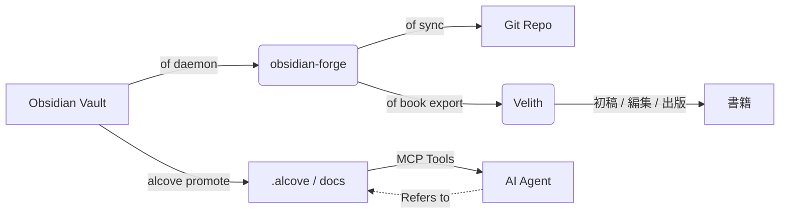

<div align="center">

# ⚒️ obsidian-forge

**Obsidian vault generator, automation daemon, and graph strengthener**

[](LICENSE)
[](https://www.rust-lang.org)
[](https://crates.io/crates/obsidian-forge)
[](https://buymeacoffee.com/epicsaga)

**Single binary. Multi-vault. Zero config to get started.**

[English](../README.md) · [中文](README_zh-CN.md) · [日本語](README_ja.md) · [한국어](README_ko.md) · [Español](README_es.md) · [Português](README_pt-BR.md) · [Français](README_fr.md) · [Deutsch](README_de.md) · [Русский](README_ru.md) · [Türkçe](README_tr.md)

</div>

---

## obsidian-forgeとは？

`obsidian-forge`は[Obsidian](https://obsidian.md) vaultのスキャフォルディング、自動化、保守を行うRust CLIツールです。バックグラウンドデーモンとして動作し、インボックスを監視し、ナレッジグラフを強化し、gitに同期します — あなたは執筆に集中できます。

```
of init my-brain          # 数秒で新しいvaultをスキャフォールド
of daemon enable         # macOSログイン項目として登録
# → vaultが自動処理、自動リンク、自動コミットされるようになります
# "of"は"obsidian-forge"の組み込みショートカットエイリアスです
```

---

## 機能

| | 機能 | 説明 |
|---|---|---|
| 🏗️ | **Vaultスキャフォルディング** | PARAレイアウト、バンドルテンプレート、`.obsidian`設定、git初期化 |
| 🔗 | **グラフ強化** | バックリンク、ブリッジノート、関連プロジェクトリンク、自動タグ |
| 📥 | **インボックス処理** | フロントマター注入、AI分類、PARAルーティング |
| 🔄 | **同期サイクル** | MOC再構築 → グラフ → タイマーベースの自動gitコミット/プッシュ |
| 🗂️ | **マルチvault** | 1つのデーモンがすべてのvaultを管理。vaultごとに有効化、一時停止、無効化 |
| ⚙️ | **設定ストア** | 1つのvaultからプラグイン/テーマをインポートし、他のすべてのvaultにプッシュ |
| 🤖 | **AIメタデータ** | Ollama、OpenAI、OpenRouter、LM Studio、またはOpenAI互換エンドポイント |
| 📄 | **PDF → Markdown** | `marker_single`による変換、`pdftotext`フォールバック対応 |
| 🍎 | **ログイン項目** | macOS LaunchAgentとしてインストール — 自動起動、自動再起動 |
| ♻️ | **冪等性** | どの操作も複数回実行しても安全。重複出力なし |
| 📚 | **書籍プロジェクト** | vault統合執筆プロジェクトの初期化、追跡、エクスポート、ソース同期 |

---

## インストール

### macOS / Linux

```bash
brew install epicsagas/tap/obsidian-forge
```

Homebrewがない場合はインストーラースクリプトを使用してください:

```bash
curl --proto '=https' --tlsv1.2 -LsSf \
  https://github.com/epicsagas/obsidian-forge/releases/latest/download/obsidian-forge-installer.sh | sh
```

### Windows

```powershell
irm https://github.com/epicsagas/obsidian-forge/releases/latest/download/obsidian-forge-installer.ps1 | iex
```

### Rustツールチェーン経由

```bash
cargo binstall obsidian-forge   # プリビルドバイナリ（高速）
cargo install obsidian-forge    # ソースからビルド
cargo install obsidian-forge --features dashboard-ui  # `of dashboard` GUIを同梱
```

上記のすべての方法で`obsidian-forge`と`of`（ショートカットエイリアス）がインストールされます。なお、デスクトップダッシュボードは`--features dashboard-ui`を指定したソースビルドでのみ提供され、プリビルドバイナリには含まれません。

> `of --version`で確認。更新は`brew upgrade obsidian-forge`またはインストーラースクリプトの再実行。

### プラットフォームサポート

| プラットフォーム | アーキテクチャ | ステータス |
|---|---|---|
| macOS | Apple Silicon (aarch64) | ✅ 完全サポート |
| macOS | Intel (x86_64) | ✅ 完全サポート |
| Linux | x86_64 (glibc) | ✅ 完全サポート |
| Linux | x86_64 (musl/static) | ✅ 完全サポート |
| Linux | ARM64 (aarch64) | ✅ 完全サポート |
| Windows | x86_64 (MSVC) | ⚠️ 部分サポート（LaunchAgentなし） |

### AIエージェントプラグイン

obsidian-forgeには、AIアシスタントにコンテキスト認識のボールト操作を提供する5つの組み込みエージェントスキルが含まれています:

| スキル | トリガー |
|-------|---------|
| `vault-health` | ボールトヘルスチェック、ボールト診断、ボールトステータス |
| `vault-sync` | ボールト同期、MOCとグラフの更新、ボールト変更のコミット |
| `graph-strengthen` | グラフ強化、グラフヘルス、孤立ノートの修正 |
| `inbox-process` | インボックス処理、ノート分類、PARAルーティング |
| `vault-fix` | ボールト修正、タグ修復、リンク修正、フロントマター修正 |

#### Claude Code

```bash
claude plugin marketplace add epicsagas/plugins
claude plugin install obsidian-forge@epicsagas
```

#### Codex CLI

```bash
codex plugin marketplace add epicsagas/plugins
```

#### Antigravity

```bash
agy plugin install https://github.com/epicsagas/obsidian-forge
```

インストール後、ボールト管理、PARAルーティング、グラフ操作、またはデーモンの問題について尋ねると、AIエージェントが自動的に適切なスキルをトリガーします。

### 前提条件

| ツール | 必須 | 目的 |
|---|---|---|
| Rust 1.85+ | ソースビルドのみ | コンパイル |
| git | ✅ | vaultバージョン管理 |
| Ollama / OpenAI / OpenRouter / LM Studio | ⬜ オプション | AIタギング（`process-all`） |
| marker_single | ⬜ オプション | 高品質PDF変換 |

---

## クイックスタート

```bash
# 1. 新しいvaultを作成
of init my-brain

# 2. Obsidianで開く → ファイル → Vaultを開く → my-brain

# 3. グローバル設定に登録
of vault add ~/my-brain

# 4. バックグラウンドデーモンをインストール
of daemon enable

# 完了 — 00-Inbox/にノートを置くと、obsidian-forgeが残りを処理します
```

---

## コマンド

### Vault初期化

```bash
obsidian-forge init <name>
obsidian-forge init <name> --path ~/vaults
obsidian-forge init <name> --clone-settings-from ~/other-vault

# 既存のvaultで再実行して修復/アップグレード（冪等 — 上書きしない）
obsidian-forge init my-brain --path ~/
```

### マルチvault管理

```bash
obsidian-forge vault add <path> [--name <alias>]
obsidian-forge vault remove <name>          # 登録解除（ファイルは保持）
obsidian-forge vault list                   # NAME / ENABLED / WATCH / PATH
obsidian-forge vault enable  <name>
obsidian-forge vault disable <name>         # 同期と監視から除外
obsidian-forge vault pause   <name>         # デーモンスキップ。手動同期は可能
obsidian-forge vault resume  <name>
```

### 設定管理

すべてのvaultにわたり`.obsidian/`プラグイン、テーマ、スニペットを同期します。

```bash
obsidian-forge settings import <vault>      # 設定をグローバルストアにインポート
obsidian-forge settings push   <vault>      # グローバル設定を1つのvaultにプッシュ
obsidian-forge settings push-all            # 登録されたすべてのvaultにプッシュ
obsidian-forge settings status

# 2つのvault間で直接設定をクローン
obsidian-forge clone-settings <source> <target>
```

### グラフ操作

```bash
obsidian-forge graph health                 # 統計とヘルスメトリクスを表示
obsidian-forge graph orphans [--auto-link]  # 孤立ノートの一覧表示（またはAI自動リンク）
obsidian-forge graph extract [--no-ai]      # リンクと関係を抽出
obsidian-forge graph tags [--dry-run]       # タグの正規化とクラスタリング
obsidian-forge graph strengthen             # フルパイプライン実行

# レガシーエイリアス（フルパイプライン実行）
obsidian-forge strengthen-graph
```

### 単発操作

```bash
obsidian-forge sync               [--vault <name>]   # MOC → グラフ → git
obsidian-forge update-mocs        [--vault <name>]
obsidian-forge process-all        [--vault <name>]   # AIインボックス処理
obsidian-forge status             [--vault <name>]   # 設定とAIステータスを表示
obsidian-forge doctor             [--vault <name>]   # vaultヘルス診断
```

### バックグラウンドデーモン（macOS LaunchAgent）

```bash
obsidian-forge daemon enable     # plist書き込み + ブートストラップ（ログイン項目）
obsidian-forge daemon disable    # ブートアウト + plist削除
obsidian-forge daemon start
obsidian-forge daemon stop
obsidian-forge daemon restart
obsidian-forge daemon status     # PID、最終終了コード、スケジュールされたvaultを表示
```

> ログ → `~/.obsidian-forge/logs/obsidian-forge/forge.log`

### フォアグラウンド監視

```bash
obsidian-forge watch              # 監視可能なすべてのvault
obsidian-forge watch --vault <name> --interval <seconds>
```

### 書籍プロジェクト

vaultから直接書籍執筆プロジェクトを管理します。

```bash
of book init <name> [--genre <genre>] [--lang <lang>]   # 01-Projects/ 下にスキャフォールド
of book status [<name>]                                   # 初稿 / 編集 / 出版フェーズの進捗
of book export <name> [--output <dir>]                   # Velith 互換ディレクトリにエクスポート
of book sync   <name>                                     # タグ付きノートを sources/ にリンク
```

`book/<name>` タグが付いたvaultのノートは、`book sync` によって `sources/` にシンボリックリンクとして自動的に追加されます。

### ダッシュボード

デスクトップダッシュボード（Tauri 2 + Svelte 5アプリ）でvaultを視覚的に閲覧できます。

```bash
of dashboard                    # ダッシュボードGUIを開く
of dashboard --vault <name>     # 特定のvaultを開く
```

各ノートには**バイタリティスコア**、**PARAゾーン**分類、グラフの接続性が表示されます。タイトル、パス、タグで検索し、ゾーンやタグで絞り込んだ後、ノートを展開すると以下の操作が可能です:

- **OPEN** — Obsidianで開く
- **FIND RELATED** — グラフベースの関連ノート（バックリンク + 共通タグ、上位5件）
- **ASK AI** — 1行要約、重要な質問、リンク候補を生成（AI設定が必要）

> **プリビルド版デスクトップビルド**は各[GitHub Release](https://github.com/epicsagas/obsidian-forge/releases)に添付されています — お使いのOS用のファイルを取得してください:
> - **macOS** — `Obsidian.Forge.Dashboard_*_aarch64.dmg` (Apple Silicon; Intelはソースビルド)
> - **Linux** — `.AppImage` (実行権限を付与: `chmod +x *.AppImage`)
> - **Windows** — `.msi` インストーラー
>
> ビルドは**未署名**です。macOSではGatekeeperを解除してください: `xattr -cr "/Applications/Obsidian Forge Dashboard.app"`。WindowsではSmartScreenを越えて「詳細情報 → 実行」を選んでください。ソースからのビルドをお好みですか? `cargo install obsidian-forge --features dashboard-ui`。少なくとも1つの登録済みvaultが必要です。

---

## 設定

`vault.toml`は`init`時に自動生成されます。すべての値に適切なデフォルトがあります。

```toml
[vault]
name            = "my-brain"
layout          = "para"           # 現在サポートされている唯一のレイアウト
inbox_dir       = "00-Inbox"
zettelkasten_dir= "10-Zettelkasten"
archive_dir     = "99-Archives"
attachments_dir = "Attachments"
templates_dir   = "obsidian-templates"

[graph]
backlinks        = true
bridge_notes     = true
auto_tags        = true
related_projects = true
# [[graph.concepts]]
# name     = "AI"
# keywords = ["machine learning", "LLM", "neural"]
# tags     = ["ai", "ml"]

[sync]
git_auto_commit  = true
git_auto_push    = true
interval_minutes = 60

[ai]
# provider: ollama | openai | openrouter | lmstudio | openai-compatible
provider = "ollama"
model    = "gemma3"
base_url = "http://192.168.0.28:1234/v1"  # openai-compatibleで必要。他はデフォルトあり
# api_key  = ""                          # オプション — 環境変数が推奨（下記参照）

[daemon]
label   = "com.obsidian-forge.watch"
log_dir = "~/.obsidian-forge/logs"
```

**APIキー**の解決順序:

1. `[ai]`セクションの`api_key`（config.tomlまたはvault.toml） — *シークレットのコミットを避ける*
2. 環境変数（下記の表を参照）
3. `~/.config/obsidian-forge/.env`ファイル — **推奨**（自動ロード、コミットされない）

| プロバイダー | 環境変数 | 備考 |
|---|---|---|
| `openai` | `OPENAI_API_KEY` | [キーを取得 →](https://platform.openai.com/api-keys) |
| `openrouter` | `OPENROUTER_API_KEY` | [キーを取得 →](https://openrouter.ai/keys) |
| `openai-compatible` | `OPENAI_COMPATIBLE_API_KEY` | `OPENAI_API_KEY`にフォールバック |
| `ollama` / `lmstudio` | — | キー不要 |

**`.env`ファイルでのAPIキー設定（推奨）:**

```bash
# .envファイルを作成（gitにコミットされない）
cat > ~/.config/obsidian-forge/.env << 'EOF'
# 使用するプロバイダーの行のコメントを外してください:
# OPENAI_API_KEY=sk-...
# OPENROUTER_API_KEY=sk-or-...
# OPENAI_COMPATIBLE_API_KEY=...
EOF
```

> `OPENAI_COMPATIBLE_API_KEY`と`OPENAI_API_KEY`の両方が設定されている場合、
> プロバイダー固有の変数が優先されます。これにより`openai`と
> `openai-compatible`を異なるキーで同時に使用できます。

**設定の解決順序:**

```
$VAULT_PATH                              # 環境変数オーバーライド
│
├── 自動検出（現在のディレクトリから上に探索）  # vault.tomlまたは00-Inbox/を検索
│
~/.config/obsidian-forge/config.toml    # グローバル: 登録されたvault
<vault>/vault.toml                      # vaultごとの設定
```

---

## アーキテクチャ

```
obsidian-forge/
├── src/
│   ├── main.rs        CLI (clap)、マルチvaultディスパッチ、同期ループ
│   ├── config.rs      vault.toml + グローバル設定構造体
│   ├── init.rs        vaultスキャフォルディング、設定インポート/プッシュ
│   ├── moc.rs         MOCハブファイル生成
│   ├── graph/         グラフ強化パイプライン
│   │   ├── mod.rs       パイプラインコーディネーター
│   │   ├── scan.rs      vault全体のグラフスキャン
│   │   ├── tags.rs      コンセプトベースの自動タギング
│   │   ├── wikilinks.rs ウィキリンクの抽出と注入
│   │   ├── backlinks.rs バックリンクセクション生成
│   │   ├── bridges.rs   ブリッジノート作成
│   │   ├── relationships.rs  関連プロジェクトリンク
│   │   ├── orphans.rs   孤立ノート検出
│   │   ├── autotag.rs   自動タグオーケストレーション
│   │   └── health.rs    グラフヘルスレポート
│   ├── git.rs         自動コミット + プッシュ（conventional commits）
│   ├── notes.rs       インボックス処理 + PARAルーティング
│   ├── converter.rs   PDF → Markdown
│   ├── ai.rs          AIクライアント（Ollama + OpenAI互換プロバイダー）
│   ├── prompts.rs     LLMプロンプトテンプレート
│   └── watcher.rs     ファイルシステム監視（notifyクレート）
└── vault.toml         vaultごとの設定（init時に生成）
```

### エコシステム

`obsidian-forge`はAIエージェントにプロジェクトドキュメントを提供するMCPサーバーである**[alcove](https://github.com/epicsagas/alcove)**の姉妹プロジェクトです。Cargoワークスペースを共有し、個人の知識とプロジェクトインテリジェンスの間のループを完成させます:

- **obsidian-forge** = **The Forge（鍛冶場）**（書き込み/プッシュ）。vaultの保守を自動化し、ナレッジグラフを強化し、gitに同期するバックグラウンドデーモン。
- **alcove** = **The Library（図書館）**（読み取り/プル）。コンテキストウィンドウを肥大化させることなく、AIエージェントにオンデマンドで検索可能なドキュメントアクセスを提供するMCPサーバー。
- **[Velith](https://github.com/epicsagas/Velith)** = **The Press（印刷所）**（執筆/出版）。`of book export`でエクスポートされたディレクトリを受け取り、初稿 → 編集 → 出版のフルパイプラインを駆動するAI書籍執筆ツールキット。



### Alcoveとの統合

`obsidian-forge`がナレッジグラフの構築と自動化に集中する一方で、[Alcove](https://github.com/epicsagas/alcove)はその知識がAIコーディングエージェントにとって実用的であることを保証します。

#### 一緒に使う方法:

1.  **Obsidianで構築**: `obsidian-forge`を使ってvaultの健全性を維持し、MOCを作成し、関連コンセプトを自動リンクします。
2.  **プロジェクトドキュメントへ昇格**: ノート（例: アーキテクチャ決定や機能仕様）がプロジェクトで使用できる状態になったら、`alcove promote --source path/to/note.md`を実行します。
3.  **エージェントによる発見**: AIエージェント（Alcove MCPサーバー使用）は、チャットにコピーペーストすることなく、`search_project_docs`または`get_doc_file`を通じてそのノートを「発見」できます。
4.  **ポリシーコンプライアンス**: Alcoveの`validate_docs`を使用して、昇格されたノートがプロジェクトのドキュメント基準（`policy.toml`で定義）を満たしていることを確認します。

### Velithとの統合

[Velith](https://github.com/epicsagas/Velith)は専用のAI書籍執筆ツールキットです。`obsidian-forge`は**vault側**を担当します — ノートの整理、リサーチのタグ付け、プロジェクト構造のスキャフォールド。`Velith`は**執筆側**を担当します — チャプター初稿作成、編集パス、出版パッケージング。

#### ワークフロー: vault → 書籍

```bash
# 1. vaultのリサーチノートにタグを追加
#    関連ノートのfrontmatter tagsに "book/my-book" を追加

# 2. 書籍プロジェクトを初期化
of book init my-book --genre non-fiction --lang ja

# 3. タグ付きノートをsources/に同期
of book sync my-book

# 4. Velith互換ディレクトリにエクスポート
of book export my-book --output ~/books/

# 5. Velithに引き渡し
cd ~/books/my-book
Velith draft        # sources/を基にAIチャプター初稿作成
Velith edit         # 多段階編集パイプライン
Velith publish      # EPUB / PDFパッケージング
```

エクスポートされたディレクトリには`PRD.md`（目標）、`STYLE.md`（スタイルガイド）、`drafts/`、`edits/`、`publish/`が含まれ、`Velith`が期待する構造と完全に一致します。

---

## コントリビュート

コントリビュートを歓迎します！プルリクエストを提出する前に[CONTRIBUTING.md](../CONTRIBUTING.md)をお読みください。

```bash
git clone https://github.com/epicsagas/obsidian-forge.git
cd obsidian-forge
cargo build
cargo test
```

---

## リンク

- 📚 **ドキュメント**: このREADME + インラインコードドキュメント
- 🐛 **Issues**: [GitHub Issues](https://github.com/epicsagas/obsidian-forge/issues)
- 💬 **ディスカッション**: [GitHub Discussions](https://github.com/epicsagas/obsidian-forge/discussions)
- 📦 **Crates.io**: [obsidian-forge](https://crates.io/crates/obsidian-forge)

---

## ライセンス

Apache 2.0 © 2026 [epicsagas](https://github.com/epicsagas)
