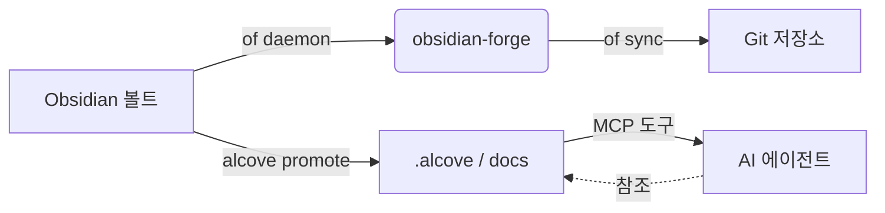

<div align="center">

# ⚒️ obsidian-forge

**Obsidian 볼트 생성기, 자동화 데몬, 그래프 강화 도구**

[](LICENSE)
[](https://www.rust-lang.org)
[](https://crates.io/crates/obsidian-forge)
[](https://buymeacoffee.com/epicsaga)

**단일 바이너리. 멀티 볼트. 설정 없이 바로 시작.**

[English](../README.md) · [中文](README_zh-CN.md) · [日本語](README_ja.md) · [한국어](README_ko.md) · [Español](README_es.md) · [Português](README_pt-BR.md) · [Français](README_fr.md) · [Deutsch](README_de.md) · [Русский](README_ru.md) · [Türkçe](README_tr.md)

</div>

---

## obsidian-forge란?

`obsidian-forge`는 [Obsidian](https://obsidian.md) 볼트를 스캐폴딩, 자동화, 유지 관리하는 Rust CLI 도구입니다. 백그라운드 데몬으로 실행되어 인박스를 감시하고, 지식 그래프를 강화하며, git에 동기화합니다 — 당신은 글쓰기에만 집중할 수 있습니다.

```
of init my-brain                      # 몇 초 만에 새 볼트 스캐폴딩
of daemon enable                     # macOS 로그인 항목으로 등록
# "of"는 "obsidian-forge"의 내장 단축 별칭입니다
# → 이제 볼트가 자동 처리, 자동 링크, 자동 커밋됩니다
```

---

## 기능

| | 기능 | 설명 |
|---|---|---|
| 🏗️ | **볼트 스캐폴딩** | PARA 레이아웃, 번들 템플릿, `.obsidian` 설정, git 초기화 |
| 🔗 | **그래프 강화** | 백링크, 브릿지 노트, 관련 프로젝트 링크, 자동 태그 |
| 📥 | **인박스 처리** | 프론트매터 주입, AI 분류, PARA 라우팅 |
| 🔄 | **동기화 사이클** | MOC 재구축 → 그래프 → 타이머 기반 자동 git 커밋/푸시 |
| 🗂️ | **멀티 볼트** | 하나의 데몬이 모든 볼트를 관리; 볼트별 활성화, 일시정지, 비활성화 |
| ⚙️ | **설정 저장소** | 하나의 볼트에서 플러그인/테마를 가져와 다른 모든 볼트에 푸시 |
| 🤖 | **AI 메타데이터** | Ollama, OpenAI, OpenRouter, LM Studio, 또는 OpenAI 호환 엔드포인트 |
| 📄 | **PDF → 마크다운** | `marker_single`을 통해 변환, `pdftotext` 폴백 지원 |
| 🍎 | **로그인 항목** | macOS LaunchAgent로 설치 — 자동 시작, 자동 재시작 |
| ♻️ | **멱등성** | 어떤 작업도 여러 번 실행해도 안전; 중복 출력 없음 |

---

## 설치

### cargo-binstall을 통한 설치 (가장 빠름 - 미리 컴파일된 바이너리)

```bash
cargo binstall obsidian-forge
# `obsidian-forge`와 `of` (단축 별칭) 모두 설치됩니다
```

> 먼저 [`cargo-binstall`](https://github.com/cargo-bins/cargo-binstall)이 설치되어 있어야 합니다:
> `cargo install cargo-binstall`

### crates.io를 통한 설치

```bash
cargo install obsidian-forge
# `obsidian-forge`와 `of` (단축 별칭) 모두 설치됩니다
```

### 소스에서 빌드

```bash
git clone https://github.com/epicsagas/obsidian-forge.git
cd obsidian-forge
cargo install --path .
# `obsidian-forge`와 `of` (단축 별칭) 모두 설치됩니다
```

### 플랫폼 지원

| 플랫폼 | 상태 |
|---|---|
| macOS | ✅ 완전 지원 (LaunchAgent 데몬 포함) |
| Linux | ✅ 완전 지원 |
| Windows | ⚠️ 부분 지원 (LaunchAgent 대체 기능 없음; 포그라운드 감시는 작동) |

### 사전 요구사항

| 도구 | 필수 여부 | 목적 |
|---|---|---|
| Rust 1.75+ | ✅ | 빌드 |
| git | ✅ | 볼트 버전 관리 |
| Ollama / OpenAI / OpenRouter / LM Studio | ⬜ 선택사항 | AI 태깅 (`process-all`) |
| marker_single | ⬜ 선택사항 | 고품질 PDF 변환 |

---

## 빠른 시작

```bash
# 1. 새 볼트 생성
of init my-brain

# 2. Obsidian에서 열기 → 파일 → 볼트 열기 → my-brain

# 3. 글로벌 설정에 등록
of vault add ~/my-brain

# 4. 백그라운드 데몬 설치
of daemon enable

# 완료 — 00-Inbox/에 노트를 넣으면 obsidian-forge가 나머지를 처리합니다
```

---

## 명령어

### 볼트 초기화

```bash
obsidian-forge init <name>
obsidian-forge init <name> --path ~/vaults
obsidian-forge init <name> --clone-settings-from ~/other-vault

# 기존 볼트에서 다시 실행하여 복구/업그레이드 (멱등성 — 덮어쓰지 않음)
obsidian-forge init my-brain --path ~/
```

### 멀티 볼트 관리

```bash
obsidian-forge vault add <path> [--name <alias>]
obsidian-forge vault remove <name>          # 등록 해제 (파일 유지)
obsidian-forge vault list                   # NAME / ENABLED / WATCH / PATH
obsidian-forge vault enable  <name>
obsidian-forge vault disable <name>         # 동기화 및 감시에서 제외
obsidian-forge vault pause   <name>         # 데몬 건너뜀; 수동 동기화 가능
obsidian-forge vault resume  <name>
```

### 설정 관리 (Settings Management)

모든 볼트에 걸쳐 `.obsidian/` 플러그인, 테마, 스니펫을 동기화합니다.

```bash
obsidian-forge settings import <vault>      # 설정을 글로벌 저장소로 가져오기
obsidian-forge settings push   <vault>      # 글로벌 설정을 하나의 볼트에 푸시
obsidian-forge settings push-all            # 등록된 모든 볼트에 푸시
obsidian-forge settings status

# 두 볼트 간의 직접 설정 복제
obsidian-forge clone-settings <source> <target>
```

### 그래프 작업 (Graph Operations)

```bash
obsidian-forge graph health                 # 통계 및 건강 메트릭 표시
obsidian-forge graph orphans [--auto-link]  # 고립된 노트 목록 표시 (또는 AI 자동 연결)
obsidian-forge graph extract [--no-ai]      # 링크 및 관계 추출
obsidian-forge graph tags [--dry-run]       # 태그 정규화 및 클러스터링
obsidian-forge graph strengthen             # 전체 파이프라인 실행

# 기존 별칭 (전체 파이프라인 실행)
obsidian-forge strengthen-graph
```

### 단발성 작업

```bash
obsidian-forge sync               [--vault <name>]   # MOC → 그래프 → git
obsidian-forge update-mocs        [--vault <name>]
obsidian-forge process-all        [--vault <name>]   # AI 인박스 처리
obsidian-forge status             [--vault <name>]   # 설정 및 AI 상태 표시
obsidian-forge doctor             [--vault <name>]   # 볼트 건강 진단
```

### 백그라운드 데몬 (macOS LaunchAgent)

```bash
obsidian-forge daemon enable     # plist 작성 + 부트스트랩 (로그인 항목)
obsidian-forge daemon disable    # 부트아웃 + plist 제거
obsidian-forge daemon start
obsidian-forge daemon stop
obsidian-forge daemon restart
obsidian-forge daemon status     # PID, 마지막 종료 코드, 스케줄된 볼트 표시
```

> 로그 → `~/.obsidian-forge/logs/obsidian-forge/forge.log`

### 포그라운드 감시

```bash
obsidian-forge watch              # 감시 가능한 모든 볼트
obsidian-forge watch --vault <name> --interval <seconds>
```

---

## 설정

`vault.toml`은 `init` 시 자동으로 생성됩니다. 모든 값에는 합리적인 기본값이 있습니다.

```toml
[vault]
name            = "my-brain"
layout          = "para"           # 현재 지원되는 유일한 레이아웃
inbox_dir       = "00-Inbox"
zettelkasten_dir= "10-Zettelkasten"
archive_dir     = "99-Archives"
attachments_dir = "Attachments"
templates_dir   = "obsidian-templates"

[graph]
backlinks        = true
bridge_notes     = true
auto_tags        = true
related_projects = true
# [[graph.concepts]]
# name     = "AI"
# keywords = ["machine learning", "LLM", "neural"]
# tags     = ["ai", "ml"]

[sync]
git_auto_commit  = true
git_auto_push    = true
interval_minutes = 5

[ai]
# provider: ollama | openai | openrouter | lmstudio | openai-compatible
provider = "ollama"
model    = "gemma3"
# base_url = "http://localhost:1234/v1"  # openai-compatible에 필요; 다른 것은 기본값 있음
# api_key  = ""                          # 선택사항 — 환경 변수가 권장됨 (아래 참조)

[daemon]
label   = "com.obsidian-forge.watch"
log_dir = "~/.obsidian-forge/logs"
```

**API 키** 조회 순서:

1. `[ai]` 섹션의 `api_key` (config.toml 또는 vault.toml) — *시크릿 커밋 방지*
2. 환경 변수 (아래 표 참조)
3. `~/.config/obsidian-forge/.env` 파일 — **권장** (자동 로드, 커밋되지 않음)

| 프로바이더 | 환경 변수 | 참고 |
|---|---|---|
| `openai` | `OPENAI_API_KEY` | [키 발급 →](https://platform.openai.com/api-keys) |
| `openrouter` | `OPENROUTER_API_KEY` | [키 발급 →](https://openrouter.ai/keys) |
| `openai-compatible` | `OPENAI_COMPATIBLE_API_KEY` | `OPENAI_API_KEY`로 폴백 |
| `ollama` / `lmstudio` | — | 키 불필요 |

**`.env` 파일로 API 키 설정 (권장):**

```bash
# .env 파일 생성 (git에 커밋되지 않음)
cat > ~/.config/obsidian-forge/.env << 'EOF'
# 사용 중인 provider의 줄의 주석을 해제하세요:
# OPENAI_API_KEY=sk-...
# OPENROUTER_API_KEY=sk-or-...
# OPENAI_COMPATIBLE_API_KEY=...
EOF
```

> `OPENAI_COMPATIBLE_API_KEY`와 `OPENAI_API_KEY`가 모두 설정된 경우
> provider 전용 변수가 우선합니다. 이렇게 하면 `openai`와
> `openai-compatible`을 동시에 다른 키로 사용할 수 있습니다.

**설정 해석 순서:**

```
$VAULT_PATH                              # 환경 변수 재정의
│
├── 자동 감지 (현재 디렉토리에서 위로 탐색)  # vault.toml 또는 00-Inbox/ 탐색
│
~/.config/obsidian-forge/config.toml    # 글로벌: 등록된 볼트
<vault>/vault.toml                      # 볼트별 설정
```

---

## 아키텍처

```
obsidian-forge/
├── src/
│   ├── main.rs        CLI (clap), 멀티 볼트 디스패치, 동기화 루프
│   ├── config.rs      vault.toml + 글로벌 설정 구조체
│   ├── init.rs        볼트 스캐폴딩, 설정 가져오기/푸시
│   ├── moc.rs         MOC 허브 파일 생성
│   ├── graph/         그래프 강화 파이프라인
│   │   ├── mod.rs       파이프라인 코디네이터
│   │   ├── scan.rs      볼트 전체 그래프 스캐닝
│   │   ├── tags.rs      컨셉 기반 자동 태깅
│   │   ├── wikilinks.rs 위키링크 추출 및 주입
│   │   ├── backlinks.rs 백링크 섹션 생성
│   │   ├── bridges.rs   브릿지 노트 생성
│   │   ├── relationships.rs  관련 프로젝트 연결
│   │   ├── orphans.rs   고립 노트 감지
│   │   ├── autotag.rs   자동 태그 오케스트레이션
│   │   └── health.rs    그래프 상태 보고
│   ├── git.rs         자동 커밋 + 푸시 (컨벤셔널 커밋)
│   ├── notes.rs       인박스 처리 + PARA 라우팅
│   ├── converter.rs   PDF → 마크다운
│   ├── ai.rs          AI 클라이언트 (Ollama, OpenAI 호환 프로바이더)
│   ├── prompts.rs     LLM 프롬프트 템플릿
│   └── watcher.rs     파일시스템 감시기 (notify 크레이트)
└── vault.toml         볼트별 설정 (init 시 생성)
```

### 생태계 (Ecosystem)

`obsidian-forge`는 AI 에이전트에게 프로젝트 문서를 제공하는 MCP 서버인 **[alcove](https://github.com/epicsagas/alcove)**의 자매 프로젝트입니다. 이들은 Cargo 워크스페이스를 공유하며 개인의 지식과 프로젝트 인텔리전스 사이의 루프를 완성합니다:

- **obsidian-forge** = **대장간 (The Forge)** (쓰기/푸시). 볼트 유지 관리를 자동화하고, 지식 그래프를 강화하며, git에 동기화하는 백그라운드 데몬입니다.
- **alcove** = **도서관 (The Library)** (읽기/가져오기). 컨텍스트 창을 비대하게 만들지 않으면서 AI 에이전트에게 온디맨드 검색이 가능한 문서 접근 권한을 제공하는 MCP 서버입니다.



### Alcove 연동

`obsidian-forge`가 지식 그래프를 구축하고 자동화하는 데 집중한다면, [Alcove](https://github.com/epicsagas/alcove)는 그 지식이 AI 코딩 에이전트에게 실질적으로 활용될 수 있도록 보장합니다.

#### 함께 사용하는 방법:

1.  **Obsidian에서 구축**: `obsidian-forge`를 사용하여 볼트의 건강 상태를 유지하고, MOC를 생성하며, 관련 컨셉을 자동으로 연결합니다.
2.  **프로젝트 문서로 승급**: 노트(예: 아키텍처 결정 또는 기능 사양)가 프로젝트에 사용될 준비가 되면, `alcove promote --source path/to/note.md`를 실행합니다.
3.  **에이전트 발견**: 이제 AI 에이전트(Alcove MCP 서버 사용)는 채팅에 일일이 복사-붙여넣기 할 필요 없이 `search_project_docs` 또는 `get_doc_file`을 통해 해당 노트를 "발견"할 수 있습니다.
4.  **정책 준수**: Alcove의 `validate_docs`를 사용하여 승급된 노트가 프로젝트의 문서 표준(`policy.toml`에 정의됨)을 충족하는지 확인합니다.

---

## 기여

기여를 환영합니다! 풀 리퀘스트를 제출하기 전에 [CONTRIBUTING.md](../CONTRIBUTING.md)를 읽어주세요.

```bash
git clone https://github.com/epicsagas/obsidian-forge.git
cd obsidian-forge
cargo build
cargo test
```

---

## 링크

- 📚 **문서**: 이 README + 인라인 코드 문서
- 🐛 **이슈**: [GitHub Issues](https://github.com/epicsagas/obsidian-forge/issues)
- 💬 **토론**: [GitHub Discussions](https://github.com/epicsagas/obsidian-forge/discussions)
- 📦 **Crates.io**: [obsidian-forge](https://crates.io/crates/obsidian-forge)

---

## 라이선스

Apache 2.0 © 2026 [epicsagas](https://github.com/epicsagas)
