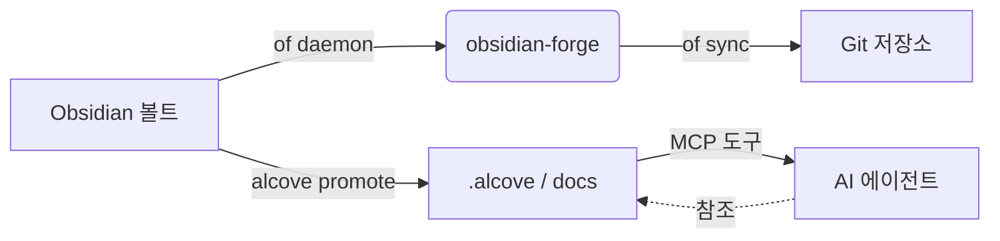

<div align="center">

# ⚒️ obsidian-forge

**Obsidian 볼트 생성기, 자동화 데몬, 유지 관리 툴킷**

[](LICENSE)
[](https://www.rust-lang.org)
[](https://crates.io/crates/obsidian-forge)
[](https://buymeacoffee.com/epicsaga)

**단일 바이너리. 멀티 볼트. 설정 없이 바로 시작.**

[English](../README.md) · [中文](README_zh-CN.md) · [日本語](README_ja.md) · [한국어](README_ko.md) · [Español](README_es.md) · [Português](README_pt-BR.md) · [Français](README_fr.md) · [Deutsch](README_de.md) · [Русский](README_ru.md) · [Türkçe](README_tr.md)

</div>

---

## obsidian-forge란?

`obsidian-forge`는 [Obsidian](https://obsidian.md) 볼트를 스캐폴딩, 자동화, 유지 관리하는 Rust CLI 도구입니다. 백그라운드 데몬으로 실행되어 인박스를 감시하고, 볼트 무결성을 검사하며, git에 동기화합니다 — 당신은 글쓰기에만 집중할 수 있습니다.

```
of init my-brain          # 몇 초 만에 새 볼트 스캐폴딩
of daemon enable         # macOS 로그인 항목으로 등록
# → 이제 볼트가 자동 처리, 헬스 체크, 자동 커밋됩니다
# "of"는 "obsidian-forge"의 내장 단축 별칭입니다
```

---

## 기능

| | 기능 | 설명 |
|---|---|---|
| 🏗️ | **볼트 스캐폴딩** | PARA 레이아웃, 번들 템플릿, `.obsidian` 설정, git 초기화 |
| 🛡️ | **볼트 무결성** | 태그 검사, 깨진 링크 검사 (코드 펜스 인식), 프론트매터 정규화 — 모두 `--fix` 지원 |
| 📊 | **그래프 헬스** | 노트/링크/고립/깨진 링크 메트릭 — 린트 루프에 활용 |
| 📥 | **인박스 처리** | 프론트매터 주입, AI 분류, PARA 라우팅 |
| 🔄 | **동기화 사이클** | 그래프 헬스 검사 → 타이머 기반 자동 git 커밋/푸시 |
| 🗂️ | **멀티 볼트** | 하나의 데몬이 모든 볼트를 관리; 볼트별 플래그는 글로벌 설정에 |
| 🤖 | **AI 메타데이터** | Ollama, OpenAI, OpenRouter, LM Studio, 또는 OpenAI 호환 엔드포인트 |
| 📄 | **PDF → 마크다운** | `marker_single`을 통해 변환, `pdftotext` 폴백 지원 |
| 🍎 | **로그인 항목** | macOS LaunchAgent로 설치 — 자동 시작, 자동 재시작 |
| ♻️ | **멱등성** | 어떤 작업도 여러 번 실행해도 안전; 중복 출력 없음 |

---

## 설치

### macOS / Linux

```bash
brew install epicsagas/tap/obsidian-forge
```

Homebrew가 없다면 설치 스크립트를 사용하세요:

```bash
curl --proto '=https' --tlsv1.2 -LsSf \
  https://github.com/epicsagas/obsidian-forge/releases/latest/download/install.sh | sh
```

### Windows

```powershell
irm https://github.com/epicsagas/obsidian-forge/releases/latest/download/install.ps1 | iex
```

### Rust 툴체인으로 설치

```bash
cargo binstall obsidian-forge   # 미리 컴파일된 바이너리 (빠름)
cargo install obsidian-forge    # 소스에서 빌드
cargo install obsidian-forge --features dashboard-ui  # `of dashboard` GUI 포함
```

위의 모든 방법으로 `obsidian-forge`와 `of`(단축 별칭)가 함께 설치됩니다. 대시보드는 `--features dashboard-ui` 소스 빌드에만 포함됩니다.

> `of --version`으로 확인. 업데이트는 `brew upgrade obsidian-forge` 또는 설치 스크립트 재실행.

### 플랫폼 지원

| 플랫폼 | 아키텍처 | 상태 |
|---|---|---|
| macOS | Apple Silicon (aarch64) | ✅ 완전 지원 |
| macOS | Intel (x86_64) | ✅ 완전 지원 |
| Linux | x86_64 (glibc) | ✅ 완전 지원 |
| Linux | x86_64 (musl/static) | ✅ 완전 지원 |
| Linux | ARM64 (aarch64) | ✅ 완전 지원 |
| Windows | x86_64 (MSVC) | ⚠️ 부분 지원 (LaunchAgent 없음) |

### AI 에이전트 플러그인

obsidian-forge에는 AI 어시스턴트에게 컨텍스트 인식 볼트 작업을 제공하는 4개의 내장 에이전트 스킬이 포함되어 있습니다:

| 스킬 | 트리거 |
|-------|---------|
| `vault-health` | 볼트 상태 확인, 볼트 진단, 볼트 상태 |
| `vault-sync` | 볼트 동기화, 그래프 헬스 검사, 볼트 변경사항 커밋 |
| `inbox-process` | 인박스 처리, 노트 분류, PARA 라우팅 |
| `vault-fix` | 볼트 수정, 태그 복구, 링크 수정, 프론트매터 수정 |

#### Claude Code

```bash
claude plugin marketplace add epicsagas/plugins
claude plugin install obsidian-forge@epicsagas
```

#### Codex CLI

```bash
codex plugin marketplace add epicsagas/plugins
```

#### Antigravity

```bash
agy plugin install https://github.com/epicsagas/obsidian-forge
```

설치하면, 볼트 관리, PARA 라우팅, 그래프 작업 또는 데몬 문제에 대해 질문할 때 AI 에이전트가 자동으로 적절한 스킬을 트리거합니다.

### 사전 요구사항

| 도구 | 필수 여부 | 목적 |
|---|---|---|
| Rust 1.85+ | 소스 빌드 시에만 | 컴파일 |
| git | ✅ | 볼트 버전 관리 |
| Ollama / OpenAI / OpenRouter / LM Studio | ⬜ 선택사항 | AI 태깅 (`process-all`) |
| marker_single | ⬜ 선택사항 | 고품질 PDF 변환 |

---

## 빠른 시작

```bash
# 1. 새 볼트 생성 (글로벌 설정에 등록)
of init my-brain

# 2. Obsidian에서 열기 → 파일 → 볼트 열기 → my-brain

# 3. 백그라운드 데몬 설치
of daemon enable

# 완료 — 00-Inbox/에 노트를 넣으면 obsidian-forge가 나머지를 처리합니다
```

---

## 명령어

### 볼트 초기화

```bash
obsidian-forge init <name>
obsidian-forge init <name> --path ~/vaults
obsidian-forge init <name> --clone-settings-from ~/other-vault

# 기존 볼트에서 다시 실행하여 복구/업그레이드 (멱등성 — 덮어쓰지 않음)
obsidian-forge init my-brain --path ~/
```

### 멀티 볼트 관리

볼트는 `init`이 자동으로 등록합니다 (기존 디렉토리에 다시 실행해도 안전).
볼트별 플래그(`enabled`, `watch`)는 `~/.config/obsidian-forge/config.toml`에 있습니다:

```toml
[[vaults]]
name    = "my-brain"
path    = "/path/to/my-brain"
enabled = true    # 동기화에 포함
watch   = true    # 데몬이 감시
```

### 볼트 무결성 및 그래프 작업

```bash
obsidian-forge check-tags            [--vault <name>]  # 누락된 layer/type/project 태그
obsidian-forge check-tags --fix      [--vault <name>]  # 누락된 태그 주입
obsidian-forge check-links           [--vault <name>]  # 깨진 위키링크 (코드 펜스 인식)
obsidian-forge check-links --fix     [--vault <name>]  # 파일명/확장자 불일치 수정
obsidian-forge normalize-frontmatter [--vault <name>]  # YAML 형식 오류
obsidian-forge graph health          [--vault <name>]  # 통계 및 헬스 메트릭 표시
```

### 단발성 작업

```bash
obsidian-forge sync               [--vault <name>]   # 그래프 헬스 → git
obsidian-forge process-all        [--vault <name>]   # AI 인박스 처리
obsidian-forge status             [--vault <name>]   # 설정 및 AI 상태 표시
obsidian-forge doctor             [--vault <name>]   # 볼트 건강 진단
```

### 백그라운드 데몬 (macOS LaunchAgent)

```bash
obsidian-forge daemon enable     # plist 작성 + 부트스트랩 (로그인 항목)
obsidian-forge daemon disable    # 부트아웃 + plist 제거
obsidian-forge daemon start
obsidian-forge daemon stop
obsidian-forge daemon restart
obsidian-forge daemon status     # PID, 마지막 종료 코드, 스케줄된 볼트 표시
```

> 로그 → `~/.obsidian-forge/logs/obsidian-forge/forge.log`

### 포그라운드 감시

```bash
obsidian-forge watch              # 감시 가능한 모든 볼트
obsidian-forge watch --vault <name> --interval <seconds>
```

### 대시보드

데스크톱 대시보드(Tauri 2 + Svelte 5 앱)로 볼트를 시각적으로 탐색하세요.

```bash
of dashboard                    # 대시보드 GUI 열기
of dashboard --vault <name>     # 특정 볼트 열기
```

모든 노트에는 **활력도 점수(vitality score)**, **PARA 존** 분류, 그리고 그래프 연결성이 함께 표시됩니다. 제목, 경로 또는 태그로 검색하고, 존이나 태그로 필터링한 뒤 노트를 펼쳐서:

- **OPEN** — Obsidian에서 열기
- **FIND RELATED** — 그래프 기반 관련 노트 (백링크 + 공유 태그, 상위 5개)
- **ASK AI** — 한 줄 요약, 핵심 질문, 링크 제안 생성 (AI 설정 필요)

> **미리 컴파일된 데스크톱 빌드**는 각 [GitHub Release](https://github.com/epicsagas/obsidian-forge/releases)에 첨부되어 있습니다 — 사용 중인 OS에 맞는 파일을 받으세요:
> - **macOS** — `Obsidian.Forge.Dashboard_*_aarch64.dmg` (Apple Silicon; Intel은 소스 빌드)
> - **Linux** — `.AppImage` (실행 권한 부여: `chmod +x *.AppImage`)
> - **Windows** — `.msi` 설치 프로그램
>
> 빌드는 **서명되지 않았습니다**. macOS에서는 Gatekeeper를 해제하세요: `xattr -cr "/Applications/Obsidian Forge Dashboard.app"`. Windows에서는 SmartScreen을 지나 "추가 정보 → 실행"을 선택하세요. 소스 빌드를 선호하시나요? `cargo install obsidian-forge --features dashboard-ui`. 최소 하나 이상의 등록된 볼트가 필요합니다.

---

## 설정

`vault.toml`은 `init` 시 자동으로 생성됩니다. 모든 값에는 합리적인 기본값이 있습니다.

```toml
[vault]
name            = "my-brain"
layout          = "para"           # 현재 지원되는 유일한 레이아웃
inbox_dir       = "00-Inbox"
zettelkasten_dir= "10-Zettelkasten"
archive_dir     = "99-Archives"
attachments_dir = "Attachments"
templates_dir   = "obsidian-templates"

# [projects]
# exclude = ["_template"]           # 스캔 시 건너뛸 추가 최상위 디렉토리
                                    # (점 디렉토리와 node_modules는 항상 제외됨)

[sync]
git_auto_commit  = true
git_auto_push    = true
interval_minutes = 60

[ai]
# provider: ollama | openai | openrouter | lmstudio | openai-compatible
provider = "ollama"
model    = "gemma3"
base_url = "http://192.168.0.28:1234/v1"  # openai-compatible에 필요; 다른 것은 기본값 있음
# api_key  = ""                          # 선택사항 — 환경 변수가 권장됨 (아래 참조)

[daemon]
label   = "com.obsidian-forge.watch"
log_dir = "~/.obsidian-forge/logs"
```

**API 키** 조회 순서:

1. `[ai]` 섹션의 `api_key` (config.toml 또는 vault.toml) — *시크릿 커밋 방지*
2. 환경 변수 (아래 표 참조)
3. `~/.config/obsidian-forge/.env` 파일 — **권장** (자동 로드, 커밋되지 않음)

| 프로바이더 | 환경 변수 | 참고 |
|---|---|---|
| `openai` | `OPENAI_API_KEY` | [키 발급 →](https://platform.openai.com/api-keys) |
| `openrouter` | `OPENROUTER_API_KEY` | [키 발급 →](https://openrouter.ai/keys) |
| `openai-compatible` | `OPENAI_COMPATIBLE_API_KEY` | `OPENAI_API_KEY`로 폴백 |
| `ollama` / `lmstudio` | — | 키 불필요 |

**`.env` 파일로 API 키 설정 (권장):**

```bash
# .env 파일 생성 (git에 커밋되지 않음)
cat > ~/.config/obsidian-forge/.env << 'EOF'
# 사용 중인 provider의 줄의 주석을 해제하세요:
# OPENAI_API_KEY=sk-...
# OPENROUTER_API_KEY=sk-or-...
# OPENAI_COMPATIBLE_API_KEY=...
EOF
```

> `OPENAI_COMPATIBLE_API_KEY`와 `OPENAI_API_KEY`가 모두 설정된 경우
> provider 전용 변수가 우선합니다. 이렇게 하면 `openai`와
> `openai-compatible`을 동시에 다른 키로 사용할 수 있습니다.

**설정 해석 순서:**

```
$VAULT_PATH                              # 환경 변수 재정의
│
├── 자동 감지 (현재 디렉토리에서 위로 탐색)  # vault.toml 또는 00-Inbox/ 탐색
│
~/.config/obsidian-forge/config.toml    # 글로벌: 등록된 볼트
<vault>/vault.toml                      # 볼트별 설정
```

---

## 아키텍처

```
obsidian-forge/
├── src/
│   ├── main.rs        CLI (clap), 멀티 볼트 디스패치, 동기화 루프
│   ├── config.rs      vault.toml + 글로벌 설정 구조체
│   ├── init.rs        볼트 스캐폴딩
│   ├── check_tags.rs  태그 헬스 검사 (--fix)
│   ├── check_links.rs 깨진 위키링크 검사 (--fix)
│   ├── frontmatter.rs 프론트매터 정규화 (--fix)
│   ├── graph/
│   │   ├── wikilinks.rs 위키링크 추출 및 해석
│   │   └── health.rs    그래프 헬스 보고
│   ├── git.rs         자동 커밋 + 푸시 (컨벤셔널 커밋)
│   ├── notes.rs       인박스 처리 + PARA 라우팅
│   ├── converter.rs   PDF → 마크다운
│   ├── ai.rs          AI 클라이언트 (Ollama + OpenAI 호환 프로바이더)
│   ├── prompts.rs     LLM 프롬프트 템플릿
│   └── watcher.rs     파일시스템 감시기 (notify 크레이트)
└── vault.toml         볼트별 설정 (init 시 생성)
```

### 생태계

`obsidian-forge`는 AI 에이전트에게 프로젝트 문서를 제공하는 MCP 서버인 **[alcove](https://github.com/epicsagas/alcove)**의 자매 프로젝트입니다. 이들은 Cargo 워크스페이스를 공유하며 개인의 지식과 프로젝트 인텔리전스 사이의 루프를 완성합니다:

- **obsidian-forge** = **대장간 (The Forge)** (쓰기/푸시). 볼트 유지 관리를 자동화하고 git에 동기화하는 백그라운드 데몬입니다.
- **alcove** = **도서관 (The Library)** (읽기/가져오기). 컨텍스트 창을 비대하게 만들지 않으면서 AI 에이전트에게 온디맨드 검색이 가능한 문서 접근 권한을 제공하는 MCP 서버입니다.
- **[Velith](https://github.com/epicsagas/Velith)** = **인쇄소 (The Press)** (집필/출판). 초고 → 편집 → 출판을 위한 독립형 AI 지원 도서 집필 툴킷입니다.


```mermaid
graph LR
    A[Obsidian 볼트] -->|of daemon| B(obsidian-forge)
    B -->|of sync| C[Git 저장소]
    A -->|alcove promote| D[.alcove / docs]
    D -->|MCP 도구| E[AI 에이전트]
    E -.->|참조| D
```

### Alcove 연동

`obsidian-forge`가 볼트의 기계적 건강 유지에 집중한다면, [Alcove](https://github.com/epicsagas/alcove)는 그 지식이 AI 코딩 에이전트에게 실질적으로 활용될 수 있도록 보장합니다.

#### 함께 사용하는 방법:

1.  **Obsidian에서 구축**: `obsidian-forge`를 사용하여 볼트를 건강하게 유지합니다 — 인박스 라우팅, 무결성 검사, git 동기화.
2.  **프로젝트 문서로 승급**: 노트(예: 아키텍처 결정 또는 기능 사양)가 프로젝트에 사용될 준비가 되면, `alcove promote --source path/to/note.md`를 실행합니다.
3.  **에이전트 발견**: 이제 AI 에이전트(Alcove MCP 서버 사용)는 채팅에 일일이 복사-붙여넣기 할 필요 없이 `search_project_docs` 또는 `get_doc_file`을 통해 해당 노트를 "발견"할 수 있습니다.
4.  **정책 준수**: Alcove의 `validate_docs`를 사용하여 승급된 노트가 프로젝트의 문서 표준(`policy.toml`에 정의됨)을 충족하는지 확인합니다.

---

## 기여

기여를 환영합니다! 풀 리퀘스트를 제출하기 전에 [CONTRIBUTING.md](../CONTRIBUTING.md)를 읽어주세요.

```bash
git clone https://github.com/epicsagas/obsidian-forge.git
cd obsidian-forge
cargo build
cargo test
```

---

## 링크

- 📚 **문서**: 이 README + 인라인 코드 문서
- 🐛 **이슈**: [GitHub Issues](https://github.com/epicsagas/obsidian-forge/issues)
- 💬 **토론**: [GitHub Discussions](https://github.com/epicsagas/obsidian-forge/discussions)
- 📦 **Crates.io**: [obsidian-forge](https://crates.io/crates/obsidian-forge)

---

## 라이선스

Apache 2.0 © 2026 [epicsagas](https://github.com/epicsagas)
