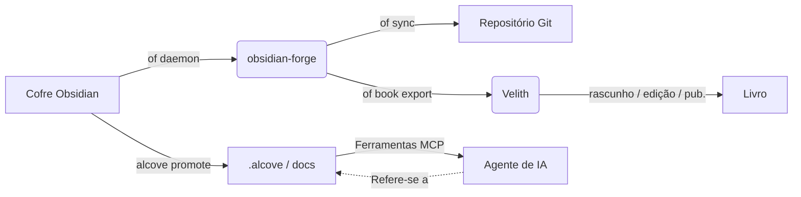

<div align="center">

# ⚒️ obsidian-forge

**Gerador de cofres Obsidian, daemon de automação e fortalecedor de grafos**

[](LICENSE)
[](https://www.rust-lang.org)
[](https://crates.io/crates/obsidian-forge)
[](https://buymeacoffee.com/epicsaga)

**Um único binário. Múltiplos cofres. Zero configuração para começar.**

[English](../README.md) · [中文](README_zh-CN.md) · [日本語](README_ja.md) · [한국어](README_ko.md) · [Español](README_es.md) · [Português](README_pt-BR.md) · [Français](README_fr.md) · [Deutsch](README_de.md) · [Русский](README_ru.md) · [Türkçe](README_tr.md)

</div>

---

## O que é o obsidian-forge?

`obsidian-forge` é uma CLI em Rust que monta, automatiza e mantém cofres do [Obsidian](https://obsidian.md). Ele roda como um daemon em segundo plano monitorando sua caixa de entrada, fortalecendo seu grafo de conhecimento e sincronizando com o git — para que você possa se concentrar em escrever.

```
of init my-brain          # monta um novo cofre em segundos
of daemon enable         # registra como item de login do macOS
# → seu cofre agora processa, linka e faz commit automaticamente
# "of" é um alias curto integrado para "obsidian-forge"
```

---

## Funcionalidades

| | Funcionalidade | Descrição |
|---|---|---|
| 🏗️ | **Montagem de cofre** | Layout PARA, templates inclusos, config `.obsidian`, git init |
| 🔗 | **Fortalecimento do grafo** | Backlinks, notas ponte, links de projetos relacionados, tags automáticas |
| 📥 | **Processamento de caixa de entrada** | Injeção de frontmatter, classificação por IA, roteamento PARA |
| 🔄 | **Ciclo de sincronização** | Reconstrução MOC → grafo → commit/push automático no git por timer |
| 🗂️ | **Multi-cofre** | Um daemon gerencia todos os cofres; habilite, pause ou desabilite por cofre |
| ⚙️ | **Armazenamento de configurações** | Importe plugins/temas de um cofre e envie para todos os outros |
| 🤖 | **Metadados IA** | Ollama, OpenAI, OpenRouter, LM Studio ou qualquer endpoint compatível com OpenAI |
| 📄 | **PDF → Markdown** | Converte via `marker_single` com fallback para `pdftotext` |
| 🍎 | **Item de login** | Instala como macOS LaunchAgent — inicia e reinicia automaticamente |
| ♻️ | **Idempotente** | Qualquer operação é segura para executar múltiplas vezes; sem saída duplicada |
| 📚 | **Projetos de livro** | Inicializar, acompanhar, exportar e sincronizar projetos de escrita integrados ao cofre |

---

## Instalação

### macOS / Linux

```bash
brew install epicsagas/tap/obsidian-forge
```

Sem Homebrew? Use o script de instalação:

```bash
curl --proto '=https' --tlsv1.2 -LsSf \
  https://github.com/epicsagas/obsidian-forge/releases/latest/download/obsidian-forge-installer.sh | sh
```

### Windows

```powershell
irm https://github.com/epicsagas/obsidian-forge/releases/latest/download/obsidian-forge-installer.ps1 | iex
```

### Via toolchain Rust

```bash
cargo binstall obsidian-forge   # binário pré-compilado (rápido)
cargo install obsidian-forge    # compilar a partir do código-fonte
cargo install obsidian-forge --features dashboard-ui  # incluir a interface do `of dashboard`
```

O dashboard só é incluído em compilações a partir do código-fonte com `--features dashboard-ui` (os binários pré-compilados não o trazem). Tanto `obsidian-forge` quanto `of` (alias curto) são instalados por todos os métodos acima.

> Use `of --version` para verificar. Atualize com `brew upgrade obsidian-forge` ou execute novamente o script de instalação.

### Suporte de Plataforma

| Plataforma | Arquitetura | Status |
|---|---|---|
| macOS | Apple Silicon (aarch64) | ✅ Completamente suportado |
| macOS | Intel (x86_64) | ✅ Completamente suportado |
| Linux | x86_64 (glibc) | ✅ Completamente suportado |
| Linux | x86_64 (musl/static) | ✅ Completamente suportado |
| Linux | ARM64 (aarch64) | ✅ Completamente suportado |
| Windows | x86_64 (MSVC) | ⚠️ Parcialmente suportado (sem LaunchAgent) |

### Plugins de Agente IA

O obsidian-forge vem com 5 habilidades de agente integradas que fornecem aos assistentes de IA operações de cofre com contexto:

| Habilidade | Gatilho |
|-------|---------|
| `vault-health` | Verificação de saúde do cofre, diagnosticar cofre, status do cofre |
| `vault-sync` | Sincronizar cofre, atualizar MOCs e grafo, commit de alterações do cofre |
| `graph-strengthen` | Fortalecer grafo, saúde do grafo, corrigir órfãos |
| `inbox-process` | Processar caixa de entrada, classificar notas, roteamento PARA |
| `vault-fix` | Corrigir cofre, reparar tags, corrigir links, corrigir frontmatter |

#### Claude Code

```bash
claude plugin marketplace add epicsagas/plugins
claude plugin install obsidian-forge@epicsagas
```

#### Codex CLI

```bash
codex plugin marketplace add epicsagas/plugins
```

#### Antigravity

```bash
agy plugin install https://github.com/epicsagas/obsidian-forge
```

Uma vez instalado, seu agente de IA aciona automaticamente a habilidade certa quando você pergunta sobre gerenciamento de cofre, roteamento PARA, operações de grafo ou problemas do daemon.

### Pré-requisitos

| Ferramenta | Necessário | Finalidade |
|---|---|---|
| Rust 1.85+ | apenas compilação a partir do fonte | Compilação |
| git | ✅ | Versionamento do cofre |
| Ollama / OpenAI / OpenRouter / LM Studio | ⬜ opcional | Tags por IA (`process-all`) |
| marker_single | ⬜ opcional | Conversão PDF de alta qualidade |

---

## Início Rápido

```bash
# 1. Criar um novo cofre
of init my-brain

# 2. Abrir no Obsidian → Arquivo → Abrir Cofre → my-brain

# 3. Registrar na configuração global
of vault add ~/my-brain

# 4. Instalar o daemon em segundo plano
of daemon enable

# Pronto — coloque notas em 00-Inbox/ e o obsidian-forge cuida do resto
```

---

## Comandos

### Inicialização de Cofre

```bash
obsidian-forge init <name>
obsidian-forge init <name> --path ~/vaults
obsidian-forge init <name> --clone-settings-from ~/other-vault

# Re-execute em um cofre existente para reparar/atualizar (idempotente — nunca sobrescreve)
obsidian-forge init my-brain --path ~/
```

### Gerenciamento de Múltiplos Cofres

```bash
obsidian-forge vault add <path> [--name <alias>]
obsidian-forge vault remove <name>          # desregistrar (arquivos mantidos)
obsidian-forge vault list                   # NAME / ENABLED / WATCH / PATH
obsidian-forge vault enable  <name>
obsidian-forge vault disable <name>         # excluir da sincronização e monitoramento
obsidian-forge vault pause   <name>         # pular daemon; sincronização manual ok
obsidian-forge vault resume  <name>
```

### Gerenciamento de Configurações

Sincroniza plugins, temas e snippets de `.obsidian/` entre cofres.

```bash
obsidian-forge settings import <vault>      # importar configurações para o armazenamento global
obsidian-forge settings push   <vault>      # enviar configurações globais para um cofre
obsidian-forge settings push-all            # enviar para TODOS os cofres registrados
obsidian-forge settings status

# Clone direto entre dois cofres
obsidian-forge clone-settings <source> <target>
```

### Operações de Grafo

```bash
obsidian-forge graph health                 # mostrar estatísticas e métricas de saúde
obsidian-forge graph orphans [--auto-link]  # listar órfãos (ou auto-linkar com IA)
obsidian-forge graph extract [--no-ai]      # extrair links e relacionamentos
obsidian-forge graph tags [--dry-run]       # normalizar e agrupar tags
obsidian-forge graph strengthen             # executar pipeline completo

# Alias herdado (executa o pipeline completo)
obsidian-forge strengthen-graph
```

### Operações Únicas

```bash
obsidian-forge sync               [--vault <name>]   # MOC → grafo → git
obsidian-forge update-mocs        [--vault <name>]
obsidian-forge process-all        [--vault <name>]   # processamento de caixa de entrada por IA
obsidian-forge status             [--vault <name>]   # mostrar status de config e IA
obsidian-forge doctor             [--vault <name>]   # diagnosticar saúde do cofre
```

### Daemon em Segundo Plano (macOS LaunchAgent)

```bash
obsidian-forge daemon enable     # escrever plist + bootstrap (item de login)
obsidian-forge daemon disable    # bootout + remover plist
obsidian-forge daemon start
obsidian-forge daemon stop
obsidian-forge daemon restart
obsidian-forge daemon status     # mostra PID, último código de saída e cofres agendados
```

> Logs → `~/.obsidian-forge/logs/obsidian-forge/forge.log`

### Monitoramento em Primeiro Plano

```bash
obsidian-forge watch              # todos os cofres monitoráveis
obsidian-forge watch --vault <name> --interval <seconds>
```

### Projetos de livro

Gerencie projetos de escrita de livros diretamente do cofre.

```bash
of book init <name> [--genre <genre>] [--lang <lang>]   # criar estrutura em 01-Projects/
of book status [<name>]                                   # progresso: rascunho / edição / publicação
of book export <name> [--output <dir>]                   # exportar para Velith
of book sync   <name>                                     # vincular notas marcadas → sources/
```

Notas do cofre com a tag `book/<name>` são automaticamente vinculadas em `sources/` pelo `book sync`.

### Dashboard

Navegue pelo seu cofre visualmente com o dashboard de desktop (app Tauri 2 + Svelte 5).

```bash
of dashboard                    # abrir a interface do dashboard
of dashboard --vault <name>     # abrir um cofre específico
```

Cada nota é exibida com uma **pontuação de vitalidade**, classificação de **zona PARA** e conectividade do grafo. Pesquise por título, caminho ou tags; filtre por zona ou tag; e então expanda uma nota para:

- **ABRIR** — abri-la no Obsidian
- **ENCONTRAR RELACIONADAS** — notas relacionadas baseadas no grafo (backlinks + tags compartilhadas, top 5)
- **PERGUNTAR À IA** — gera um resumo de uma linha, perguntas-chave e sugestões de links (requer configuração de IA)

> Os **builds de desktop pré-compilados** estão anexados a cada [GitHub Release](https://github.com/epicsagas/obsidian-forge/releases) — baixe o arquivo para o seu SO:
> - **macOS** — `Obsidian.Forge.Dashboard_*_aarch64.dmg` (Apple Silicon; Intel a partir do código-fonte)
> - **Linux** — `.AppImage` (torne executável: `chmod +x *.AppImage`)
> - **Windows** — instalador `.msi`
>
> Os builds **não são assinados**. No macOS, ignore o Gatekeeper: `xattr -cr "/Applications/Obsidian Forge Dashboard.app"`. No Windows, escolha "Mais informações → Executar mesmo assim" para passar pelo SmartScreen. Prefere a partir do código-fonte? `cargo install obsidian-forge --features dashboard-ui`. É necessário pelo menos um cofre registrado.

---

## Configuração

`vault.toml` é criado automaticamente pelo `init`. Cada valor tem um padrão razoável.

```toml
[vault]
name            = "my-brain"
layout          = "para"           # único layout atualmente suportado
inbox_dir       = "00-Inbox"
zettelkasten_dir= "10-Zettelkasten"
archive_dir     = "99-Archives"
attachments_dir = "Attachments"
templates_dir   = "obsidian-templates"

[graph]
backlinks        = true
bridge_notes     = true
auto_tags        = true
related_projects = true
# [[graph.concepts]]
# name     = "AI"
# keywords = ["machine learning", "LLM", "neural"]
# tags     = ["ai", "ml"]

[sync]
git_auto_commit  = true
git_auto_push    = true
interval_minutes = 60

[ai]
# provider: ollama | openai | openrouter | lmstudio | openai-compatible
provider = "ollama"
model    = "gemma3"
base_url = "http://192.168.0.28:1234/v1"  # necessário para openai-compatible; outros têm padrões
# api_key  = ""                          # opcional — variável de ambiente é preferida (veja abaixo)

[daemon]
label   = "com.obsidian-forge.watch"
log_dir = "~/.obsidian-forge/logs"
```

**As chaves de API** são resolvidas nesta ordem:

1. `api_key` na seção `[ai]` (config.toml ou vault.toml) — *evite commitar segredos*
2. Variável de ambiente (veja tabela abaixo)
3. Arquivo `~/.config/obsidian-forge/.env` — **recomendado** (carregamento automático, nunca commitado)

| Provedor | Variável de ambiente | Observações |
|---|---|---|
| `openai` | `OPENAI_API_KEY` | [Obter chave →](https://platform.openai.com/api-keys) |
| `openrouter` | `OPENROUTER_API_KEY` | [Obter chave →](https://openrouter.ai/keys) |
| `openai-compatible` | `OPENAI_COMPATIBLE_API_KEY` | retroage para `OPENAI_API_KEY` |
| `ollama` / `lmstudio` | — | nenhuma chave necessária |

**Configurando chaves de API com `.env` (recomendado):**

```bash
# Crie o arquivo .env (nunca commitado ao git)
cat > ~/.config/obsidian-forge/.env << 'EOF'
# Descomente a(s) linha(s) do(s) seu(s) provedor(es):
# OPENAI_API_KEY=sk-...
# OPENROUTER_API_KEY=sk-or-...
# OPENAI_COMPATIBLE_API_KEY=...
EOF
```

> Se tanto `OPENAI_COMPATIBLE_API_KEY` quanto `OPENAI_API_KEY` estiverem definidas,
> a específica do provedor tem precedência. Isso permite usar `openai` e
> `openai-compatible` com chaves diferentes simultaneamente.

**Resolução de configuração:**

```
$VAULT_PATH                              # substituição por variável de ambiente
│
├── detecção automática (sobe do CWD)   # procura vault.toml ou 00-Inbox/
│
~/.config/obsidian-forge/config.toml    # global: cofres registrados
<vault>/vault.toml                      # configurações por cofre
```

---

## Arquitetura

```
obsidian-forge/
├── src/
│   ├── main.rs        CLI (clap), despacho multi-cofre, loop de sincronização
│   ├── config.rs      vault.toml + estruturas de configuração global
│   ├── init.rs        montagem de cofre, importação/envio de configurações
│   ├── moc.rs         geração de arquivo hub MOC
│   ├── graph/         Pipeline de fortalecimento do grafo
│   │   ├── mod.rs       coordenador do pipeline
│   │   ├── scan.rs      escaneamento do grafo em todo o cofre
│   │   ├── tags.rs      etiquetagem automática baseada em conceitos
│   │   ├── wikilinks.rs extração e injeção de wikilinks
│   │   ├── backlinks.rs geração de seção de backlinks
│   │   ├── bridges.rs   criação de notas ponte
│   │   ├── relationships.rs linkagem de projetos relacionados
│   │   ├── orphans.rs   detecção de notas órfãs
│   │   ├── autotag.rs   orquestração de tags automáticas
│   │   └── health.rs    relatório de saúde do grafo
│   ├── git.rs         commit + push automático (commits convencionais)
│   ├── notes.rs       processamento de caixa de entrada + roteamento PARA
│   ├── converter.rs   PDF → Markdown
│   ├── ai.rs          cliente IA (Ollama + provedores compatíveis com OpenAI)
│   ├── prompts.rs     templates de prompts LLM
│   └── watcher.rs     monitor do sistema de arquivos (crate notify)
└── vault.toml         configuração por cofre (criada pelo init)
```

### Ecossistema

obsidian-forge é o **projeto parceiro do [alcove](https://github.com/epicsagas/alcove)** — um servidor MCP que fornece documentos de projeto para agentes de IA. Eles compartilham um workspace Cargo e trabalham juntos para fechar o ciclo entre o conhecimento pessoal e a inteligência de projeto:

- **obsidian-forge** = **A Forja** (escrever/empurrar). Daemon em segundo plano que automatiza a manutenção do cofre, fortalece o grafo de conhecimento e sincroniza com o git.
- **alcove** = **A Biblioteca** (ler/puxar). Servidor MCP que fornece aos agentes de IA acesso sob demanda e pesquisável à documentação sem sobrecarregar a janela de contexto.
- **[Velith](https://github.com/epicsagas/Velith)** = **A Tipografia** (redigir/publicar). Toolkit de escrita de livros assistido por IA que consome o diretório exportado por `of book export` e conduz o pipeline completo de rascunho → edição → publicação.



### Integração com o Alcove

Enquanto o `obsidian-forge` se concentra em construir e automatizar seu grafo de conhecimento, o [Alcove](https://github.com/epicsagas/alcove) garante que o conhecimento seja acionável para agentes de codificação de IA.

#### Como usá-los juntos:

1.  **Construa no Obsidian**: Use o `obsidian-forge` para manter a saúde do seu cofre, criar MOCs e auto-linkar conceitos relacionados.
2.  **Promova para Documentos de Projeto**: Quando uma nota (ex: uma decisão arquitetural ou uma especificação de funcionalidade) estiver pronta para um projeto, execute `alcove promote --source caminho/para/nota.md`.
3.  **Descoberta pelo Agente**: Seu agente de IA (usando o servidor MCP Alcove) agora pode "descobrir" essa nota via `search_project_docs` ou `get_doc_file` em vez de você ter que copiar e colar no chat.
4.  **Conformidade com Políticas**: Use o `validate_docs` do Alcove para garantir que suas notas promovidas atendam aos padrões de documentação do projeto (definidos em `policy.toml`).

### Integração com o Velith

[Velith](https://github.com/epicsagas/Velith) é o toolkit dedicado à escrita de livros com IA. O `obsidian-forge` gerencia o **lado do cofre** — organizar notas, etiquetar pesquisas, criar a estrutura do projeto. O `Velith` gerencia o **lado da escrita** — rascunhos de capítulos, passes de edição, empacotamento para publicação.

#### Fluxo de trabalho: Cofre → Livro

```bash
# 1. Etiquetar notas de pesquisa no cofre
#    Adicionar "book/meu-livro" às tags do frontmatter das notas relevantes

# 2. Inicializar o projeto de livro
of book init meu-livro --genre non-fiction --lang pt

# 3. Sincronizar notas etiquetadas em sources/
of book sync meu-livro

# 4. Exportar para diretório compatível com Velith
of book export meu-livro --output ~/books/

# 5. Transferir para o Velith
cd ~/books/meu-livro
Velith draft        # rascunho de capítulos com IA a partir de sources/
Velith edit         # pipeline de edição em múltiplas passes
Velith publish      # empacotar EPUB / PDF
```

O diretório exportado contém `PRD.md` (objetivos), `STYLE.md` (guia de estilo), `drafts/`, `edits/` e `publish/` — exatamente a estrutura que o `Velith` espera.

---

## Contribuindo

Contribuições são bem-vindas! Por favor, leia [CONTRIBUTING.md](../CONTRIBUTING.md) antes de enviar um pull request.

```bash
git clone https://github.com/epicsagas/obsidian-forge.git
cd obsidian-forge
cargo build
cargo test
```

---

## Links

- 📚 **Documentação**: Este README + documentação de código em linha
- 🐛 **Problemas**: [GitHub Issues](https://github.com/epicsagas/obsidian-forge/issues)
- 💬 **Discussões**: [GitHub Discussions](https://github.com/epicsagas/obsidian-forge/discussions)
- 📦 **Crates.io**: [obsidian-forge](https://crates.io/crates/obsidian-forge)

---

## Licença

Apache 2.0 © 2026 [epicsagas](https://github.com/epicsagas)
