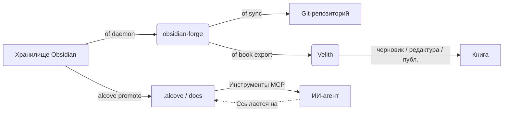

<div align="center">

# ⚒️ obsidian-forge

**Генератор хранилищ Obsidian, демон автоматизации и усилитель графов**

[](LICENSE)
[](https://www.rust-lang.org)
[](https://crates.io/crates/obsidian-forge)
[](https://buymeacoffee.com/epicsaga)

**Один бинарный файл. Несколько хранилищ. Нулевая настройка для начала работы.**

[English](../README.md) · [中文](README_zh-CN.md) · [日本語](README_ja.md) · [한국어](README_ko.md) · [Español](README_es.md) · [Português](README_pt-BR.md) · [Français](README_fr.md) · [Deutsch](README_de.md) · [Русский](README_ru.md) · [Türkçe](README_tr.md)

</div>

---

## Что такое obsidian-forge?

`obsidian-forge` — это Rust CLI, которая создаёт, автоматизирует и поддерживает хранилища [Obsidian](https://obsidian.md). Работает как фоновый демон, отслеживая вашу папку входящих, укрепляя граф знаний и синхронизируя с git — чтобы вы могли сосредоточиться на написании.

```
of init my-brain          # создать новое хранилище за секунды
of daemon enable         # зарегистрировать как элемент входа macOS
# → ваше хранилище теперь обрабатывается, связывается и фиксируется автоматически
# "of" — встроенный короткий псевдоним для "obsidian-forge"
```

---

## Возможности

| | Возможность | Описание |
|---|---|---|
| 🏗️ | **Создание хранилища** | Структура PARA, встроенные шаблоны, конфиг `.obsidian`, инициализация git |
| 🔗 | **Усиление графа** | Обратные ссылки, связующие заметки, ссылки на связанные проекты, автотеги |
| 📥 | **Обработка входящих** | Внедрение frontmatter, классификация ИИ, маршрутизация PARA |
| 🔄 | **Цикл синхронизации** | Перестройка MOC → граф → автоматический git-коммит/пуш по таймеру |
| 🗂️ | **Несколько хранилищ** | Один демон управляет всеми хранилищами; включать, приостанавливать или отключать каждое |
| ⚙️ | **Хранилище настроек** | Импортировать плагины/темы из одного хранилища и передавать во все остальные |
| 🤖 | **Метаданные ИИ** | Ollama, OpenAI, OpenRouter, LM Studio или любой OpenAI-совместимый эндпоинт |
| 📄 | **PDF → Markdown** | Конвертация через `marker_single` с резервным вариантом `pdftotext` |
| 🍎 | **Элемент входа** | Устанавливается как macOS LaunchAgent — автоматический запуск и перезапуск |
| ♻️ | **Идемпотентность** | Любую операцию безопасно запускать многократно; без дублирования вывода |
| 📚 | **Книжные проекты** | Инициализация, отслеживание, экспорт и синхронизация источников книжных проектов |

---

## Установка

### macOS / Linux

```bash
brew install epicsagas/tap/obsidian-forge
```

Нет Homebrew? Используйте скрипт установки:

```bash
curl --proto '=https' --tlsv1.2 -LsSf \
  https://github.com/epicsagas/obsidian-forge/releases/latest/download/obsidian-forge-installer.sh | sh
```

### Windows

```powershell
irm https://github.com/epicsagas/obsidian-forge/releases/latest/download/obsidian-forge-installer.ps1 | iex
```

### Через инструментальные средства Rust

```bash
cargo binstall obsidian-forge   # готовый бинарник (быстро)
cargo install obsidian-forge    # сборка из исходного кода
cargo install obsidian-forge --features dashboard-ui  # включает графический интерфейс `of dashboard`
```

Оба метода выше устанавливают как `obsidian-forge`, так и `of` (короткий псевдоним). Панель управления (`of dashboard`) поставляется только в сборках из исходного кода с флагом `--features dashboard-ui` и отсутствует в готовых бинарниках.

> Выполните `of --version` для проверки. Обновите через `brew upgrade obsidian-forge` или повторно запустите скрипт установки.

### Поддержка платформ

| Платформа | Архитектура | Статус |
|---|---|---|
| macOS | Apple Silicon (aarch64) | ✅ Полностью поддерживается |
| macOS | Intel (x86_64) | ✅ Полностью поддерживается |
| Linux | x86_64 (glibc) | ✅ Полностью поддерживается |
| Linux | x86_64 (musl/static) | ✅ Полностью поддерживается |
| Linux | ARM64 (aarch64) | ✅ Полностью поддерживается |
| Windows | x86_64 (MSVC) | ⚠️ Частично поддерживается (нет LaunchAgent) |

### Плагины ИИ-агента

obsidian-forge поставляется с 5 встроенными навыками агента, которые предоставляют ИИ-ассистентам контекстно-зависимые операции с хранилищем:

| Навык | Триггер |
|-------|---------|
| `vault-health` | Проверка здоровья хранилища, диагностика хранилища, статус хранилища |
| `vault-sync` | Синхронизация хранилища, обновление MOC и графа, фиксация изменений хранилища |
| `graph-strengthen` | Усиление графа, здоровье графа, исправление сирот |
| `inbox-process` | Обработка входящих, классификация заметок, маршрутизация PARA |
| `vault-fix` | Исправление хранилища, восстановление тегов, исправление ссылок, исправление frontmatter |

#### Claude Code

```bash
claude plugin marketplace add epicsagas/plugins
claude plugin install obsidian-forge@epicsagas
```

#### Codex CLI

```bash
codex plugin marketplace add epicsagas/plugins
```

#### Antigravity

```bash
agy plugin install https://github.com/epicsagas/obsidian-forge
```

После установки ваш ИИ-агент автоматически активирует нужный навык, когда вы спрашиваете об управлении хранилищем, маршрутизации PARA, операциях с графом или проблемах демона.

### Предварительные требования

| Инструмент | Обязательно | Назначение |
|---|---|---|
| Rust 1.85+ | только для сборки из исходного кода | Компиляция |
| git | ✅ | Версионирование хранилища |
| Ollama / OpenAI / OpenRouter / LM Studio | ⬜ опционально | Теги ИИ (`process-all`) |
| marker_single | ⬜ опционально | Высококачественная конвертация PDF |

---

## Быстрый старт

```bash
# 1. Создать новое хранилище
of init my-brain

# 2. Открыть в Obsidian → Файл → Открыть хранилище → my-brain

# 3. Зарегистрировать в глобальной конфигурации
of vault add ~/my-brain

# 4. Установить фоновый демон
of daemon enable

# Готово — помещайте заметки в 00-Inbox/, obsidian-forge позаботится об остальном
```

---

## Команды

### Инициализация хранилища

```bash
obsidian-forge init <name>
obsidian-forge init <name> --path ~/vaults
obsidian-forge init <name> --clone-settings-from ~/other-vault

# Повторный запуск в существующем хранилище для восстановления/обновления (идемпотентно — никогда не перезаписывает)
obsidian-forge init my-brain --path ~/
```

### Управление несколькими хранилищами

```bash
obsidian-forge vault add <path> [--name <alias>]
obsidian-forge vault remove <name>          # снять с учёта (файлы сохраняются)
obsidian-forge vault list                   # NAME / ENABLED / WATCH / PATH
obsidian-forge vault enable  <name>
obsidian-forge vault disable <name>         # исключить из синхронизации и наблюдения
obsidian-forge vault pause   <name>         # пропустить демон; ручная синхронизация доступна
obsidian-forge vault resume  <name>
```

### Управление настройками

Синхронизирует плагины, темы и сниппеты `.obsidian/` между хранилищами.

```bash
obsidian-forge settings import <vault>      # импортировать настройки в глобальное хранилище
obsidian-forge settings push   <vault>      # передать глобальные настройки в одно хранилище
obsidian-forge settings push-all            # передать ВО ВСЕ зарегистрированные хранилища
obsidian-forge settings status

# Прямое клонирование между двумя хранилищами
obsidian-forge clone-settings <source> <target>
```

### Операции с графом

```bash
obsidian-forge graph health                 # показать статистику и показатели здоровья
obsidian-forge graph orphans [--auto-link]  # список сирот (или авто-связывание с ИИ)
obsidian-forge graph extract [--no-ai]      # извлечь ссылки и отношения
obsidian-forge graph tags [--dry-run]       # нормализовать и кластеризовать теги
obsidian-forge graph strengthen             # запустить полный конвейер

# Устаревший псевдоним (запускает полный конвейер)
obsidian-forge strengthen-graph
```

### Разовые операции

```bash
obsidian-forge sync               [--vault <name>]   # MOC → граф → git
obsidian-forge update-mocs        [--vault <name>]
obsidian-forge process-all        [--vault <name>]   # обработка входящих с ИИ
obsidian-forge status             [--vault <name>]   # показать конфиг и статус ИИ
obsidian-forge doctor             [--vault <name>]   # диагностировать здоровье хранилища
```

### Фоновый демон (macOS LaunchAgent)

```bash
obsidian-forge daemon enable     # записать plist + bootstrap (элемент входа)
obsidian-forge daemon disable    # bootout + удалить plist
obsidian-forge daemon start
obsidian-forge daemon stop
obsidian-forge daemon restart
obsidian-forge daemon status     # показывает PID, последний код выхода и запланированные хранилища
```

> Логи → `~/.obsidian-forge/logs/obsidian-forge/forge.log`

### Наблюдение на переднем плане

```bash
obsidian-forge watch              # все наблюдаемые хранилища
obsidian-forge watch --vault <name> --interval <seconds>
```

### Книжные проекты

Управляйте проектами написания книг прямо из хранилища.

```bash
of book init <name> [--genre <genre>] [--lang <lang>]   # создать структуру в 01-Projects/
of book status [<name>]                                   # прогресс: черновик / редактура / публикация
of book export <name> [--output <dir>]                   # экспорт для Velith
of book sync   <name>                                     # связать помеченные заметки → sources/
```

Заметки с тегом `book/<name>` в хранилище автоматически связываются в `sources/` командой `book sync`.

### Панель управления

Просматривайте хранилище наглядно с помощью настольной панели управления (приложение на Tauri 2 + Svelte 5).

```bash
of dashboard                    # открыть панель управления (графический интерфейс)
of dashboard --vault <name>     # открыть конкретное хранилище
```

Каждая заметка отображается с показателем **жизненной силы** (vitality score), классификацией по зонам **PARA** и связностью в графе. Поиск по названию, пути или тегам; фильтрация по зоне или тегу; затем раскройте заметку, чтобы:

- **ОТКРЫТЬ** — открыть её в Obsidian
- **НАЙТИ СВЯЗАННЫЕ** — связанные заметки на основе графа (обратные ссылки + общие теги, топ-5)
- **СПРОСИТЬ ИИ** — генерирует однострочное резюме, ключевые вопросы и предложения ссылок (требуется настройка ИИ)

> **Готовые сборки для десктопа** прикреплены к каждому [GitHub Release](https://github.com/epicsagas/obsidian-forge/releases) — скачайте файл для вашей ОС:
> - **macOS** — `Obsidian.Forge.Dashboard_*_aarch64.dmg` (Apple Silicon; Intel из исходников)
> - **Linux** — `.AppImage` (сделайте исполняемым: `chmod +x *.AppImage`)
> - **Windows** — установщик `.msi`
>
> Сборки **не подписаны**. На macOS снимите блокировку Gatekeeper: `xattr -cr "/Applications/Obsidian Forge Dashboard.app"`. На Windows выберите «Подробнее → Всё равно запустить», чтобы пройти SmartScreen. Предпочитаете сборку из исходников? `cargo install obsidian-forge --features dashboard-ui`. Требуется как минимум одно зарегистрированное хранилище.

---

## Конфигурация

`vault.toml` создаётся автоматически при `init`. Каждое значение имеет разумное значение по умолчанию.

```toml
[vault]
name            = "my-brain"
layout          = "para"           # единственный поддерживаемый в данный момент макет
inbox_dir       = "00-Inbox"
zettelkasten_dir= "10-Zettelkasten"
archive_dir     = "99-Archives"
attachments_dir = "Attachments"
templates_dir   = "obsidian-templates"

[graph]
backlinks        = true
bridge_notes     = true
auto_tags        = true
related_projects = true
# [[graph.concepts]]
# name     = "AI"
# keywords = ["machine learning", "LLM", "neural"]
# tags     = ["ai", "ml"]

[sync]
git_auto_commit  = true
git_auto_push    = true
interval_minutes = 60

[ai]
# provider: ollama | openai | openrouter | lmstudio | openai-compatible
provider = "ollama"
model    = "gemma3"
base_url = "http://192.168.0.28:1234/v1"  # обязательно для openai-compatible; у остальных есть значения по умолчанию
# api_key  = ""                          # опционально — предпочтительна переменная среды (см. ниже)

[daemon]
label   = "com.obsidian-forge.watch"
log_dir = "~/.obsidian-forge/logs"
```

**API-ключи** определяются в следующем порядке:

1. `api_key` в секции `[ai]` (config.toml или vault.toml) — *избегайте коммита секретов*
2. Переменная среды (см. таблицу ниже)
3. Файл `~/.config/obsidian-forge/.env` — **рекомендуется** (автозагрузка, не коммитится)

| Провайдер | Переменная среды | Примечания |
|---|---|---|
| `openai` | `OPENAI_API_KEY` | [Получить ключ →](https://platform.openai.com/api-keys) |
| `openrouter` | `OPENROUTER_API_KEY` | [Получить ключ →](https://openrouter.ai/keys) |
| `openai-compatible` | `OPENAI_COMPATIBLE_API_KEY` | откат к `OPENAI_API_KEY` |
| `ollama` / `lmstudio` | — | ключ не нужен |

**Настройка API-ключей через `.env` (рекомендуется):**

```bash
# Создайте файл .env (никогда не попадёт в git)
cat > ~/.config/obsidian-forge/.env << 'EOF'
# Раскомментируйте строку(и) нужного провайдера:
# OPENAI_API_KEY=sk-...
# OPENROUTER_API_KEY=sk-or-...
# OPENAI_COMPATIBLE_API_KEY=...
EOF
```

> Если установлены обе переменные `OPENAI_COMPATIBLE_API_KEY` и `OPENAI_API_KEY`,
> приоритет имеет специфичная для провайдера. Это позволяет использовать `openai` и
> `openai-compatible` с разными ключами одновременно.

**Порядок разрешения конфигурации:**

```
$VAULT_PATH                              # переопределение через переменную среды
│
├── автоопределение (поднимается от CWD)  # ищет vault.toml или 00-Inbox/
│
~/.config/obsidian-forge/config.toml    # глобальный: зарегистрированные хранилища
<vault>/vault.toml                      # настройки для каждого хранилища
```

---

## Архитектура

```
obsidian-forge/
├── src/
│   ├── main.rs        CLI (clap), диспетчеризация нескольких хранилищ, цикл синхронизации
│   ├── config.rs      vault.toml + структуры глобальной конфигурации
│   ├── init.rs        создание хранилища, импорт/передача настроек
│   ├── moc.rs         генерация файла-узла MOC
│   ├── graph/         Конвейер укрепления графа
│   │   ├── mod.rs       координатор конвейера
│   │   ├── scan.rs      сканирование графа во всем хранилище
│   │   ├── tags.rs      автотеги на основе концепций
│   │   ├── wikilinks.rs извлечение и внедрение вики-ссылок
│   │   ├── backlinks.rs генерация раздела обратных ссылок
│   │   ├── bridges.rs   создание связующих заметок
│   │   ├── relationships.rs связывание связанных проектов
│   │   ├── orphans.rs   обнаружение заметок-сирот
│   │   ├── autotag.rs   оркестрация автотегов
│   │   └── health.rs    отчет о здоровье графа
│   ├── git.rs         автоматический коммит + пуш (conventional commits)
│   ├── notes.rs       обработка входящих + маршрутизация PARA
│   ├── converter.rs   PDF → Markdown
│   ├── ai.rs          ИИ-клиент (Ollama + OpenAI-совместимые провайдеры)
│   ├── prompts.rs     шаблоны промптов LLM
│   └── watcher.rs     наблюдатель файловой системы (крейт notify)
└── vault.toml         конфигурация хранилища (создаётся при init)
```

### Экосистема

obsidian-forge — это **проект-компаньон для [alcove](https://github.com/epicsagas/alcove)** — MCP-сервера, который предоставляет документы проектов ИИ-агентам. Они разделяют рабочее пространство Cargo и работают вместе, чтобы замкнуть цикл между личными знаниями и проектным интеллектом:

- **obsidian-forge** = **Кузница** (запись/пуш). Фоновый демон, который автоматизирует обслуживание хранилища, укрепляет граф знаний и синхронизирует с git.
- **alcove** = **Библиотека** (чтение/пулл). MCP-сервер, который предоставляет ИИ-агентам доступ к документации по запросу и с возможностью поиска, не раздувая окно контекста.
- **[Velith](https://github.com/epicsagas/Velith)** = **Типография** (написание/публикация). ИИ-ассистент для написания книг, принимающий директорию, экспортированную через `of book export`, и управляющий полным пайплайном черновик → редактура → публикация.



### Интеграция с Alcove

В то время как `obsidian-forge` фокусируется на создании и автоматизации вашего графа знаний, [Alcove](https://github.com/epicsagas/alcove) гарантирует, что эти знания будут пригодны для использования ИИ-агентами для кодинга.

#### Как использовать их вместе:

1.  **Создавайте в Obsidian**: Используйте `obsidian-forge` для поддержания здоровья вашего хранилища, создания MOC и автоматического связывания связанных концепций.
2.  **Повышайте статус до документов проекта**: Когда заметка (например, архитектурное решение или спецификация функции) готова для проекта, выполните команду `alcove promote --source path/to/note.md`.
3.  **Обнаружение агентом**: Ваш ИИ-агент (использующий MCP-сервер Alcove) теперь может «обнаружить» эту заметку через `search_project_docs` или `get_doc_file`, вместо того чтобы вы вручную копировали и вставляли её в чат.
4.  **Соблюдение политик**: Используйте `validate_docs` в Alcove, чтобы убедиться, что ваши продвинутые заметки соответствуют стандартам документации проекта (определенным в `policy.toml`).

### Интеграция с Velith

[Velith](https://github.com/epicsagas/Velith) — это специализированный инструмент для написания книг с ИИ. `obsidian-forge` отвечает за **сторону хранилища** — организацию заметок, теггинг исследований, создание структуры проекта. `Velith` отвечает за **сторону написания** — черновики глав, проходы редактуры, упаковку для публикации.

#### Рабочий процесс: Хранилище → Книга

```bash
# 1. Отметить исследовательские заметки в хранилище
#    Добавить "book/моя-книга" к тегам frontmatter нужных заметок

# 2. Инициализировать книжный проект
of book init моя-книга --genre non-fiction --lang ru

# 3. Синхронизировать отмеченные заметки в sources/
of book sync моя-книга

# 4. Экспортировать в директорию, совместимую с Velith
of book export моя-книга --output ~/books/

# 5. Передать в Velith
cd ~/books/моя-книга
Velith draft        # ИИ-черновики глав из sources/
Velith edit         # многопроходный пайплайн редактуры
Velith publish      # упаковка EPUB / PDF
```

Экспортированная директория содержит `PRD.md` (цели), `STYLE.md` (руководство по стилю), `drafts/`, `edits/` и `publish/` — именно ту структуру, которую ожидает `Velith`.

---

## Вклад в разработку

Вклад приветствуется! Пожалуйста, прочитайте [CONTRIBUTING.md](../CONTRIBUTING.md) перед отправкой пул-реквеста.

```bash
git clone https://github.com/epicsagas/obsidian-forge.git
cd obsidian-forge
cargo build
cargo test
```

---

## Ссылки

- 📚 **Документация**: Этот README + встроенная документация кода
- 🐛 **Проблемы**: [GitHub Issues](https://github.com/epicsagas/obsidian-forge/issues)
- 💬 **Обсуждения**: [GitHub Discussions](https://github.com/epicsagas/obsidian-forge/discussions)
- 📦 **Crates.io**: [obsidian-forge](https://crates.io/crates/obsidian-forge)

---

## Лицензия

Apache 2.0 © 2026 [epicsagas](https://github.com/epicsagas)
