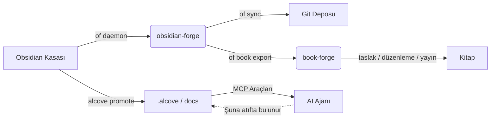

<div align="center">

# ⚒️ obsidian-forge

**Obsidian kasa oluşturucu, otomasyon daemonu ve grafik güçlendirici**

[](LICENSE)
[](https://www.rust-lang.org)
[](https://crates.io/crates/obsidian-forge)
[](https://buymeacoffee.com/epicsaga)

**Tek binary. Çoklu kasa. Başlamak için sıfır yapılandırma.**

[English](../README.md) · [中文](README_zh-CN.md) · [日本語](README_ja.md) · [한국어](README_ko.md) · [Español](README_es.md) · [Português](README_pt-BR.md) · [Français](README_fr.md) · [Deutsch](README_de.md) · [Русский](README_ru.md) · [Türkçe](README_tr.md)

</div>

---

## obsidian-forge nedir?

`obsidian-forge`, [Obsidian](https://obsidian.md) kasalarını kuran, otomatikleştiren ve bakımını yapan bir Rust CLI aracıdır. Arka planda bir daemon olarak çalışır; gelen kutunuzu izler, bilgi grafiğinizi güçlendirir ve git ile senkronize eder — böylece siz yazmaya odaklanabilirsiniz.

```
of init my-brain          # saniyeler içinde yeni kasa kur
of daemon enable         # macOS giriş öğesi olarak kaydet
# → kasanız artık otomatik işliyor, bağlantı kuruyor ve commit yapıyor
# "of", "obsidian-forge" için yerleşik kısa takma addır
```

---

## Özellikler

| | Özellik | Açıklama |
|---|---|---|
| 🏗️ | **Kasa kurulumu** | PARA düzeni, paket şablonlar, `.obsidian` yapılandırması, git başlatma |
| 🔗 | **Grafik güçlendirme** | Geri bağlantılar, köprü notları, ilgili proje bağlantıları, otomatik etiketler |
| 📥 | **Gelen kutusu işleme** | Frontmatter enjeksiyonu, AI sınıflandırma, PARA yönlendirme |
| 🔄 | **Senkronizasyon döngüsü** | MOC yeniden oluşturma → grafik → zamanlayıcıyla otomatik git commit/push |
| 🗂️ | **Çoklu kasa** | Bir daemon tüm kasaları yönetir; kasa bazında etkinleştir, duraklat veya devre dışı bırak |
| ⚙️ | **Ayarlar deposu** | Bir kasadan eklentileri/temaları içe aktar ve diğer tüm kasalara gönder |
| 🤖 | **AI meta verileri** | Ollama, OpenAI, OpenRouter, LM Studio veya herhangi bir OpenAI uyumlu uç nokta |
| 📄 | **PDF → Markdown** | `marker_single` ile dönüştürme, `pdftotext` yedek seçeneğiyle |
| 🍎 | **Giriş öğesi** | macOS LaunchAgent olarak kurulur — otomatik başlar ve yeniden başlar |
| ♻️ | **Idempotent** | Her işlem birden fazla kez güvenle çalıştırılabilir; yinelenen çıktı yok |
| 📚 | **Kitap projeleri** | Kasa tümleşik yazma projelerini başlatın, takip edin, dışa aktarın ve kaynakları senkronize edin |

---

## Kurulum

### macOS / Linux

```bash
brew install epicsagas/tap/obsidian-forge
```

Homebrew yok mu? Kurulum betiğini kullanın:

```bash
curl --proto '=https' --tlsv1.2 -LsSf \
  https://github.com/epicsagas/obsidian-forge/releases/latest/download/obsidian-forge-installer.sh | sh
```

### Windows

```powershell
irm https://github.com/epicsagas/obsidian-forge/releases/latest/download/obsidian-forge-installer.ps1 | iex
```

### Rust araç zinciri ile

```bash
cargo binstall obsidian-forge   # önceden derlenmiş binary (hızlı)
cargo install obsidian-forge    # kaynaktan derle
cargo install obsidian-forge --features dashboard-ui  # `of dashboard` GUI'sini de içer
```

Yukarıdaki tüm yöntemlerle hem `obsidian-forge` hem de `of` (kısa takma ad) kurulur. Panel yalnızca `--features dashboard-ui` ile kaynaktan derlenen sürümlerde bulunur; önceden derlenmiş binary'lere dahil değildir.

> Doğrulamak için `of --version` komutunu çalıştırın. Güncellemek için `brew upgrade obsidian-forge` veya kurulum betiğini yeniden çalıştırın.

### Platform Desteği

| Platform | Mimari | Durum |
|---|---|---|
| macOS | Apple Silicon (aarch64) | ✅ Tam desteklenir |
| macOS | Intel (x86_64) | ✅ Tam desteklenir |
| Linux | x86_64 (glibc) | ✅ Tam desteklenir |
| Linux | x86_64 (musl/statik) | ✅ Tam desteklenir |
| Linux | ARM64 (aarch64) | ✅ Tam desteklenir |
| Windows | x86_64 (MSVC) | ⚠️ Kısmen desteklenir (LaunchAgent yok) |

### Ön koşullar

| Araç | Gerekli | Amaç |
|---|---|---|
| Rust 1.85+ | yalnızca kaynaktan derleme için | Derleme |
| git | ✅ | Kasa sürümleme |
| Ollama / OpenAI / OpenRouter / LM Studio | ⬜ isteğe bağlı | AI etiketleme (`process-all`) |
| marker_single | ⬜ isteğe bağlı | Yüksek kaliteli PDF dönüştürme |

---

## Hızlı Başlangıç

```bash
# 1. Yeni kasa oluştur
of init my-brain

# 2. Obsidian'da aç → Dosya → Kasayı Aç → my-brain

# 3. Global yapılandırmaya kaydet
of vault add ~/my-brain

# 4. Arka plan daemonunu kur
of daemon enable

# Bitti — 00-Inbox/ dizinine notlar bırakın, obsidian-forge gerisini halleder
```

---

## Komutlar

### Kasa Başlatma

```bash
obsidian-forge init <name>
obsidian-forge init <name> --path ~/vaults
obsidian-forge init <name> --clone-settings-from ~/other-vault

# Mevcut bir kasada onarmak/yükseltmek için yeniden çalıştırın (idempotent — asla üzerine yazmaz)
obsidian-forge init my-brain --path ~/
```

### Çoklu Kasa Yönetimi

```bash
obsidian-forge vault add <path> [--name <alias>]
obsidian-forge vault remove <name>          # kaydı sil (dosyalar korunur)
obsidian-forge vault list                   # NAME / ENABLED / WATCH / PATH
obsidian-forge vault enable  <name>
obsidian-forge vault disable <name>         # senkronizasyon ve izlemeden hariç tut
obsidian-forge vault pause   <name>         # daemonu atla; manuel senkronizasyon tamam
obsidian-forge vault resume  <name>
```

### Ayarlar Yönetimi

Kasalar arasında `.obsidian/` eklentilerini, temalarını ve snippet'lerini senkronize eder.

```bash
obsidian-forge settings import <vault>      # ayarları global depoya çek
obsidian-forge settings push   <vault>      # global ayarları bir kasaya gönder
obsidian-forge settings push-all            # TÜM kayıtlı kasalara gönder
obsidian-forge settings status

# İki kasa arasında doğrudan klonlama
obsidian-forge clone-settings <source> <target>
```

### Grafik İşlemleri

```bash
obsidian-forge graph health                 # istatistikleri ve sağlık metriklerini göster
obsidian-forge graph orphans [--auto-link]  # yetim notları listele (veya AI ile otomatik bağla)
obsidian-forge graph extract [--no-ai]      # bağlantıları ve ilişkileri çıkar
obsidian-forge graph tags [--dry-run]       # etiketleri normalleştir ve kümele
obsidian-forge graph strengthen             # tam boru hattını çalıştır

# Eski takma ad (tam boru hattını çalıştırır)
obsidian-forge strengthen-graph
```

### Tek Seferlik İşlemler

```bash
obsidian-forge sync               [--vault <name>]   # MOC → grafik → git
obsidian-forge update-mocs        [--vault <name>]
obsidian-forge process-all        [--vault <name>]   # AI gelen kutusu işleme
obsidian-forge status             [--vault <name>]   # yapılandırma ve AI durumunu göster
obsidian-forge doctor             [--vault <name>]   # kasa sağlığını teşhis et
```

### Arka Plan Daemonu (macOS LaunchAgent)

```bash
obsidian-forge daemon enable     # plist yaz + bootstrap (giriş öğesi)
obsidian-forge daemon disable    # bootout + plist kaldır
obsidian-forge daemon start
obsidian-forge daemon stop
obsidian-forge daemon restart
obsidian-forge daemon status     # PID, son çıkış kodu ve planlanmış kasaları gösterir
```

> Günlükler → `~/.obsidian-forge/logs/obsidian-forge/forge.log`

### Ön Planda İzleme

```bash
obsidian-forge watch              # izlenebilir tüm kasalar
obsidian-forge watch --vault <name> --interval <saniye>
```

### Kitap Projeleri

Kitap yazma projelerini doğrudan kasa içinden yönetin.

```bash
of book init <name> [--genre <genre>] [--lang <lang>]   # 01-Projects/ altında yapı oluştur
of book status [<name>]                                   # taslak / düzenleme / yayın aşaması ilerleme
of book export <name> [--output <dir>]                   # book-forge için dışa aktar
of book sync   <name>                                     # etiketli notları sources/ klasörüne bağla
```

Kasada `book/<name>` etiketiyle işaretlenmiş notlar, `book sync` komutuyla `sources/` klasörüne otomatik olarak sembolik bağlantı olarak eklenir.

### Panel (Dashboard)

Kasanızı masaüstü paneliyle görsel olarak gezin (Tauri 2 + Svelte 5 uygulaması).

```bash
of dashboard                    # panel GUI'sini aç
of dashboard --vault <name>     # belirli bir kasayı aç
```

Her not bir **canlılık skoru (vitality score)**, **PARA bölgesi** sınıflandırması ve grafik bağlantısıyla gösterilir. Başlığa, yola veya etiketlere göre arayın; bölgeye veya etikete göre filtreleyin; ardından bir notu genişleterek:

- **AÇ (OPEN)** — Obsidian'da aç
- **İLİŞKİLİLERİ BUL (FIND RELATED)** — grafik tabanlı ilgili notlar (geri bağlantılar + paylaşılan etiketler, ilk 5)
- **AI'YA SOR (ASK AI)** — tek satırlık bir özet, temel sorular ve bağlantı önerileri üretir (AI yapılandırması gerekir)

> Panel, isteğe bağlı bir `dashboard-ui` özelliğidir ve önceden derlenmiş binary'lere dahil değildir. Kaynaktan `--features dashboard-ui` ile derleyin (bkz. Kurulum). En az bir kayıtlı kasa gerekir.

---

## Yapılandırma

`vault.toml`, `init` tarafından otomatik olarak oluşturulur. Her değerin makul bir varsayılanı vardır.

```toml
[vault]
name            = "my-brain"
layout          = "para"           # şu an desteklenen tek düzen
inbox_dir       = "00-Inbox"
zettelkasten_dir= "10-Zettelkasten"
archive_dir     = "99-Archives"
attachments_dir = "Attachments"
templates_dir   = "obsidian-templates"

[graph]
backlinks        = true
bridge_notes     = true
auto_tags        = true
related_projects = true
# [[graph.concepts]]
# name     = "AI"
# keywords = ["machine learning", "LLM", "neural"]
# tags     = ["ai", "ml"]

[sync]
git_auto_commit  = true
git_auto_push    = true
interval_minutes = 60

[ai]
# provider: ollama | openai | openrouter | lmstudio | openai-compatible
provider = "ollama"
model    = "gemma3"
base_url = "http://192.168.0.28:1234/v1"  # openai-compatible için gerekli; diğerlerinin varsayılanı var
# api_key  = ""                          # isteğe bağlı — ortam değişkeni tercih edilir (aşağıya bkz.)

[daemon]
label   = "com.obsidian-forge.watch"
log_dir = "~/.obsidian-forge/logs"
```

**API anahtarları** şu sırayla çözümlenir:

1. `[ai]` bölümündeki `api_key` (config.toml veya vault.toml) — *sırları commit etmekten kaçının*
2. Ortam değişkeni (aşağıdaki tabloya bakın)
3. `~/.config/obsidian-forge/.env` dosyası — **önerilen** (otomatik yüklenir, asla commit edilmez)

| Provider | Ortam değişkeni | Notlar |
|---|---|---|
| `openai` | `OPENAI_API_KEY` | [Anahtar al →](https://platform.openai.com/api-keys) |
| `openrouter` | `OPENROUTER_API_KEY` | [Anahtar al →](https://openrouter.ai/keys) |
| `openai-compatible` | `OPENAI_COMPATIBLE_API_KEY` | `OPENAI_API_KEY`'ye geri düşer |
| `ollama` / `lmstudio` | — | anahtar gerekli değil |

**`.env` ile API anahtarlarını ayarlama (önerilen):**

```bash
# .env dosyasını oluşturun (asla git'e commit edilmez)
cat > ~/.config/obsidian-forge/.env << 'EOF'
# Sağlayıcınız için satır(ların yorumunu kaldırın:
# OPENAI_API_KEY=sk-...
# OPENROUTER_API_KEY=sk-or-...
# OPENAI_COMPATIBLE_API_KEY=...
EOF
```

> Hem `OPENAI_COMPATIBLE_API_KEY` hem de `OPENAI_API_KEY` ayarlanmışsa,
> sağlayıcıya özel olan öncelik alır. Bu, `openai` ve
> `openai-compatible`'ı aynı anda farklı anahtarlarla kullanmanıza olanak tanır.

**Yapılandırma çözümleme:**

```
$VAULT_PATH                              # ortam değişkeni geçersiz kılma
│
├── otomatik algılama (CWD'den yukarı çıkar)  # vault.toml veya 00-Inbox/ arar
│
~/.config/obsidian-forge/config.toml    # global: kayıtlı kasalar
<vault>/vault.toml                      # kasa başına ayarlar
```

---

## Mimari

```
obsidian-forge/
├── src/
│   ├── main.rs        CLI (clap), çoklu kasa dağıtımı, senkronizasyon döngüsü
│   ├── config.rs      vault.toml + global yapılandırma yapıları
│   ├── init.rs        kasa kurulumu, ayar içe aktarma/gönderme
│   ├── moc.rs         MOC merkez dosyası oluşturma
│   ├── graph/         Grafik güçlendirme boru hattı
│   │   ├── mod.rs       boru hattı koordinatörü
│   │   ├── scan.rs      kasa çapında grafik tarama
│   │   ├── tags.rs      kavram tabanlı otomatik etiketleme
│   │   ├── wikilinks.rs wikilink çıkarma ve enjeksiyonu
│   │   ├── backlinks.rs geri bağlantı bölümü oluşturma
│   │   ├── bridges.rs   köprü notu oluşturma
│   │   ├── relationships.rs ilgili proje bağlantılama
│   │   ├── orphans.rs   yetim not tespiti
│   │   ├── autotag.rs   otomatik etiket orkestrasyonu
│   │   └── health.rs    grafik sağlık raporlaması
│   ├── git.rs         otomatik commit + push (conventional commits)
│   ├── notes.rs       gelen kutusu işleme + PARA yönlendirme
│   ├── converter.rs   PDF → Markdown
│   ├── ai.rs          AI istemcisi (Ollama, OpenAI uyumlu sağlayıcılar)
│   ├── prompts.rs     LLM prompt şablonları
│   └── watcher.rs     dosya sistemi izleyici (notify crate)
└── vault.toml         kasa başına yapılandırma (init tarafından oluşturulur)
```

### Ekosistem

obsidian-forge, AI ajanlarına proje belgeleri sunan bir MCP sunucusu olan **[alcove](https://github.com/epicsagas/alcove)**'un kardeş projesidir. Bir Cargo çalışma alanını paylaşırlar ve kişisel bilgi ile proje zekası arasındaki döngüyü kapatmak için birlikte çalışırlar:

- **obsidian-forge** = **Demirhane (The Forge)** (yazma/itme). Kasa bakımını otomatikleştiren, bilgi grafiğini güçlendiren ve git ile senkronize eden arka plan daemonu.
- **alcove** = **Kütüphane (The Library)** (okuma/çekme). AI ajanlarına, bağlam penceresini şişirmeden belgelere on-demand ve aranabilir erişim sağlayan MCP sunucusu.
- **[book-forge](https://github.com/epicsagas/book-forge)** = **Matbaa (The Press)** (yazma/yayımlama). `of book export` ile dışa aktarılan dizini alıp taslak → düzenleme → yayımlama pipeline'ını yöneten AI destekli kitap yazma araç takımı.



### Alcove ile Entegrasyon

`obsidian-forge` bilgi grafiğinizi oluşturmaya ve otomatikleştirmeye odaklanırken, [Alcove](https://github.com/epicsagas/alcove) bu bilginin AI kodlama ajanları için eyleme dönüştürülebilir olmasını sağlar.

#### Birlikte nasıl kullanılır:

1.  **Obsidian'da İnşa Edin**: Kasanızın sağlığını korumak, MOC'ler oluşturmak ve ilgili kavramları otomatik olarak bağlamak için `obsidian-forge` kullanın.
2.  **Proje Belgelerine Yükseltin**: Bir not (örneğin bir mimari karar veya özellik spesifikasyonu) bir proje için hazır olduğunda, `alcove promote --source path/to/note.md` komutunu çalıştırın.
3.  **Ajan Keşfi**: AI ajanınız (Alcove MCP sunucusunu kullanarak) artık sohbet kutusuna kopyalayıp yapıştırmanıza gerek kalmadan `search_project_docs` veya `get_doc_file` aracılığıyla o notu "keşfedebilir".
4.  **Politika Uyumluluğu**: Yükseltilen notlarınızın projenin belge standartlarını (`policy.toml` içinde tanımlanan) karşıladığından emin olmak için Alcove'un `validate_docs` aracını kullanın.

### book-forge ile Entegrasyon

[book-forge](https://github.com/epicsagas/book-forge), AI destekli kitap yazma için özel araç takımıdır. `obsidian-forge` **kasa tarafını** yönetir — notları düzenleme, araştırmaları etiketleme, proje yapısını oluşturma. `book-forge` **yazma tarafını** yönetir — bölüm taslakları, düzenleme turları, yayına hazırlama.

#### İş akışı: Kasa → Kitap

```bash
# 1. Kasadaki araştırma notlarını etiketleyin
#    İlgili notların frontmatter tags alanına "book/kitabim" ekleyin

# 2. Kitap projesini başlatın
of book init kitabim --genre non-fiction --lang tr

# 3. Etiketli notları sources/ klasörüne senkronize edin
of book sync kitabim

# 4. book-forge uyumlu dizine aktarın
of book export kitabim --output ~/books/

# 5. book-forge'a devredin
cd ~/books/kitabim
book-forge draft        # sources/ temelinde AI bölüm taslakları
book-forge edit         # çok turlu düzenleme pipeline'ı
book-forge publish      # EPUB / PDF paketleme
```

Dışa aktarılan dizin `PRD.md` (hedefler), `STYLE.md` (stil kılavuzu), `drafts/`, `edits/` ve `publish/` içerir — tam olarak `book-forge`'un beklediği yapı.

---

## Katkıda Bulunma

Katkılar memnuniyetle karşılanır! Pull request göndermeden önce lütfen [CONTRIBUTING.md](../CONTRIBUTING.md) dosyasını okuyun.

```bash
git clone https://github.com/epicsagas/obsidian-forge.git
cd obsidian-forge
cargo build
cargo test
```

---

## Bağlantılar

- 📚 **Belgeleme**: Bu README + satır içi kod belgeleri
- 🐛 **Sorunlar**: [GitHub Issues](https://github.com/epicsagas/obsidian-forge/issues)
- 💬 **Tartışmalar**: [GitHub Discussions](https://github.com/epicsagas/obsidian-forge/discussions)
- 📦 **Crates.io**: [obsidian-forge](https://crates.io/crates/obsidian-forge)

---

## Lisans

Apache 2.0 © 2026 [epicsagas](https://github.com/epicsagas)
