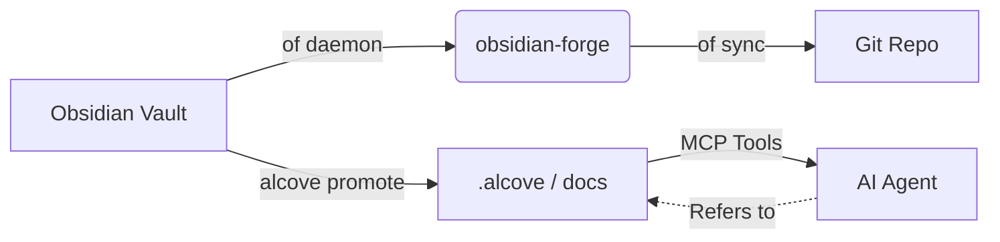

<div align="center">

# ⚒️ obsidian-forge

**Obsidian 知识库生成器、自动化守护进程和图谱增强工具**

[](LICENSE)
[](https://www.rust-lang.org)
[](https://crates.io/crates/obsidian-forge)
[](https://buymeacoffee.com/epicsaga)

**单一二进制文件。多知识库支持。零配置即可上手。**

[English](../README.md) · [中文](README_zh-CN.md) · [日本語](README_ja.md) · [한국어](README_ko.md) · [Español](README_es.md) · [Português](README_pt-BR.md) · [Français](README_fr.md) · [Deutsch](README_de.md) · [Русский](README_ru.md) · [Türkçe](README_tr.md)

</div>

---

## 什么是 obsidian-forge？

`obsidian-forge` 是一个 Rust 编写的 CLI 工具，用于创建、自动化和维护 [Obsidian](https://obsidian.md) 知识库。它作为后台守护进程运行，监控你的收件箱，增强你的知识图谱，并自动同步到 git —— 让你专注于写作。

```
of init my-brain          # 几秒钟内创建一个新知识库
of daemon enable         # 注册为 macOS 登录项
# → 你的知识库现在将自动处理、自动链接和自动提交
# "of" 是 "obsidian-forge" 的内置短别名
```

---

## 功能特性

| | 功能 | 说明 |
|---|---|---|
| 🏗️ | **知识库脚手架** | PARA 布局、内置模板、`.obsidian` 配置、git 初始化 |
| 🔗 | **图谱增强** | 反向链接、桥接笔记、关联项目链接、自动标签 |
| 📥 | **收件箱处理** | Frontmatter 注入、AI 分类、PARA 路由 |
| 🔄 | **同步循环** | MOC 重建 → 图谱 → 定时自动 git commit/push |
| 🗂️ | **多知识库** | 一个守护进程管理所有知识库；可逐个启用、暂停或禁用 |
| ⚙️ | **设置存储** | 从一个知识库导入插件/主题，然后推送到所有其他知识库 |
| 🤖 | **AI 元数据** | 支持 Ollama、OpenAI、OpenRouter、LM Studio 或任何 OpenAI 兼容端点 |
| 📄 | **PDF → Markdown** | 通过 `marker_single` 转换，以 `pdftotext` 作为后备方案 |
| 🍎 | **登录项** | 安装为 macOS LaunchAgent —— 自动启动、自动重启 |
| ♻️ | **幂等性** | 可安全地多次运行任何操作；不会产生重复输出 |
| 📚 | **图书项目** | 初始化、追踪、导出和同步知识库集成写作项目的来源 |

---

## 安装

### macOS / Linux

```bash
brew install epicsagas/tap/obsidian-forge
```

没有 Homebrew？使用安装脚本：

```bash
curl --proto '=https' --tlsv1.2 -LsSf \
  https://github.com/epicsagas/obsidian-forge/releases/latest/download/obsidian-forge-installer.sh | sh
```

### Windows

```powershell
irm https://github.com/epicsagas/obsidian-forge/releases/latest/download/obsidian-forge-installer.ps1 | iex
```

### 通过 Rust 工具链

```bash
cargo binstall obsidian-forge   # 预编译二进制文件（快速）
cargo install obsidian-forge    # 从源码编译
```

以上所有方法都会同时安装 `obsidian-forge` 和 `of`（短别名）。

> 使用 `of --version` 验证安装。使用 `brew upgrade obsidian-forge` 或重新运行安装脚本来更新。

### 平台支持

| 平台 | 架构 | 状态 |
|---|---|---|
| macOS | Apple Silicon (aarch64) | ✅ 完全支持 |
| macOS | Intel (x86_64) | ✅ 完全支持 |
| Linux | x86_64 (glibc) | ✅ 完全支持 |
| Linux | x86_64 (musl/static) | ✅ 完全支持 |
| Linux | ARM64 (aarch64) | ✅ 完全支持 |
| Windows | x86_64 (MSVC) | ⚠️ 部分支持（无 LaunchAgent） |

### 前置条件

| 工具 | 是否必需 | 用途 |
|---|---|---|
| Rust 1.85+ | 仅源码编译时需要 | 编译 |
| git | ✅ | 知识库版本管理 |
| Ollama / OpenAI / OpenRouter / LM Studio | ⬜ 可选 | AI 标签（`process-all`） |
| marker_single | ⬜ 可选 | 高质量 PDF 转换 |

---

## 快速开始

```bash
# 1. 创建新知识库
of init my-brain

# 2. 在 Obsidian 中打开 → 文件 → 打开知识库 → my-brain

# 3. 将其注册到全局配置
of vault add ~/my-brain

# 4. 安装后台守护进程
of daemon enable

# 完成 — 将笔记放入 00-Inbox/，obsidian-forge 会处理其余工作
```

---

## 命令

### 知识库初始化

```bash
obsidian-forge init <name>
obsidian-forge init <name> --path ~/vaults
obsidian-forge init <name> --clone-settings-from ~/other-vault

# 在已有知识库上重新运行以修复/升级（幂等 — 永不覆盖）
obsidian-forge init my-brain --path ~/
```

### 多知识库管理

```bash
obsidian-forge vault add <path> [--name <alias>]
obsidian-forge vault remove <name>          # 取消注册（文件保留）
obsidian-forge vault list                   # NAME / ENABLED / WATCH / PATH
obsidian-forge vault enable  <name>
obsidian-forge vault disable <name>         # 排除在同步和监控之外
obsidian-forge vault pause   <name>         # 跳过守护进程；手动同步仍可用
obsidian-forge vault resume  <name>
```

### 设置管理

在知识库之间同步 `.obsidian/` 插件、主题和片段。

```bash
obsidian-forge settings import <vault>      # 将设置拉取到全局存储
obsidian-forge settings push   <vault>      # 将全局设置推送到某个知识库
obsidian-forge settings push-all            # 推送到所有已注册的知识库
obsidian-forge settings status

# 直接在两个知识库之间克隆
obsidian-forge clone-settings <source> <target>
```

### 图谱操作

```bash
obsidian-forge graph health                 # 显示统计信息和健康指标
obsidian-forge graph orphans [--auto-link]  # 列出孤立笔记（或使用 AI 自动链接）
obsidian-forge graph extract [--no-ai]      # 提取链接和关系
obsidian-forge graph tags [--dry-run]       # 规范化和聚类标签
obsidian-forge graph strengthen             # 运行完整流水线

# 旧版别名（运行完整流水线）
obsidian-forge strengthen-graph
```

### 一次性操作

```bash
obsidian-forge sync               [--vault <name>]   # MOC → 图谱 → git
obsidian-forge update-mocs        [--vault <name>]
obsidian-forge process-all        [--vault <name>]   # AI 收件箱处理
obsidian-forge status             [--vault <name>]   # 显示配置和 AI 状态
obsidian-forge doctor             [--vault <name>]   # 诊断知识库健康状态
```

### 后台守护进程（macOS LaunchAgent）

```bash
obsidian-forge daemon enable     # 写入 plist + 引导加载（登录项）
obsidian-forge daemon disable    # 注销 + 移除 plist
obsidian-forge daemon start
obsidian-forge daemon stop
obsidian-forge daemon restart
obsidian-forge daemon status     # 显示 PID、上次退出状态和已调度的知识库
```

> 日志 → `~/.obsidian-forge/logs/obsidian-forge/forge.log`

### 前台监控

```bash
obsidian-forge watch              # 监控所有可监控的知识库
obsidian-forge watch --vault <name> --interval <seconds>
```

### 图书项目

直接在知识库中管理书籍写作项目。

```bash
of book init <name> [--genre <genre>] [--lang <lang>]   # 在 01-Projects/ 下创建项目
of book status [<name>]                                   # 初稿 / 编辑 / 出版阶段进度
of book export <name> [--output <dir>]                   # 导出为 book-forge 兼容目录
of book sync   <name>                                     # 将标记的笔记链接到 sources/
```

知识库中标记了 `book/<name>` 的笔记，将通过 `book sync` 自动以符号链接的形式出现在 `sources/` 中。

---

## 配置

`vault.toml` 由 `init` 命令自动创建。每个值都有合理的默认设置。

```toml
[vault]
name            = "my-brain"
layout          = "para"           # 目前仅支持的布局
inbox_dir       = "00-Inbox"
zettelkasten_dir= "10-Zettelkasten"
archive_dir     = "99-Archives"
attachments_dir = "Attachments"
templates_dir   = "obsidian-templates"

[graph]
backlinks        = true
bridge_notes     = true
auto_tags        = true
related_projects = true
# [[graph.concepts]]
# name     = "AI"
# keywords = ["machine learning", "LLM", "neural"]
# tags     = ["ai", "ml"]

[sync]
git_auto_commit  = true
git_auto_push    = true
interval_minutes = 60

[ai]
# provider: ollama | openai | openrouter | lmstudio | openai-compatible
provider = "ollama"
model    = "gemma3"
base_url = "http://192.168.0.28:1234/v1"  # openai-compatible 必填；其他有默认值
# api_key  = ""                          # 可选 — 推荐使用环境变量（见下文）

[daemon]
label   = "com.obsidian-forge.watch"
log_dir = "~/.obsidian-forge/logs"
```

**API 密钥**按以下顺序解析：

1. `[ai]` 节中的 `api_key`（config.toml 或 vault.toml）— *避免提交敏感信息*
2. 环境变量（见下表）
3. `~/.config/obsidian-forge/.env` 文件 — **推荐**（自动加载，不会被提交）

| 提供者 | 环境变量 | 备注 |
|---|---|---|
| `openai` | `OPENAI_API_KEY` | [获取密钥 →](https://platform.openai.com/api-keys) |
| `openrouter` | `OPENROUTER_API_KEY` | [获取密钥 →](https://openrouter.ai/keys) |
| `openai-compatible` | `OPENAI_COMPATIBLE_API_KEY` | 回退到 `OPENAI_API_KEY` |
| `ollama` / `lmstudio` | — | 无需密钥 |

**使用 `.env` 设置 API 密钥（推荐）：**

```bash
# 创建 .env 文件（不会被提交到 git）
cat > ~/.config/obsidian-forge/.env << 'EOF'
# 取消注释你所使用的提供者对应的行：
# OPENAI_API_KEY=sk-...
# OPENROUTER_API_KEY=sk-or-...
# OPENAI_COMPATIBLE_API_KEY=...
EOF
```

> 如果同时设置了 `OPENAI_COMPATIBLE_API_KEY` 和 `OPENAI_API_KEY`，
> 提供者特定的密钥优先。这允许你同时使用 `openai` 和
> `openai-compatible` 并使用不同的密钥。

**配置解析顺序：**

```
$VAULT_PATH                              # 环境变量覆盖
│
├── auto-detection (walks up from CWD)  # 查找 vault.toml 或 00-Inbox/
│
~/.config/obsidian-forge/config.toml    # 全局：已注册的知识库
<vault>/vault.toml                      # 每个知识库的设置
```

---

## 架构

```
obsidian-forge/
├── src/
│   ├── main.rs        CLI (clap)，多知识库调度，同步循环
│   ├── config.rs      vault.toml + 全局配置结构体
│   ├── init.rs        知识库脚手架，设置导入/推送
│   ├── moc.rs         MOC 中心文件生成
│   ├── graph/         图谱增强流水线
│   │   ├── mod.rs       流水线协调器
│   │   ├── scan.rs      全知识库图谱扫描
│   │   ├── tags.rs      基于概念的自动标签
│   │   ├── wikilinks.rs wikilink 提取与注入
│   │   ├── backlinks.rs 反向链接节生成
│   │   ├── bridges.rs   桥接笔记创建
│   │   ├── relationships.rs  关联项目链接
│   │   ├── orphans.rs   孤立笔记检测
│   │   ├── autotag.rs   自动标签编排
│   │   └── health.rs    图谱健康报告
│   ├── git.rs         自动 commit + push（约定式提交）
│   ├── notes.rs       收件箱处理 + PARA 路由
│   ├── converter.rs   PDF → Markdown
│   ├── ai.rs          AI 客户端（Ollama + OpenAI 兼容提供者）
│   ├── prompts.rs     LLM 提示模板
│   └── watcher.rs     文件系统监控（notify crate）
└── vault.toml         每个知识库的配置（由 init 创建）
```

### 生态系统

obsidian-forge 是 **[alcove](https://github.com/epicsagas/alcove) 的姊妹项目** —— 一个为 AI 代理提供项目文档服务的 MCP 服务器。它们共享一个 Cargo 工作区，协同工作，在个人知识和项目智能之间形成闭环：

- **obsidian-forge** = **锻造厂**（写入/推送）。后台守护进程，自动化知识库维护，增强知识图谱，并同步到 git。
- **alcove** = **图书馆**（读取/拉取）。MCP 服务器，为 AI 代理提供按需、可搜索的文档访问，而不会膨胀上下文窗口。



### 与 Alcove 集成

`obsidian-forge` 专注于构建和自动化你的知识图谱，而 [Alcove](https://github.com/epicsagas/alcove) 则确保这些知识能被 AI 编码代理有效利用。

#### 如何配合使用：

1. **在 Obsidian 中构建**：使用 `obsidian-forge` 维护知识库的健康状态，创建 MOC，并自动链接相关概念。
2. **提升为项目文档**：当一篇笔记（例如架构决策或功能规格）准备好用于项目时，运行 `alcove promote --source path/to/note.md`。
3. **代理发现**：你的 AI 代理（使用 Alcove MCP 服务器）现在可以通过 `search_project_docs` 或 `get_doc_file` "发现"该笔记，而无需你手动复制粘贴到聊天中。
4. **策略合规**：使用 Alcove 的 `validate_docs` 确保你提升的笔记符合项目的文档标准（在 `policy.toml` 中定义）。

---

## 贡献

欢迎贡献！请在提交 Pull Request 之前阅读 [CONTRIBUTING.md](../CONTRIBUTING.md)。

```bash
git clone https://github.com/epicsagas/obsidian-forge.git
cd obsidian-forge
cargo build
cargo test
```

---

## 链接

- 📚 **文档**：本 README + 内联代码文档
- 🐛 **问题**：[GitHub Issues](https://github.com/epicsagas/obsidian-forge/issues)
- 💬 **讨论**：[GitHub Discussions](https://github.com/epicsagas/obsidian-forge/discussions)
- 📦 **Crates.io**：[obsidian-forge](https://crates.io/crates/obsidian-forge)

---

## 许可证

Apache 2.0 © 2026 [epicsagas](https://github.com/epicsagas)
